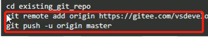

# 一、项目准备阶段


## 一、创建项目

1、第一步：打开命令行窗口。

2、第二步：执行创建项目命令行

vue create vue3_project(项目可以任意，最好是英文)

3、自定义创建


4、第四步：选中vue-router,vuex,css Pre-processors选项


5、选择vue3.0版本，选择hash模式的路由，

选择less作为预处理器，选择 standard 标准代码风格；（这里就不配图了）

6、选择 standard 标准代码风格，保存代码校验代码风格，代码提交时候校验代码风格，依赖插件或者工具的配置文件分文件保存


7、是否记录以上操作，选择否，最后等待安装即可。

## 二、目录调整

大致步骤：

- 删除无用代码和文件
- 完善项目的基础结构
- 读懂默认生成的代码


## 三、vuex基础

### 1、根模块的用法


```js
// sotre/index.js
import { createStore } from 'vuex'

export default createStore({
  state: {
    username: 'zs'
  },
  getters: {
    newName(state){
      return state.username + '!!'
    }
  },
  mutations: {
    updateName(state){
      state.username = 'ls'
    }
  },
  actions: {
    updateName(ctx) {
      setTimeout(() => {
        ctx.commit('updateName')
      }, 1000);
    }
  },
  modules: {
  }
})

```

App.vue

```vue
<template>
  <div>
    APP
    <p>{{ $store.state.username }}</p>

    <p>{{ $store.getters['newName'] }}</p>

    <button @click="mutationsFn">mutationsFn</button>
  </div>
</template>

<script >
import { useStore } from "vuex";
import { useRouter } from "vue-router";
export default {
  name: "App",
  setup() {
    // 使用vuex仓库
    const store = useStore();
    console.log(store.state.username);
    console.log(store.getters.newName);
    // console.log(store);
    // const router = useRouter()
    // console.log(router);
    const mutationsFn=() => {
      //store.commit('updateName')
      // 调用根模块actions函数
      store.dispatch('updateName')
    }
    return {mutationsFn}
  },
};
</script>

```

### 2、modules (分模块)

- 存在两种情况
  - 默认的模块，`state` 区分模块，其他 `getters` `mutations` `actions` 都在全局。
  - 带命名空间 `namespaced: true` 的模块，所有功能区分模块，更高封装度和复用。

```js

import { createStore } from 'vuex'

const moduleA = {
  state: {
    username: 'moduleA'
  },
  getters: {
    newName(state) {
      return state.username + '11'
    }
  },
  mutations: {
    updateName(state) {
      state.username = 'moduleAAAA'
    }
  }
}

// B模块
const moduleB = {
  namespaced: true,
  state: {
    username: 'moduleB'
  },
  getters: {
    newName(state) {
      return state.username + '11'
    }
  },
  mutations: {
    updateName(state) {
      state.username = 'moduleBBBB'
    }
  },
  actions: {
    updateName(ctx) {
      setTimeout(() => {
        ctx.commit('updateName')
      }, 1000);
    }
  }
}

export default createStore({
  modules: {
    moduleA,
    moduleB
  }
})

```

```vue
<template>
  <div>
    APP
    <!--使用A模块的state数据-->
    <p>{{ $store.state.moduleA.username }}</p>
    <!--使用A模块的getters数据-->
    <p>{{ $store.getters.newName }}</p>
    <!--使用B模块的state数据-->
    <p>{{ $store.state.moduleB.username }}</p>
     <!--使用B模块的getters数据  B模块用到了命名空间-->
    <p>{{ $store.getters['moduleB/newName'] }}</p>

    <button @click="mutationsFn">mutationsFn</button>
    <button @click="actionsFn">actionsFn</button>
  </div>
</template>

<script >
import { useStore } from "vuex";
export default {
  name: "App",
  setup() {
    const store = useStore()

    const mutationsFn =() => {
      store.commit("moduleB/updateName")
    }
    const actionsFn=()=> {
      store.dispatch('moduleB/updateName')
    }
    return {
      mutationsFn,
      actionsFn
    }
  },
};
</script>

```

## 四、本地项目托管到Gitee

1、先在Gitee上创建一个仓库（点击右上角的+ 号就能创建）


**注意把第一个对勾去掉**


如果是第一次将代码推送到码云，在新建仓库之前先去申请SSH公钥，具体教程网上都有，申请之后执行Git全局配置，（之前有推送代码到码云，第二次就不需要初始化配置了）

2、在项目路径下cmd进入命令窗口，执行如下命令

```sh
git add .

git commit - m "add files"

git status(这里如果显示 working tree clean 就代表工作区已经干净)


```



执行红色框框里面的代码即可（在项目路径下）


## 五、vuex持久化

**目的：让在vuex中管理的状态数据同时存储在本地。可免去自己存储的环节。**

- 在开发的过程中，像用户信息（名字，头像，token）需要vuex中存储且需要本地存储。
- 再例如，购物车如果需要未登录状态下也支持，如果管理在vuex中页需要存储在本地。
- 我们需要category模块存储分类信息，但是分类信息不需要持久化。

1）首先：我们需要安装一个vuex的插件`vuex-persistedstate`来支持vuex的状态持久化。

```sh
npm i vuex-persistedstate
```

这个时候可能会报错


大致看了报错信息，应该是eslint-config-standard和eslint-plugin-vue版本不对应导致的，我们可以选择下面2种解决方案

```sh
npm i vuex-persistedstate --legacy-peer-deps

```

```sh
npm i vuex-persistedstate --force
```

2）然后：在`src/store` 文件夹下新建 `modules` 文件，在 `modules` 下新建 `user.js` 和 `cart.js`

**src/store/modules/user.js**

```js
// 用户模块
export default {
  namespaced: true,
  state () {
    return {
      // 用户信息
      profile: {
        id: '',
        avatar: '',
        nickname: '',
        account: '',
        mobile: '',
        token: ''
      }
    }
  },
  mutations: {
    // 修改用户信息，payload就是用户信息对象
    setUser (state, payload) {
      state.profile = payload
    }
  }
}

```

src/store/modules/cart.js:

```js
// 购物车状态
export default {
  namespaced: true,
  state: () => {
    return {
      list: []
    }
  }
}

```

src/store/modules/category.js

```js
// 分类模块
export default {
  namespaced: true,
  state () {
    return {
      // 分类信息集合
      list: []
    }
  }
}

```

3）继续：在 `src/store/index.js` 中导入 user cart 模块，并使用vuex-persistedstate插件来进行持久化

```js

import { createStore } from 'vuex'
import createPersistedState from 'vuex-persistedstate'
import user from './modules/user'
import cart from './modules/cart'
import category from './modules/category'

export default createStore({
  modules: {
    user,
    cart,
    category
  },
   // 配置插件
   plugins: [
    // 默认存储在localStorage
    createPersistedState({
      // 本地存储名字
      key: 'erabbit-client-pc-124-store',
      // 指定需要存储的模块
      paths: ['user', 'cart']
    })
  ]
})

```

**测试：** user模块定义一个mutation在main.js去调用下，观察浏览器application的localStorage下数据。

```vue
<template>
  <div>
    APP
       <!-- 修改数据，测试是否持久化 -->
     {{ $store.state.user.profile.account }}
    <button @click="$store.commit('user/setUser',{account: 'zhangsang'})">设置用户信息</button>
  </div>
</template>

<script >

export default {
  name: 'App',
  setup () {
    
  }
}
</script>
```


无论刷新多少次数据都是持久化

## 六、请求工具

- 安装 axios

```sh
npm i axios
```

或者

```sh
npm i axios --force
```

- 新建 `src/utils/request.js` 模块，代码如下

```js
import axios from 'axios'

import store from '@/store'

import router from '@/router'
// 导出基准地址，原因：其他地方不是通过axios发请求的地方用上基准地址
export const baseURL = 'http://pcapi-xiaotuxian-front-devtest.itheima.net/'

const instance = axios.create({
    baseURL,
    timeout: 5000
})

instance.interceptors.request.use(config => {
     // 拦截业务逻辑
  // 进行请求配置的修改
  // 如果本地又token就在头部携带
  // 1. 获取用户信息对象
  const {profile} = store.state.user
  // 判断是否有token
  if(profile.token) {
    console.log(profile.token);
    config.headers.Authorization =  `Bearer ${profile.token}`
  }
  return config
},err=> {
    return Promise.reject(err)
})

// res => res.data  取出data数据，将来调用接口的时候直接拿到的就是后台的数据
instance.interceptors.response.use(res => res.data, err => {
    // 401 状态码，进入该函数
    if (err.response && err.response.status === 401) {
      // 1. 清空无效用户信息
      // 2. 跳转到登录页
      // 3. 跳转需要传参（当前路由地址）给登录页码
      store.commit('user/setUser', {})
      // 当前路由地址
      // 组件里头：`/user?a=10` $route.path === /user  $route.fullPath === /user?a=10
      // js模块中：router.currentRoute.value.fullPath 就是当前路由地址，router.currentRoute 是ref响应式数据
      const fullPath = encodeURIComponent(router.currentRoute.value.fullPath)
      // encodeURIComponent 转换uri编码，防止解析地址出问题
      router.push('/login?redirectUrl=' + fullPath)
    }
    return Promise.reject(err)
  })

  export default (url,method,submitData) => {
    return instance({
        url,
        method,
        [method.toLowerCase() === 'get' ? 'params' : 'data']: submitData
    })
  }

```


```vue
<template>
  <div>
    APP
       <!-- 修改数据，测试是否持久化 -->
    <button @click="fn">测试request工具函数</button>
  </div>
</template>

<script >
import request from '@/utils/request'
export default {
  name: 'App',
  setup () {
    const fn=() => {
      request('/member/profile','get',{a:10})
    }
    return {fn}
  }
}
</script>

```

## 七、路由设计


# 二、首页模块

## 一、首页路由与组件

App.vue

```vue
<template>
  <!-- 一级路由 -->
  <router-view></router-view>
</template>
```

- 一级路由布局容器 `src/views/Layout.vue`

```vue
<template>
  <nav>顶部通栏</nav>
  <header>头部</header>
  <main>
    <!-- 二级路由 -->
    <router-view></router-view>
  </main>
  <footer>底部</footer>
</template>

<script>
export default {
  name: 'xtx-layout'
}
</script>

<style scoped lang='less'></style>
```

- 二级路由首页组件 `src/views/home/index.vue`

```vue
<template>
  <div class='container'>
    首页
  </div>
</template>

<script>
export default {
  name: 'HomePage'
}
</script>

<style scoped lang='less'>
</style>
```

- 配置路由规则 `src/router/index.js`

  ```js
  import { createRouter, createWebHashHistory } from 'vue-router'
  
  +const Layout = () => import('@/views/Layout')
  +const Home = () => import('@/views/home/index')
  
  const routes = [
  +  {
  +    path: '/',
  +    component: Layout,
  +    children: [
  +      { path: '/', component: Home }
  +    ]
  +  }
  ]
  
  const router = createRouter({
    history: createWebHashHistory(),
    routes
  })
  
  export default router
  
  ```

## 二、首页-less的自动化导入

**1）准备要用的变量和混入代码**

- 变量 `src/assets/styles/variables.less`

```less
// 主题
@xtxColor:#27BA9B;
// 辅助
@helpColor:#E26237;
// 成功
@sucColor:#1DC779;
// 警告
@warnColor:#FFB302;
// 价格
@priceColor:#CF4444;
```

- 混入 `src/assets/styles/mixins.less`

```less
// 鼠标经过上移阴影动画
.hoverShadow () {
  transition: all .5s;
  &:hover {
    transform: translate3d(0,-3px,0);
    box-shadow: 0 3px 8px rgba(0,0,0,0.2);
  }
}
```

- 混入 `src/assets/styles/mixins.less`

```less
// 鼠标经过上移阴影动画
.hoverShadow () {
  transition: all .5s;
  &:hover {
    transform: translate3d(0,-3px,0);
    box-shadow: 0 3px 8px rgba(0,0,0,0.2);
  }
}
```

less混入就是，申明一段css代码（选择器包裹的代码）或者函数，在其他css选择器调用，可复用包裹的代码

**测试：**src/assets/styles/mixins.less

```less
// less混入

// 演示混入
.abc {
  width: 100px;
  height: 100px;
}

.box {
  .abc();
}

.abc2 (@width) {
  width: @width;
  height: @width;
}

.box2 {
  .abc2(300px);
}

// 鼠标经过上移阴影动画
.hoverShadow () {
  transition: all .5s;
  &:hover {
    transform: translate3d(0,-3px,0);
    box-shadow: 0 3px 8px rgba(0,0,0,0.2);
  }
}
```

home/index.vue

```vue
<template>
  <div class='container'>
    首页
  </div>
</template>

<script>
export default {
  name: 'HomePage'
}
</script>

<style scoped lang='less'>
@import '../../assets/styles/mixins.less';
</style>

```

**效果：**（看红色框内容即可）


**2）完成自动注入公用变量和混入**

**遇到问题：** 每次使用公用的变量和mixin的时候需要单独引入到文件中。

**解决方法：** 使用vuecli的style-resoures-loader插件来完成自动注入到每个less文件或者vue组件中style标签中。

- 在当前项目下执行一下命令`vue add style-resources-loader`，添加一个vuecli的插件


- 安装完毕后会在`vue.config.js`中自动添加配置，如下：

```js
const { defineConfig } = require('@vue/cli-service')
module.exports = defineConfig({
  transpileDependencies: true,
  lintOnSave: false,

  pluginOptions: {
    'style-resources-loader': {
      preProcessor: 'less',
      patterns: []
    }
  }
})

```

我们可以到npm官网看下对应的配置


**测试：**

```vue
<template>
  <div class='container'>
    首页
  </div>
</template>

<script>
export default {
  name: 'HomePage'
}
</script>

<style scoped lang='less'>
.container {
  .hoverShadow();
  color: @xtxColor;
}
</style>

```

**效果：**


## 三、首页-样式重置与公用

- 重置样式

执行 `npm i normalize.css` 安装重置样式的包，然后在 `main.js` 导入 `normalize.css` 即可。

- 公用样式

新建文件 `src/assets/styles/common.less` 在该文件写入常用的样式，然后在 `main.js` 导入即可。

```
src/assets/styles/common.less
```

```less
// 自己的重置样式代码，公用样式代码
* {
  box-sizing: border-box;
 }
 
 html {
   height: 100%;
   font-size: 14px;
 }
 body {
   height: 100%;
   color: #333;
   min-width: 1240px;
   font: 1em/1.4 'Microsoft Yahei', 'PingFang SC', 'Avenir', 'Segoe UI', 'Hiragino Sans GB', 'STHeiti', 'Microsoft Sans Serif', 'WenQuanYi Micro Hei', sans-serif
 }
 
 ul,
 h1,
 h3,
 h4,
 p,
 dl,
 dd {
   padding: 0;
   margin: 0;
 }
 
 a {
   text-decoration: none;
   color: #333;
   outline: none;
 }
 
 i {
   font-style: normal;
 }
 
 input[type="text"],
 input[type="search"],
 input[type="password"], 
 input[type="checkbox"]{
   padding: 0;
   outline: none;
   border: none;
   -webkit-appearance: none;
   &::placeholder{
     color: #ccc;
   }
 }
 
 img {
   max-width: 100%;
   max-height: 100%;
   vertical-align: middle;
 }
 
 ul {
   list-style: none;
 }
 
 #app {
   background: #f5f5f5;
   user-select: none;
 }
 
 .container {
   width: 1240px;
   margin: 0 auto;
   position: relative;
 }
 
 .ellipsis {
   white-space: nowrap;
   text-overflow: ellipsis;
   overflow: hidden;
 }
 
 .ellipsis-2 {
   word-break: break-all;
   text-overflow: ellipsis;
   display: -webkit-box;
   -webkit-box-orient: vertical;
   -webkit-line-clamp: 2;
   overflow: hidden;
 }
 
 .fl {
   float: left;
 }
 
 .fr {
   float: right;
 }
 
 .clearfix:after {
   content: ".";
   display: block;
   visibility: hidden;
   height: 0;
   line-height: 0;
   clear: both;
 }


 // 离开时候淡出动画
.fade{
  &-leave {
    &-active {
      position: absolute;
      width: 100%;
      transition: opacity .5s .2s;
      z-index: 1;
    }
    &-to {
      opacity: 0;
    }
  }
}

// 面包屑动画
// 进入：右侧 20px的位移 透明度0  做过渡0.5s   本来位置 没有位移 透明度1
// 离开：本来位置 没有位移 透明度1  做过渡0.5s  右侧 20px的位移 透明度0
.fade-right-enter-from,
.fade-right-leave-to{
  transform: translateX(20px);
  opacity: 0;
}
.fade-right-enter-active,
.fade-right-leave-active{
  transition: all 0.5s;
}
.fade-right-enter-to,
.fade-right-leave-from{
  transform: none;
  opacity: 1;
}

// 表单
.xtx-form {
  padding: 50px 0;
  &-item {
    display: flex;
    align-items: center;
    width: 700px;
    margin: 0 auto;
    padding-bottom: 25px;
    .label {
      width: 180px;
      padding-right: 10px;
      text-align: right;
      color: #999;
      ~ .field {
        margin-left: 0;
      }
    }
    .field {
      width: 320px;
      height: 50px;
      position: relative;
      margin-left: 190px;
      .icon {
        position: absolute;
        left: 0;
        top: 0;
        width: 40px;
        height: 50px;
        text-align: center;
        line-height: 50px;
        color: #999;
        ~ .input {
          padding-left: 40px;
        }
      }
      .input{
        border: 1px solid #e4e4e4;
        width: 320px;
        height: 50px;
        line-height: 50px;
        padding: 0 10px;
        &.err {
          border-color: @priceColor;
        }
        &:focus,&:active{
          border-color: @xtxColor;
        }
      }
    }
    .error {
      width: 180px;
      padding-left: 10px;
      color: @priceColor;
    }
  }
  .submit {
    width: 320px;
    height: 50px;
    border-radius: 4px;
    background: @xtxColor;
    height: 50px;
    line-height: 50px;
    text-align: center;
    font-size: 16px;
    color: #fff;
    display: block;
    margin: 0 auto;
  }
}
```

**src/main.js**

```js
import { createApp } from 'vue'
import App from './App.vue'
import router from './router'
import store from './store'

//
import 'normalize.css'

import '@/assets/styles/common.less'
createApp(App).use(store).use(router).mount('#app')

```

## 四、顶部通栏布局

1）在 `public/index.html` 引入字体图标文件。

```html
<!DOCTYPE html>
<html lang="">
  <head>
    <meta charset="utf-8">
    <meta http-equiv="X-UA-Compatible" content="IE=edge">
    <meta name="viewport" content="width=device-width,initial-scale=1.0">
    <link rel="icon" href="<%= BASE_URL %>favicon.ico">
    <link rel="stylesheet" href="//at.alicdn.com/t/font_2143783_iq6z4ey5vu.css">
    <title><%= htmlWebpackPlugin.options.title %></title>
  </head>
  <body>
    <noscript>
      <strong>We're sorry but <%= htmlWebpackPlugin.options.title %> doesn't work properly without JavaScript enabled. Please enable it to continue.</strong>
    </noscript>
    <div id="app"></div>
    <!-- built files will be auto injected -->
  </body>
</html>

```

2）在 `src/components/` 下新建 `app-navbar.vue` 组件，基础布局如下：

```vue
<template>
  <nav class="app-topnav">
    <div class="container">
      <ul>
        <template v-if="profile.token">
          <li><RouterLink to="/member"><i class="iconfont icon-user"></i>{{profile.account}}</RouterLink></li>
          <li><a @click="logout()" href="javascript:;">退出登录</a></li>
        </template>
        <template v-else>
          <li><a href="javascript:;">请先登录</a></li>
        <li><a href="javascript:;">免费注册</a></li>
        </template>
        <li><a href="javascript:;">我的订单</a></li>
        <li><a href="javascript:;">会员中心</a></li>
        <li><a href="javascript:;">帮助中心</a></li>
        <li><a href="javascript:;">关于我们</a></li>
        <li>
          <a href="javascript:;"><i class="iconfont icon-phone"></i>手机版</a>
        </li>
      </ul>
    </div>
  </nav>
</template>


<script>
import { computed } from 'vue'
import { useStore } from 'vuex'
export default {
  name: 'AppTopnav',
  setup() {
    const store = useStore()
    // 使用vuex中的state需要计算属性
    const profile = computed(()=> {
      return store.state.user.profile
    })

    return {profile}
  }
};
</script>

<style lang="less">
.app-topnav {
  background: #333;
  ul {
    display: flex;
    height: 53px;
    justify-content: flex-end;
    align-items: center;
    li {
      a {
        padding: 0 15px;
        color: #cdcdcd;
        line-height: 1;
        display: inline-block;
        i {
          font-size: 14px;
          margin-right: 2px;
        }
        &:hover {
          color: @xtxColor;
        }
      }
      ~ li {
        a {
          border-left: 2px solid #666;
        }
      }
    }
  }
}
// ~ 选择器作用：选择当前选择器后的所有元素
</style>

```

3）在 `src/views/Layout.vue` 中导入使用。

```vue
<template>
 <AppNavbar/>
  <header>头部</header>
  <main>
    <!-- 二级路由 -->
    <router-view></router-view>
  </main>
  <footer>底部</footer>
</template>

<script>
import AppNavbar from '@/components/app-navbar.vue'
export default {
  name: 'xtx-layout',
  components: {
     AppNavbar
  }
}
</script>

<style scoped lang='less'>

</style>

```

4）根据当前的登录状态显示 用户名和退出登录

```js
<script>
import { useStore } from 'vuex'
import { computed } from 'vue'    
export default {
  name: 'AppTopnav',
  setup () {
      const store = useStore()
      const profile = computed(()=>{
          return store.state.user.profile
      })
      return { profile }
  }
}
</script>
```

```vue
   <template v-if="profile.token">
          <li><a href="javascript:;"><i class="iconfont icon-user"></i>{{profile.account}}</a></li>
          <li><a href="javascript:;">退出登录</a></li>
        </template>
        <template v-else>
          <li><a href="javascript:;">请先登录</a></li>
          <li><a href="javascript:;">免费注册</a></li>
        </template>
```

## 五、首页-头部布局

- 1）在 `src/components/` 下新建 `app-header.vue` 组件，基础布局如下：

```vue
<template>
  <header class='app-header'>
    <div class="container">
      <h1 class="logo"><RouterLink to="/">小兔鲜</RouterLink></h1>
      <ul class="navs">
        <li class="home"><RouterLink to="/">首页</RouterLink></li>
        <li><a href="#">美食</a></li>
        <li><a href="#">餐厨</a></li>
        <li><a href="#">艺术</a></li>
        <li><a href="#">电器</a></li>
        <li><a href="#">居家</a></li>
        <li><a href="#">洗护</a></li>
        <li><a href="#">孕婴</a></li>
        <li><a href="#">服装</a></li>
        <li><a href="#">杂货</a></li>
      </ul>
      <div class="search">
        <i class="iconfont icon-search"></i>
        <input type="text" placeholder="搜一搜">
      </div>
      <div class="cart">
        <a class="curr" href="#">
          <i class="iconfont icon-cart"></i><em>2</em>
        </a>
      </div>
    </div>
  </header>
</template>

<script>
export default {
  name: 'AppHeader'
}
</script>

<style lang="less">
.app-header {
  background: #fff;
  .container {
    display: flex;
    align-items: center;
  }
  .logo {
    width: 200px;
    a {
      display: block;
      height: 132px;
      width: 100%;
      text-indent: -9999px;
      background: url(../assets/images/logo.png) no-repeat center 18px / contain;
    }
  }
  .navs{
    width: 820px;
    display: flex;
    justify-content: space-around;
    padding-left: 40px;
    li {
      margin-right: 40px;
      width: 38px;
      text-align: center;
      a{
        font-size: 16px;
        line-height: 32px;
        height: 32px;
        display: inline-block;
      }
      &:hover {
        a {
          color: @xtxColor;
          border-bottom: 1px solid @sucColor;
        }
      }
    }
  }
  .search {
    width: 170px;
    height: 32px;
    position: relative;
    border-bottom: 1px solid #e7e7e7;
    line-height: 32px;
    .icon-search {
      font-size: 18px;
      margin-left: 5px;
    }
    input {
      width: 140px;
      padding-left: 5px;
      color: #666;
    }
  }
  .cart {
    width: 50px;
    .curr {
      height: 32px;
      line-height: 32px;
      text-align: center;
      position: relative;
      display: block;
      .icon-cart{
        font-size: 22px;
      }
        em {
        font-style: normal;
        position: absolute;
        right: 0;
        top: 0;
        padding: 1px 6px;
        line-height: 1;
        background: @helpColor;
        color: #fff;
        font-size: 12px;
        border-radius: 10px;
        font-family: Arial;
      }
    }
  }
}

</style>

```

- 2）在 `src/views/Layout.vue` 中导入使用。

```vue
<template>
 <AppNavbar/>
 <AppHeader/>
  <main>
    <!-- 二级路由 -->
    <router-view></router-view>
  </main>
  <footer>底部</footer>
</template>

<script>
import AppNavbar from '@/components/app-navbar.vue'
import AppHeader from '@/components/app-header.vue'
export default {
  name: 'xtx-layout',
  components: {
     AppNavbar,
     AppHeader
  }
}
</script>

<style scoped lang='less'>

</style>

```

## 六、首页-底部布局


首先，在 `src/components/` 下新建 `app-footer.vue` 组件，基础布局如下：

```vue
<template>
  <footer class="app-footer">
    <!-- 联系我们 -->
    <div class="contact">
      <div class="container">
        <dl>
          <dt>客户服务</dt>
          <dd><i class="iconfont icon-kefu"></i> 在线客服</dd>
          <dd><i class="iconfont icon-question"></i> 问题反馈</dd>
        </dl>
        <dl>
          <dt>关注我们</dt>
          <dd><i class="iconfont icon-weixin"></i> 公众号</dd>
          <dd><i class="iconfont icon-weibo"></i> 微博</dd>
        </dl>
        <dl>
          <dt>下载APP</dt>
          <dd class="qrcode"></dd>
          <dd class="download">
            <span>扫描二维码</span>
            <span>立马下载APP</span>
            <a href="javascript:;">下载页面</a>
          </dd>
        </dl>
        <dl>
          <dt>服务热线</dt>
          <dd class="hotline">
            400-0000-000 <small>周一至周日 8:00-18:00</small>
          </dd>
        </dl>
      </div>
    </div>
     <!-- 其它 -->
     <div class="extra">
      <div class="container">
        <div class="slogan">
          <a href="javascript:;">
            <i class="iconfont icon-footer01"></i>
            <span>价格亲民</span>
          </a>
          <a href="javascript:;">
            <i class="iconfont icon-footer02"></i>
            <span>物流快捷</span>
          </a>
          <a href="javascript:;">
            <i class="iconfont icon-footer03"></i>
            <span>品质新鲜</span>
          </a>
        </div>
        <!-- 版权信息 -->
        <div class="copyright">
          <p>
            <a href="javascript:;">关于我们</a>
            <a href="javascript:;">帮助中心</a>
            <a href="javascript:;">售后服务</a>
            <a href="javascript:;">配送与验收</a>
            <a href="javascript:;">商务合作</a>
            <a href="javascript:;">搜索推荐</a>
            <a href="javascript:;">友情链接</a>
          </p>
          <p>CopyRight © 小兔鲜儿</p>
        </div>
      </div>
    </div>
  </footer>
</template>
<script>
export default {
  name: "AppFooter",
};
</script>
<style lang="less">
.app-footer {
  overflow: hidden;
  background-color: #f5f5f5;
  padding-top: 20px;
  .contact {
  .container {
    padding: 60px 0 40px 25px;
    display: flex;
  }
  dl {
    height: 190px;
    text-align: center;
    padding: 0 72px;
    border-right: 1px solid #f2f2f2;
    color: #999;
    &:first-child {
      padding-left: 0;
    }
    &:last-child {
      border-right: none;
      padding-right: 0;
    }
  }
  dt {
      line-height: 1;
      font-size: 18px;
    }
    dd {
      margin: 36px 12px 0 0;
      float: left;
      width: 92px;
      height: 92px;
      padding-top: 10px;
      border: 1px solid #ededed;
      .iconfont {
        font-size: 36px;
        display: block;
        color: #666;
      }
      &:hover {
        .iconfont {
          color: @xtxColor;
        }
      }
      &:last-child {
        margin-right: 0;
      }
    }
    .qrcode {
      width: 92px;
      height: 92px;
      padding: 7px;
      border: 1px solid #ededed;
    }
    .download {
      padding-top: 5px;
      font-size: 14px;
      border: none;
      width:  auto;
      height: auto;
      span {
        display: block;
      }
      a {
        display: block;
        line-height: 1;
        padding: 10px 25px;
        margin-top: 5px;
        color: #fff;
        border-radius: 2px;
        background-color: @xtxColor;
      }
    }
    .hotline {
      padding-top: 20px;
      font-size: 22px;
      color: #666;
      border: none;
      width: auto;
      height: auto;
      small {
        display: block;
        font-size: 15px;
        color: #999;
      }
    }
  }
  .extra {
    background-color: #333;
  }
  .slogan {

    height: 178px;
    line-height: 58px;
    padding: 60px 100px;
    border-bottom: 1px solid #434343;
    display: flex;
    justify-content: space-between;

    a {
      height: 58px;
      line-height: 58px;
      color: #fff;
      font-size: 28px;
      i {
        font-size: 50px;
        vertical-align: middle;
        margin-right: 10px;
        font-weight: 100;
      }
      span {
        vertical-align: middle;
        text-shadow: 0 0 1px #333;
      }
    }
  }
  .copyright {
    height: 170px;
    padding-top: 40px;
    text-align: center;
    color: #999;
    font-size: 15px;
    p {
      line-height: 1;
      margin-bottom: 20px;
    }
    a{
      color: #999;
      padding: 0 10px;
      border-right: 1px solid #999;
      &:last-child {
        border-right: none;
      }
    }
  }
}
</style>

```

最后，在 `src/views/Layout.vue` 中导入使用。

```vue
<template>
 <AppNavbar/>
 <AppHeader/>
  <main>
    <!-- 二级路由 -->
    <router-view></router-view>
  </main>
  <AppFooter/>
</template>

<script>
import AppNavbar from '@/components/app-navbar.vue'
import AppHeader from '@/components/app-header.vue'
import AppFooter from '@/components/app-footer.vue'
export default {
  name: 'xtx-layout',
  components: {
     AppNavbar,
     AppHeader,
     AppFooter
  }
}
</script>

<style scoped lang='less'>

</style>

```

## 七、首页-头部分类导航组件


第一步：提取头部导航为一个组件

- 新建`src/components/app-header-nav.vue` 组件。

```vue
<template>
  <ul class="app-header-nav">
    <li class="home"><RouterLink to="/">首页</RouterLink></li>
    <li><a href="#">美食</a></li>
    <li><a href="#">餐厨</a></li>
    <li><a href="#">艺术</a></li>
    <li><a href="#">电器</a></li>
    <li><a href="#">居家</a></li>
    <li><a href="#">洗护</a></li>
    <li><a href="#">孕婴</a></li>
    <li><a href="#">服装</a></li>
    <li><a href="#">杂货</a></li>
  </ul>
</template>

<script>
export default {
  name: 'AppHeaderNav'
}
</script>

<style scoped lang='less'>
.app-header-nav {
  width: 820px;
  display: flex;
  padding-left: 40px;
  position: relative;
  z-index: 998;
  li {
    margin-right: 40px;
    width: 38px;
    text-align: center;
    a {
      font-size: 16px;
      line-height: 32px;
      height: 32px;
      display: inline-block;
    }
    &:hover {
      a {
        color: @xtxColor;
        border-bottom: 1px solid @xtxColor;
      }
    }
  }
}
</style>
```


- 在 `app-header.vue` 中使用组件。注意，删除结构和样式。

```vue
<template>
  <header class='app-header'>
    <div class="container">
      <h1 class="logo"><RouterLink to="/">小兔鲜</RouterLink></h1>
+      <AppHeaderNav />
      <div class="search">
        <i class="iconfont icon-search"></i>
        <input type="text" placeholder="搜一搜">
      </div>
      <div class="cart">
        <a class="curr" href="#">
          <i class="iconfont icon-cart"></i><em>2</em>
        </a>
      </div>
    </div>
  </header>
</template>

<script>
+import AppHeaderNav from './app-header-nav'
export default {
  name: 'AppHeader',
+  components: { AppHeaderNav }
}
</script>
```

第二步：完善子级分类布局 `src/components/app-header-nav.vue`

```vue
<template>
  <ul class="app-header-nav">
    <li class="home"><RouterLink to="/">首页</RouterLink></li>
    <li>
      <a href="#">美食</a>
      <div class="layer">
        <ul>
          <li v-for="i in 10" :key="i">
            <a href="#">
              
              <p>果干</p>
            </a>
          </li>
        </ul>
      </div>
    </li>
    <li><a href="#">餐厨</a></li>
    <li><a href="#">艺术</a></li>
    <li><a href="#">电器</a></li>
    <li><a href="#">居家</a></li>
    <li><a href="#">洗护</a></li>
    <li><a href="#">孕婴</a></li>
    <li><a href="#">服装</a></li>
    <li><a href="#">杂货</a></li>
  </ul>
</template>

<script>
export default {
  name: 'AppHeaderNav'
}
</script>

<style scoped lang='less'>
.app-header-nav {
  width: 820px;
  display: flex;
  justify-content: space-around;
  padding-left: 40px;
  position: relative; 
  z-index: 998;  
  > li {
    margin-right: 40px;
    width: 38px;
    text-align: center; 
    > a {
      font-size: 16px;
      line-height: 32px;
      height: 32px;
      display: inline-block;
    }
    &:hover {  
      > a {
        color: @xtxColor;
        border-bottom: 1px solid @xtxColor;
      }
      > .layer {
        height: 132px;
        opacity: 1;
      }
    }
  }
}
.layer {
  width: 1240px;
  background-color: #fff;
  position: absolute;
  left: -200px;
  top: 56px;
  height: 0;
  overflow: hidden;
  opacity: 0;
  box-shadow: 0 0 5px #ccc;
  transition: all .2s .1s;
  ul {
    display: flex;
    flex-wrap: wrap;
    padding: 0 70px;
    align-items: center;
    height: 132px;
    li {
      width: 110px;
      text-align: center;
      img {
        width: 60px;
        height: 60px;
      }
      p {
        padding-top: 10px;
      }
      &:hover {
        p {
          color: @xtxColor;
        }
      }
    }
  }
}
</style>
```

## 八、首页-头部分类导航渲染

**基本步骤：**

- 定义一个常量数据和后台保持一致（约定好9大分类），这样不请求后台就能展示一级分类，不至于白屏。
- 在API目录定义接口函数
- 在vuex中的category模块，基于常量数据定义state数据，定义修改分类列表函数，定义获取数据函数。
- 在Layout组件获取调用actions获取数据，在头部导航组件渲染即可。

- 定义九个分类常量数据 `src/api/constants.js`

```js
// 顶级分类
export const topCategory = [
  '居家',
  '美食',
  '服饰',
  '母婴',
  '个护',
  '严选',
  '数码',
  '运动',
  '杂货'
]

```

- 定义API函数 `src/api/category.js`

```js
// 定义首页需要的接口函数
import request from '@/utils/request'

/**
 * 获取首页头部分类数据
 */
export const findAllCategory = () => {
  return request('/home/category/head', 'get')
}
```

- vuex在category模块，来存储分类数据，提供修改和获取的函数。 `src/store/modules/category.js`

```js
// 分类模块
// 存储的分类数据
import {topCategory } from '@/api/constants'
import { findAllCategory } from '@/api/category'
export default {
  namespaced: true,
  state () {
    return {
      // 分类信息集合，依赖topCategory重新设置，保证初始化就要数据，不至于白屏
      list: topCategory.map(item => ({ name: item }))
    }
  },
  mutations: {
    setList(state,payload){
      state.list = payload
    }
  },

  actions: {
    async getList({commit}) {
      const {result} = await findAllCategory()
      console.log(result);
       // 获取数据成功，提交mutations进行数据修改
      commit('setList',result)
    }
  }
}

```

- 获取数据在 `src/views/Layout.vue` 初始化的时候

```vue
<template>
 <AppNavbar/>
 <AppHeader/>
  <main>
    <!-- 二级路由 -->
    <router-view></router-view>
  </main>
  <AppFooter/>
</template>

<script>
import AppNavbar from '@/components/app-navbar.vue'
import AppHeader from '@/components/app-header.vue'
import AppFooter from '@/components/app-footer.vue'
import { useStore } from 'vuex'
export default {
  name: 'xtx-layout',
  components: {
     AppNavbar,
     AppHeader,
     AppFooter
  },
  setup() {
    const store = useStore()
    store.dispatch('category/getList')
  }
}
</script>

<style scoped lang='less'>

</style>

```

- 在头部导航组件渲染 `src/compotents/app-header-nav.vue`

```vue
<template>
  <ul class="app-header-nav">
    <li class="home"><RouterLink to="/">首页</RouterLink></li>
    <li v-for="item in list" :key="item.id"> <RouterLink to="/">{{item.name}}</RouterLink>
      <div class="layer">
        <ul>
          <li v-for="sub in item.children" :key="sub.id">
            <RouterLink to="/">
              
              <p>{{sub.name}}</p>
            </RouterLink>
          </li>
        </ul>
      </div>
    </li>

  </ul>
</template>

<script>
import { computed } from 'vue'
import { useStore } from 'vuex'
export default {
  name: 'AppHeaderNav',
  setup() {
    const store = useStore()
    const list = computed(()=>{
      return store.state.category.list
    })
    
    return {list}
  }
}
</script>

<style scoped lang='less'>
.app-header-nav {
  width: 820px;
  display: flex;
  justify-content: space-around;
  padding-left: 40px;
  position: relative;
  z-index: 998;
  >li {
    margin-right: 40px;
    width: 38px;
    text-align: center;
    a {
      font-size: 16px;
      line-height: 32px;
      height: 32px;
      display: inline-block;
    }
    &:hover {
      a {
        color: @xtxColor;
        border-bottom: 1px solid @xtxColor;
      }
    }
  }
}
.layer {
  width: 1240px;
  background-color: #fff;
  position: absolute;
  left: -200px;
  top: 56px;
  opacity: 0;
  height: 0;
  overflow: hidden;
  box-shadow: 0 0 5px #ccc;
  transition: all .2s .1s;
  ul {
    display: flex;
    flex-wrap: wrap;
    padding: 0 70px;
    align-items: center;
    height: 132px;
    li {
      width: 110px;
      text-align: center;
      img {
        width: 60px;
        height: 60px;
      }
      p {
        padding-top: 10px;
      }
      &:hover {
        p {
          color: @xtxColor;
        }
      }
    }
  }
}
</style>

```

打印的数据：


vue中state的数据：


## 九、首页-头部分类导航交互

> 目的：实现点击的时候跳转，且能关闭二级分类弹窗。

描述：由于是单页面路由跳转不会刷新页面，css的hover一直触发无法关闭分类弹窗。

大致逻辑：

- 配置路由组件支持分类跳转
- 鼠标进入一级分类展示对应的二级分类弹窗
- 点击一级分类，二级分类，隐藏二级分类弹窗
- 离开一级分类，二级分类，隐藏二级分类弹窗
- **1) 配置路由和组件实现跳转**
  - 配置路由规则 `src/router/index.js`

```js
import { createRouter, createWebHashHistory } from 'vue-router'
import TopCategory  from '@/views/category'
import SubCategory from '@/views/category/sub'
const Layout = () => import('@/views/Layout')
const Home = () => import('@/views/home/index')
const routes = [
  {
    path: '/',
    component: Layout,
    children: [
      {
        path: '/', component: Home
      },
      {
        path: '/category/:id', component: TopCategory
      },
      {
        path: '/category/sub/:id', component: SubCategory
      }
    ]
  }

]
// vue2.0 new VueRouter({}) 创建路由实例
// vue3.0 createRouter({}) 创建路由实例
const router = createRouter({
  history: createWebHashHistory(),
  routes
})

export default router

```


**2）跳转后关闭二级分类弹窗**

- 给每一个一级分类定义控制显示隐藏的数据，`open` 布尔类型，通过open设置类名控制显示隐藏。
- 当进入一级分类的时候，将open改为true
- 当离开一级分类的时候，将open改为false
- 点击一级分类，二级分类，将open改为false

在vuex种给一级分类加open数据，并且添加了 show hide vuex的mutations函数修改 open

 `src/store/modules/category.js`

```js
// 分类模块
// 存储的分类数据
import { topCategory } from "@/api/constants";
import { findAllCategory } from "@/api/category";
export default {
  namespaced: true,
  state() {
    return {
      // 分类信息集合，依赖topCategory重新设置，保证初始化就要数据，不至于白屏
      list: topCategory.map((item) => ({ name: item })),
    };
  },
  mutations: {
    setList(state, payload) {
      state.list = payload;
    },
    show(state, id) {
      //find() 方法返回数组中满足提供的测试函数的第一个元素的值。否则返回
      const currCategory = state.list.find(item => item.id === id)
      currCategory.open = true
    },
    // 修改当前一级分类下的open数据为false
    hide (state, id) {
      const currCategory = state.list.find(item => item.id === id)
      currCategory.open = false
    }
  },

  actions: {
    async getList({ commit }) {
      const { result } = await findAllCategory();
      console.log(result);
      result.forEach(item => {
        item.open = false;
      });
      // 获取数据成功，提交mutations进行数据修改
      commit("setList", result);
    },
  },
};

```

再 头部导航组件 实现显示和隐藏 `src/components/app-header-nav.vue`


```vue
<template>
  <ul class="app-header-nav">
    <li class="home"><RouterLink to="/">首页</RouterLink></li>
    <li v-for="item in list" :key="item.id" @mousemove="show(item)" @mouseleave="hide(item)">
      <RouterLink @click="hide(item)" :to="`/category/${item.id}`">{{item.name}}</RouterLink>
      <div class="layer" :class="{open:item.open}">
        <ul>
          <li v-for="sub in item.children" :key="sub.id">
            <RouterLink  @click="hide(item)" :to="`/category/sub/${sub.id}`">
              
              <p>{{sub.name}}</p>
            </RouterLink>
          </li>
        </ul>
      </div>
    </li>
  </ul>
</template>
```

改CSS代码


## 十、首页-吸顶头部组件-传统实现

> **目的：** 完成吸顶头部

大致步骤：

- 准备吸顶组件基础布局
- 页面滚动到78px以上，显示吸顶组件。

- 新建 `src/components/app-header-sticky.vue` 组件完成布局

```vue
<template>
  <div class="app-header-sticky">
    <div class="container">
      <RouterLink class="logo" to="/" />
      <AppHeaderNav />
      <div class="right">
        <RouterLink to="/" >品牌</RouterLink>
        <RouterLink to="/" >专题</RouterLink>
      </div>
    </div>
  </div>
</template>

<script>
import AppHeaderNav from './app-header-nav'
export default {
  name: 'AppHeaderSticky',
  components: { AppHeaderNav }
}
</script>

<style scoped lang='less'>
.app-header-sticky {
  width: 100%;
  height: 80px;
  position: fixed;
  left: 0;
  top: 0;
  z-index: 999;
  background-color: #fff;
  border-bottom: 1px solid #e4e4e4;
  .container {
    display: flex;
    align-items: center;
  }
  .logo {
    width: 200px;
    height: 80px;
    background: url(../assets/images/logo.png) no-repeat  right 2px;
    background-size: 160px auto;
  }
  .right {
    width: 220px;
    display: flex;
    text-align: center;
    padding-left: 40px;
    border-left: 2px solid @xtxColor;
    a {
      width: 38px;
      margin-right: 40px;
      font-size: 16px;
      line-height: 1;
      &:hover {
        color: @xtxColor;
      }
    }
  }
}
</style>
```

- 在滚动到78px完成显示效果，需要滑出动画。

第一步：默认移出顶部且完全透明，定义一个类回到默认吸顶位置完全显示。

```css
.app-header-sticky {
  width: 100%;
  height: 80px;
  position: fixed;
  left: 0;
  top: 0;
  z-index: 999;
  background-color: #fff;
  border-bottom: 1px solid #e4e4e4;
  transform: translateY(-100%);
  opacity: 0;
  &.show {
    transition: all 0.3s linear;
    transform: none;
    opacity: 1;
  }
```

第二步：组件渲染后，监听滚动距离超过78px隐藏

```js
<script>
import AppHeaderNav from './app-header-nav'
import { onMounted,ref } from 'vue';

export default {
  name: 'AppHeaderSticky',
  components: { AppHeaderNav },
  setup(){
    const y = ref(0)
    onMounted(()=> {
      window.onscroll=()=>{
        const scrollTop = document.documentElement.scrollTop
        y.value = scrollTop
      }
    })
    return {y}
  }
}
</script>
```

```vue
 <div class="app-header-sticky" :class="{show:y>=78}">
```

第三步：v-show使用，为了吸顶头部的内容不遮住不吸顶的头部。

```vue
 <div class="container" v-show="y>=78">
```

##  十一、首页-吸顶头部组件-组合API

> **目的：** 体验基于组合API的@vueuse/core工具库

安装：@vueuse/core 包，它封装了常见的一些交互逻辑。

```sh
npm i @vueuse/core@4.9.0
因为版本问题报错就按下面的下载
npm i @vueuse/core --force
```

使用：`src/components/app-header-sticky.vue` 组件

```js
<script>
import AppHeaderNav from './app-header-nav'
//import { onMounted,ref } from 'vue';
import {userWindowScroll} from '@vueuse/core'
export default {
  name: 'AppHeaderSticky',
  components: { AppHeaderNav },
  setup(){
    const {y}  = userWindowScroll()
    // const y = ref(0)
    // onMounted(()=> {
    //   window.onscroll=()=>{
    //     const scrollTop = document.documentElement.scrollTop
    //     y.value = scrollTop
    //   }
    // })
    return {y}
  }
}
</script>
```

**总结：**

- useWindowScroll() 是@vueuse/core提供的api可返回当前页面滚动时候蜷曲的距离。x横向，y纵向
- vue3.0组合API提供了更多逻辑代码封装的能力。@vueuse/core 基于组合API封装好用的工具函数。


## 十二、首页主体-左侧分类-结构渲染

> **目的：** 实现首页主体内容-左侧分类

大致步骤：

- 准备左侧分类组件和基础布局
- 从vuex中拿出9个分类数据，且值需要两个子分类，但是左侧是10个，需要补充一个品牌数据。
  - 使用计算属性完成上面逻辑
- 渲染组件

- 准备组件：`src/views/home/components/home-category.vue`

```vue
<template>
  <div class='home-category'>
    <ul class="menu">
      <li v-for="i in 10" :key="i">
        <RouterLink to="/">居家</RouterLink>
        <RouterLink to="/">洗漱</RouterLink>
        <RouterLink to="/">清洁</RouterLink>  
      </li>
    </ul>
  </div>
</template>

<script>
export default {
  name: 'HomeCategory'
}
</script>

<style scoped lang='less'></style>
```

- 预览组件：`src/views/home/index.vue`

- 从vuex中拿出分类，取出子分类中的前两项。给一级分类追加一项品牌，进行渲染。

```vue
<template>
  <div class='home-category'>
    <ul class="menu">
      <li v-for="item in menuList" :key="item.id">
        <RouterLink :to="`/category/${item.id}`">{{item.name}}</RouterLink>
        <template v-if="item.children">
          <RouterLink
            v-for="sub in item.children"
            :key="sub.id"
            :to="`/category/sub/${sub.id}`">
            {{sub.name}}
          </RouterLink>
        </template>
      </li>
    </ul>
  </div>
</template>

<script>
import { useStore } from 'vuex'
import { reactive, computed } from 'vue'   
export default {
  name: 'HomeCategory',
  // 1. 获取vuex的一级分类，并且只需要两个二级分类
  // 2. 需要在组件内部，定义一个品牌数据
  // 3. 根据vuex的分类数据和组件中定义品牌数据，得到左侧分类完整数据(9分类+1品牌)数组
  // 4. 进行渲染即可
  setup () {  
    const brand = reactive({
      id: 'brand',
      name: '品牌',
      children: [{ id: 'brand-chilren', name: '品牌推荐' }]
    })
    
    const store = useStore()
    const menuList = computed(() {
      const list = store.state.category.list.map(item => {
        return {
          id: item.id,
          name: item.name,
          // 防止初始化没有children的时候调用slice函数报错
          children: item.children && item.children.slice(0, 2)
        }
      })
      list.push(brand)
      return list
    })
    return { menuList }
  }
}
</script>

<style scoped lang='less'>
.home-category {
  width: 250px;
  height: 500px;
  background: rgba(0,0,0,0.8);
  position: relative;
  z-index: 99;
  .menu {
    li {
      padding-left: 40px;
      height: 50px;
      line-height: 50px;
      &:hover {
        background: @xtxColor;
      }
      a {
        margin-right: 4px;
        color: #fff;
        &:first-child {
          font-size: 16px;
        }
      }
    }
  }
}
</style>
```


## 十三、首页主体-左侧分类-弹层展示

> **目的：** 实现首页主体内容-左侧分类-鼠标进入弹出

大致步骤：

- 准备布局
- 得到数据
  - 鼠标经过记录ID
  - 通过ID得到分类推荐商品，使用计算属性
  - 完成渲染

1. 准备布局：`src/views/home/components/home-category.vue`

```vue
  <!-- 弹层 -->
    <div class="layer">
      <h4>分类推荐 <small>根据您的购买或浏览记录推荐</small></h4>
      <ul>
        <li v-for="i in 9" :key="i">
          <RouterLink to="/">
            
            <div class="info">
              <p class="name ellipsis-2">【定金购】严选零食大礼包（12件）</p>
              <p class="desc ellipsis">超值组合装，满足馋嘴欲</p>
              <p class="price"><i>¥</i>100.00</p>
            </div>
          </RouterLink>
        </li>
      </ul>
    </div>
```

```less
  .layer {
    width: 990px;
    height: 500px;
    background: rgba(255,255,255,0.8);
    position: absolute;
    left: 250px;
    top: 0;
    display: none;
    padding: 0 15px;
    h4 {
      font-size: 20px;
      font-weight: normal;
      line-height: 80px;
      small {
        font-size: 16px;
        color: #666;
      }
    }
    ul {
      display: flex;
      flex-wrap: wrap;
      li {
        width: 310px;
        height: 120px;
        margin-right: 15px;
        margin-bottom: 15px;
        border: 1px solid #eee;
        border-radius: 4px;
        background: #fff;
        &:nth-child(3n) {
          margin-right: 0;
        }
        a {
          display: flex;
          width: 100%;
          height: 100%;
          align-items: center;
          padding: 10px;
          &:hover {
            background: #e3f9f4;
          }
          img {
              width: 95px;
              height: 95px;
          }
          .info {
            padding-left: 10px;
            line-height: 24px;
		    width: 190px;
            .name {
              font-size: 16px;
              color: #666;
            }
            .desc {
              color: #999;
            }
            .price {
              font-size: 22px;
              color: @priceColor;
              i {
                font-size: 16px;
              }
            }
          }
        }
      }
    }
  }
  &:hover {
    .layer {
      display: block;
    }
  }
```

2、渲染逻辑：`src/views/home/components/home-category.vue`

- 定义一个数据记录当前鼠标经过分类的ID，使用计算属性得到当前的分类推荐商品数据

- 渲染模版

```vue
<template>
  <div class="home-category">
    <ul class="menu">
      <li v-for="item in menuList" :key="item.id" @mouseenter="categoryId=item.id">
        <RouterLink :to="`/category/${item.id}}`">{{ item.name }}</RouterLink>
        <template v-if="item.children">
          <RouterLink
            v-for="sub in item.children"
            :key="sub.id"
            :to="`/category/sub/${sub.id}`"
            >{{ sub.name }}</RouterLink
          >
        </template>
      </li>
    </ul>
    <!-- 弹层 -->
    <div class="layer">
      <h4>分类推荐 <small>根据您的购买或浏览记录推荐</small></h4>
      <ul v-if="currCategory && currCategory.goods && currCategory.goods.length">
        <li v-for="item in currCategory.goods" :key="item.id">
          <RouterLink to="/">
            
            <div class="info">
              <p class="name ellipsis-2">{{ item.name }}</p>
              <p class="desc ellipsis">{{ item.desc }}</p>
              <p class="price"><i>¥</i>{{ item.price }}</p>
            </div>
          </RouterLink>
        </li>
      </ul>
    </div>
  </div>
</template>

<script>
import { useStore } from "vuex";
import { ref } from "vue";
import { reactive, computed } from "vue";


export default {
  name: "HomeCategory",
  // 1. 获取vuex的一级分类，并且只需要两个二级分类
  // 2. 需要在组件内部，定义一个品牌数据
  // 3. 根据vuex的分类数据和组件中定义品牌数据，得到左侧分类完整数据(9分类+1品牌)数组
  // 4. 进行渲染即可
  setup() {
    const brand = reactive({
      id: "brand",
      name: "品牌",
      children: [{ id: "brand-chilren", name: "品牌推荐" }],
    });

    const store = useStore();
    const menuList = computed(() => {
      const list = store.state.category.list.map((item) => {
        return {
          id: item.id,
          name: item.name,
          children: item.children && item.children.slice(0, 2),
          goods: item.goods
        };
      });
      list.push(brand);
      return list;
    });
    const categoryId = ref(null)
    console.log(menuList.value);
    const currCategory = computed(()=>{
      return menuList.value.find(item => item.id === categoryId.value)
    })
    return { menuList,categoryId,currCategory };

  },
};
</script>

<style scoped lang='less'>
.home-category {
  width: 250px;
  height: 500px;
  background: rgba(0, 0, 0, 0.8);
  position: relative;
  z-index: 99;
  .menu {
    li {
      padding-left: 40px;
      height: 50px;
      line-height: 50px;
      &:hover {
        background: @xtxColor;
      }
      a {
        margin-right: 4px;
        color: #fff;
        &:first-child {
          font-size: 16px;
        }
      }
    }
  }
  .layer {
    width: 990px;
    height: 500px;
    background: rgba(255,255,255,0.8);
    left: 250px;
    top: 0;
    position: absolute;
    padding: 0 15px;
    display: none;
    h4 {
      font-size: 20px;
      font-weight: normal;
      line-height: 80px;
      small {
        font-size: 16px;
        color: #666;
      }
    }
    ul {
      display: flex;
      flex-wrap: wrap;
      li {
        width: 310px;
        height: 120px;
        margin-right: 15px;
        margin-bottom: 15px;
        border: 1px solid #eee;
        border-radius: 4px;
        background: #fff;
        &:nth-child(3n) {
          margin-right: 0;
        }
        a {
          width: 100%;
          height: 100%;
          display: flex;
          align-items: center;
          padding: 10px;
          &:hover {
            background: #e3f9f4;
          }
          img {
              width: 95px;
              height: 95px;
          }
          .info {
            padding-left: 10px;
            line-height: 24px;
            width: 190px;
            .name {
              font-size: 16px;
              color: #666;
            }
            .desc {
              color: #999;
            }
            .price {
              font-size: 22px;
              color: @priceColor;
              i {
                font-size: 16px;
              }
            }
          }
        }
      }
    }
  }
  &:hover {
    .layer {
      display: block;
    }
  }
}
</style>

```

## 十四、首页主体-左侧分类-处理品牌

> **目的：** 品牌展示特殊，需要额外获取数据和额外的布局。

大致步骤：

- 定义API接口，在 `home-category.vue` 组件获取数据。
- 完成基础布局，根据数据进行渲染。
- 处理左侧分类激活显示。

落地代码：

1. 定义API接口，在 `home-category.vue` 组件获取数据。

src/api/home.js

```js
// 提供首页相关API函数
import request from '@/utils/request'
/**
 * 获取品牌
 * @param {Integer} limit - 品牌个数
 * @returns Promise
 */
export const findBrand = (limit = 6) => {
  return request('/home/brand', 'get', {limit})
}


```

src/views/home/components/home-category.vue

```js
+import { findBrand } from '@/api/home.js'
// ... 省略代码
setup () {
    // ... 省略代码
+    findBrand().then(data=>{
+        brand.brands = data.result
+    })
    return { menuList, categoryId, currCategory }
}
```


```js
    const brand = reactive({
      id: 'brand',
      name: '品牌',
      children: [{ id: 'brand-children', name: '品牌推荐' }],
+      brands: []
    })
```

进行渲染：`src/views/home/components/home-category.vue`

- 布局样式

```vue
<ul>
  <li class="brand" v-for="i in 6" :key="i">
    <RouterLink to="/">
      
      <div class="info">
        <p class="place"><i class="iconfont icon-dingwei"></i>北京</p>
        <p class="name ellipsis">DW</p>
        <p class="desc ellipsis-2">DW品牌闪购</p>
      </div>
    </RouterLink>
  </li>
</ul>
```

```less
 li.brand {
        height: 180px;
        a {
          align-items: flex-start;
          img {
            width: 120px;
            height: 160px;
          }
          .info {
            p {
              margin-top: 8px;
            }
            .place {
              color: #999;
            }
          }
        }
      }
```

- 进行渲染

```vue
 <!-- 品牌 -->
       <ul v-if="currCategory && currCategory.brands">
        <li class="brand" v-for="brand in currCategory.brands" :key="brand.id">
          <RouterLink to="/">
            
            <div class="info">
              <p class="place"><i class="iconfont icon-dingwei"></i>{{brand.place}}</p>
              <p class="name ellipsis">{{brand.name}}</p>
              <p class="desc ellipsis-2">{{brand.desc}}</p>
            </div>
          </RouterLink>
        </li>
      </ul>
```


处理左侧分类激活显示 `src/views/home/components/home-category.vue`

- 激活类active，绑定类，移除类


整个组件完整代码

```vue
<template>
  <div class="home-category" @mouseleave="categoryId=null">
    <ul class="menu">
      <li :class="{active:categoryId === item.id}"
        v-for="item in menuList"
        :key="item.id"
        @mouseenter="categoryId = item.id"
      >
        <RouterLink :to="`/category/${item.id}}`">{{ item.name }}</RouterLink>
        <template v-if="item.children">
          <RouterLink
            v-for="sub in item.children"
            :key="sub.id"
            :to="`/category/sub/${sub.id}`"
            >{{ sub.name }}</RouterLink
          >
        </template>
      </li>
    </ul>
    <!-- 弹层 -->
    <div class="layer">
      <h4>{{currCategory&& currCategory.id === 'brand'? '品牌':'分类'}}推荐 <small>根据您的购买或浏览记录推荐</small></h4>
      <ul
        v-if="currCategory && currCategory.goods && currCategory.goods.length"
      >
        <li v-for="item in currCategory.goods" :key="item.id">
          <RouterLink to="/">
            
            <div class="info">
              <p class="name ellipsis-2">{{ item.name }}</p>
              <p class="desc ellipsis">{{ item.desc }}</p>
              <p class="price"><i>¥</i>{{ item.price }}</p>
            </div>
          </RouterLink>
        </li>
      </ul>
       <!-- 品牌 -->
       <ul v-if="currCategory && currCategory.brands">
        <li class="brand" v-for="brand in currCategory.brands" :key="brand.id">
          <RouterLink to="/">
            
            <div class="info">
              <p class="place"><i class="iconfont icon-dingwei"></i>{{brand.place}}</p>
              <p class="name ellipsis">{{brand.name}}</p>
              <p class="desc ellipsis-2">{{brand.desc}}</p>
            </div>
          </RouterLink>
        </li>
      </ul>
    </div>


  </div>
</template>

<script>
import { useStore } from "vuex";
import { ref } from "vue";
import { reactive, computed } from "vue";
import { findBrand } from "@/api/home.js";

export default {
  name: "HomeCategory",
  // 1. 获取vuex的一级分类，并且只需要两个二级分类
  // 2. 需要在组件内部，定义一个品牌数据
  // 3. 根据vuex的分类数据和组件中定义品牌数据，得到左侧分类完整数据(9分类+1品牌)数组
  // 4. 进行渲染即可
  setup() {
    const brand = reactive({
      id: "brand",
      name: "品牌",
      children: [{ id: "brand-chilren", name: "品牌推荐" }],
      brands: [],
    });

    const store = useStore();
    const menuList = computed(() => {
      const list = store.state.category.list.map((item) => {
        return {
          id: item.id,
          name: item.name,
          children: item.children && item.children.slice(0, 2),
          goods: item.goods,
        };
      });
      list.push(brand);
      return list;
    });
    const categoryId = ref(null);
    console.log(menuList.value);
    const currCategory = computed(() => {
      return menuList.value.find((item) => item.id === categoryId.value);
    });
    console.log(findBrand());
    findBrand().then((data) => {
      brand.brands = data.result;
    });
    return { menuList, categoryId, currCategory };
  },
};
</script>

<style scoped lang='less'>
.home-category {
  width: 250px;
  height: 500px;
  background: rgba(0, 0, 0, 0.8);
  position: relative;
  z-index: 99;
  .menu {
    li {
      padding-left: 40px;
      height: 50px;
      line-height: 50px;
      &:hover,&.active {
        background: @xtxColor;
      }
      a {
        margin-right: 4px;
        color: #fff;
        &:first-child {
          font-size: 16px;
        }
      }
    }
  }
  .layer {
    width: 990px;
    height: 500px;
    background: rgba(255, 255, 255, 0.8);
    left: 250px;
    top: 0;
    position: absolute;
    padding: 0 15px;
    display: none;
    h4 {
      font-size: 20px;
      font-weight: normal;
      line-height: 80px;
      small {
        font-size: 16px;
        color: #666;
      }
    }
    ul {
      display: flex;
      flex-wrap: wrap;
      li {
        width: 310px;
        height: 120px;
        margin-right: 15px;
        margin-bottom: 15px;
        border: 1px solid #eee;
        border-radius: 4px;
        background: #fff;
        &:nth-child(3n) {
          margin-right: 0;
        }
        a {
          width: 100%;
          height: 100%;
          display: flex;
          align-items: center;
          padding: 10px;
          &:hover {
            background: #e3f9f4;
          }
          img {
            width: 95px;
            height: 95px;
          }
          .info {
            padding-left: 10px;
            line-height: 24px;
            width: 190px;
            .name {
              font-size: 16px;
              color: #666;
            }
            .desc {
              color: #999;
            }
            .price {
              font-size: 22px;
              color: @priceColor;
              i {
                font-size: 16px;
              }
            }
          }
        }
      }
      // 品牌
      li.brand {
        height: 180px;
        a {
          align-items: flex-start;
          img {
            width: 120px;
            height: 160px;
          }
          .info {
            p {
              margin-top: 8px;
            }
            .place {
              color: #999;
            }
          }
        }
      }
    }

  }
  &:hover {
    .layer {
      display: block;
    }
  }

}
</style>

```


## 十五、首页主体-左侧分类-骨架效果

> **目的：** 为了在加载的过程中等待效果更好，封装一个骨架屏组件。

大致步骤：

- 需要一个组件，做占位使用。这个占位组件有个专业术语：骨架屏组件。
  - 暴露一些属性：高，宽，背景，是否有闪动画。
- 这是一个公用组件，需要全局注册，将来这样的组件建议再vue插件中定义。
- 使用组件完成左侧分类骨架效果。

1. 封装组件：`src/components/library/xtx-skeleton.vue`

```vue
<template>
  <div class="xtx-skeleton" :style="{width,height}" :class="{shan:animated}">
    <!-- 1 盒子-->
    <div class="block" :style="{backgroundColor:bg}"></div>
    <!-- 2 闪效果 xtx-skeleton 伪元素 --->
  </div>
</template>
<script>
export default {
  name: 'XtxSkeleton',
  // 使用的时候需要动态设置 高度，宽度，背景颜色，是否闪下
  props: {
    bg: {
      type: String,
      default: '#efefef'
    },
    width: {
      type: String,
      default: '100px'
    },
    height: {
      type: String,
      default: '100px'
    },
    animated: {
      type: Boolean,
      default: false
    }
  }
}
</script>
<style scoped lang="less">
.xtx-skeleton {
  display: inline-block;
  position: relative;
  overflow: hidden;
  vertical-align: middle;
  .block {
    width: 100%;
    height: 100%;
    border-radius: 2px;
  }
}
.shan {
  &::after {
    content: "";
    position: absolute;
    animation: shan 1.5s ease 0s infinite;
    top: 0;
    width: 50%;
    height: 100%;
    background: linear-gradient(
      to left,
      rgba(255, 255, 255, 0) 0,
      rgba(255, 255, 255, 0.3) 50%,
      rgba(255, 255, 255, 0) 100%
    );
    transform: skewX(-45deg);
  }
}
@keyframes shan {
  0% {
    left: -100%;
  }
  100% {
    left: 120%;
  }
}
</style>
```

2.封装插件：插件定义 `src/componets/library/index.js` 使用插件 `src/main.js`

```js
// 扩展vue原有的功能：全局组件，自定义指令，挂载原型方法，注意：没有全局过滤器。
// 这就是插件
// vue2.0插件写法要素：导出一个对象，有install函数，默认传入了Vue构造函数，Vue基础之上扩展
// vue3.0插件写法要素：导出一个对象，有install函数，默认传入了app应用实例，app基础之上扩展

import XtxSkeleton from './xtx-skeleton.vue'

export default {
  install(app) {
     // 在app上进行扩展，app提供 component directive 函数
    // 如果要挂载原型 app.config.globalProperties 方式
    app.component(XtxSkeleton.name,XtxSkeleton)
   
  }
}

```

```js
// 省略前面代码

import ui from './components/library'

createApp(App).use(store).use(router).use(ui).mount('#app')

```

3.最后使用组件完成左侧分类骨架效果： `src/views/home/components/home-category.vue`

```less
// 骨架动画
.xtx-skeleton {
  animation: fade 1s linear infinite alternate;
}
@keyframes fade {
  from {
    opacity: 0.2;
  }
  to {
    opacity: 1;
  }
}
```


## 十六、首页主体-轮播图-基础布局

> **目的：** 封装小兔鲜轮播图组件，第一步：基础结构的使用。

**大致步骤：**

- 准备xtx-carousel组件基础布局，全局注册
- 准备home-banner组件，使用xtx-carousel组件，再首页注册使用。
- 深度作用xtx-carousel组件的默认样式

- 轮播图基础结构 `src/components/library/xtx-carousel.vue`

```vue
<template>
  <div class='xtx-carousel'>
    <ul class="carousel-body">
      <li class="carousel-item fade">
        <RouterLink to="/">
          
        </RouterLink>
      </li>
    </ul>
    <a href="javascript:;" class="carousel-btn prev"><i class="iconfont icon-angle-left"></i></a>
    <a href="javascript:;" class="carousel-btn next"><i class="iconfont icon-angle-right"></i></a>
    <div class="carousel-indicator">
      <span v-for="i in 5" :key="i"></span>
    </div>
  </div>
</template>

<script>
export default {
  name: 'XtxCarousel'
}
</script>
<style scoped lang="less">
.xtx-carousel{
  width: 100%;
  height: 100%;
  min-width: 300px;
  min-height: 150px;
  position: relative;
  .carousel{
    &-body {
      width: 100%;
      height: 100%;
    }
    &-item {
      width: 100%;
      height: 100%;
      position: absolute;
      left: 0;
      top: 0;
      opacity: 0;
      transition: opacity 0.5s linear;
      &.fade {
        opacity: 1;
        z-index: 1;
      }
      img {
        width: 100%;
        height: 100%;
      }
    }
    &-indicator {
      position: absolute;
      left: 0;
      bottom: 20px;
      z-index: 2;
      width: 100%;
      text-align: center;
      span {
        display: inline-block;
        width: 12px;
        height: 12px;
        background: rgba(0,0,0,0.2);
        border-radius: 50%;
        cursor: pointer;
        ~ span {
          margin-left: 12px;
        }
        &.active {
          background:  #fff;
        }
      }
    }
    &-btn {
      width: 44px;
      height: 44px;
      background: rgba(0,0,0,.2);
      color: #fff;
      border-radius: 50%;
      position: absolute;
      top: 228px;
      z-index: 2;
      text-align: center;
      line-height: 44px;
      opacity: 0;
      transition: all 0.5s;
      &.prev{
        left: 20px;
      }
      &.next{
        right: 20px;
      }
    }
  }
  &:hover {
    .carousel-btn {
      opacity: 1;
    }
  }
}
</style>
```

- 全局注册轮播图 `src/components/library/index.js`


```js
import XtxSkeleton from './xtx-skeleton.vue'
import XtxCarousel from './xtx-carousel.vue'
export default {
  install(app) {
    app.component(XtxSkeleton.name,XtxSkeleton)
    app.component(XtxCarousel.name, XtxCarousel)
  }
}

```

- 首页广告组件基础结构 `src/views/home/components/home-banner.vue`

```vue
<template>
  <div class="home-banner">
    <XtxCarousel />
  </div>
</template>
<script>
export default {
  name: 'HomeBanner'
}
</script>
<style scoped lang="less">
.home-banner {
  width: 1240px;
  height: 500px;
  position: absolute;
  left: 0;
  top: 0;
  z-index: 98
}
</style>
```

- 首页使用广告组件（步骤就是引入和注册组件，然后在应用）

首页组件：src/view/home/index.vue


- 覆盖轮播图组件样式 `src/views/home/components/home-banner.vue`

```less
.xtx-carousel {
  ::v-deep .carousel-btn.prev {
    left: 270px;
  }
  ::v-deep .carousel-indicator {
    padding-left: 250px;
  }
}
```

vue样式穿透 ::v-deep的具体使用

## 十七、首页主体-轮播图-渲染结构

> **目的：** 封装小兔鲜轮播图组件，第二步：动态渲染结构。

**大致步骤：**

- 定义获取广告图API函数
- 在home-banner组件获取轮播图数据，传递给xtx-carousel组件
- 在xtx-carousel组件完成渲染

- API函数 `src/api/home.js`

```js
/**
 * 获取广告图
 * @returns Promise
 */
export const findBanner = () => {
  return request('/home/banner', 'get')
}
```

- 广告组件获取数据，传给轮播图 `src/views/home/components/home-banner.vue`

```vue
<template>
  <div class="home-banner">
    <XtxCarousel :sliders = "sliders"/>
  </div>
</template>
<script>
import {ref} from 'vue'
import {findBanner} from '@/api/home'
export default {
  name: 'HomeBanner',
  setup(){
    const sliders = ref([])
    findBanner().then(data=> {
      sliders.value = data.result
    })
    console.log(findBanner());
    return{sliders}
  }
}
</script>
<style scoped lang="less">
.home-banner {
  width: 1240px;
  height: 500px;
  position: absolute;
  left: 0;
  top: 0;
  z-index: 98
}
</style>

```

我们打印看下findBanner（），发现是Promise,所以我们这里直接调用.then()方法，then方法可以接收2个参数，其中一个是成功的回调，

findBanner().then(data=> {
      sliders.value = data.result
    })

所以我们直接data.result就能拿到数据，这里的result要打开控制台看下对应的字段名


- 完成轮播图结构渲染 `src/components/library/xtx-carousel.vue`

```vue
<template>
  <div class='xtx-carousel'>
    <ul class="carousel-body">
      <li class="carousel-item " v-for="(item,i) in sliders" :key="i" :class="{fade:index === i}">
        <RouterLink to="/">
          
        </RouterLink>
      </li>
    </ul>
    <a href="javascript:;" class="carousel-btn prev"><i class="iconfont icon-angle-left"></i></a>
    <a href="javascript:;" class="carousel-btn next"><i class="iconfont icon-angle-right"></i></a>
    <div class="carousel-indicator">
      <span v-for="(item,i) in sliders" :key="i" :class="{active: index === i}"></span>
    </div>
  </div>
</template>

<script>
import { ref } from 'vue'
export default {
  name: 'XtxCarousel',
  props:{
    sliders: {
      tyoe: Array,
      default:()=>[]
    }
  },
  setup(){
    const index = ref(0)
    return{index}
  }
}
</script>
// 下面代码省略
```


## 十八、首页主体-轮播图-逻辑封装

> **目的：** 封装小兔鲜轮播图组件，第三步：逻辑功能实现。

**大致步骤：**

- 自动播放，暴露自动轮播属性，设置了就自动轮播
- 如果有自动播放，鼠标进入离开，暂停，开启
- 指示器切换，上一张，下一张
- 销毁组件，清理定时器

```
src/components/library/xtx-carousel.vue
```

- 自动轮播实现

src/components/library/xtx-carousel.vue

**步骤**：

通过前面:class="{ fade: index === i }，fade是控制显示那张图片的，

我们可以结合定时器和index的值变化来实现自动轮播，index的值变化轮播图就会变化；

当然这里的判断条件是根据silders.length，超过重新置零即可，这里的sliders(轮播图数据)（由于xtx-carousel是home-bannner的子组件）所以可以用props传递数据

```js
// 自动轮播逻辑
let timer = null;

    const autoPlayFn = () => {
      clearInterval(timer);
      timer = setInterval(() => {
        index.value++;
        if (index.value >= props.sliders.length) {
          index.value = 0;
        }
      }, props.duration);
    };
```

 这里多传了一个数据，主要是用来控制*是否自动轮播*

```vue
 <XtxCarousel auto-play :sliders="sliders" />
```

```vue
 props: {
    sliders: {
      tyoe: Array,
      default: () => [],
    },
    // 是否自动轮播
    autoPlay: {
      type: Boolean,
      default: false
    },
    // 间隔时长
    duration: {
      type: Number,
      default: 2500,
    },
```

剩下的自动播放，鼠标进入离开，暂停，开启，指示器切换上一张，下一张的逻辑都比较简单，直接列出完整代码（style的代码省略，前面已有），注意组件销毁时记得清除定时器

```vue
<template>
  <div class="xtx-carousel" @mouseenter="stop()" @mouseleave="start()">
    <ul class="carousel-body">
      <li
        class="carousel-item"
        v-for="(item, i) in sliders"
        :key="i"
        :class="{ fade: index === i }"
      >
        <RouterLink to="/">
          
        </RouterLink>
      </li>
    </ul>
    <a @click="toggle(-1)" href="javascript:;" class="carousel-btn prev"
      ><i class="iconfont icon-angle-left"></i
    ></a>
    <a @click="toggle(1)" href="javascript:;" class="carousel-btn next"
      ><i class="iconfont icon-angle-right"></i
    ></a>
    <div class="carousel-indicator">
      <span
        v-for="(item, i) in sliders"
        :key="i"
        :class="{ active: index === i }"
      ></span>
    </div>
  </div>
</template>

<script>
import { ref, watch,onUnmounted } from "vue";
export default {
  name: "XtxCarousel",
  props: {
    sliders: {
      tyoe: Array,
      default: () => [],
    },
    // 是否自动轮播
    autoPlay: {
      type: Boolean,
      default: false
    },
    // 间隔时长
    duration: {
      type: Number,
      default: 2500,
    },
  },
  setup(props) {
    const index = ref(0);
    console.log(props.duration, "13");
    // 自动轮播的逻辑
    let timer = null;

    const autoPlayFn = () => {
      clearInterval(timer);
      timer = setInterval(() => {
        index.value++;
        if (index.value >= props.sliders.length) {
          index.value = 0;
        }
      }, props.duration);
    };

    //autoPlayFn();
    // watch(index, (newValue,oldValue) => {
    //   console.log('index变了',newValue,oldValue);
    // }, { immediate: true });
    watch(() => props.sliders, (newVal) => {
      if (newVal.length && props.autoPlay) {
        autoPlayFn()
      }
    }, { immediate: true })

     // 2. 鼠标进入暂停  离开开启自动播放（有开启条件）
     const stop =() => {
      if(timer) clearInterval(timer)
     }
     const start =() => {
      if(props.sliders.length && props.autoPlay ) {
        autoPlayFn()
      }
     }
      // 3. 点击点点可以切换，上一张下一张
     const toggle=(step)=> {
      index.value = index.value + step
      if(index.value >= props.sliders.length) {
        index.value = 0
        return
      }
      if(index.value < 0) {
        index.value = props.sliders.length - 1
        return
      }
     }
     onUnmounted(()=> {
       clearInterval(timer)
     })
    return { index,stop,start,toggle };
  },
};
</script>


```

复习一下watch:


由于轮播图的接口有时候不能用，为了防止轮播图出现白屏，我们可以在promise失败的回调里面把数据替换成本地的数据


这样的话不论成功还是失败，首页轮播图不至于白屏


## 十九、首页主体-面板封装

> **目的：** 提取首页的公用面板进行复用

大致思路：

- 头部
  - 标题和副标题由props传入
  - 右侧内容由插槽传入
    - 查看更多使用次数多封装成全局组件
- 主体
  - 全部由插槽传入

`src/components/library/xtx-more.vue` 定义

```vue
<template>
  <RouterLink :to="path" class="xtx-more">
    <span>查看全部</span>
    <i class="iconfont icon-angle-right"></i>
  </RouterLink>
</template>

<script>
export default {
  name: 'XtxMore',
  props: {
    path: {
      type: String,
      default: '/'
    }
  }
}
</script>

<style scoped lang='less'>
.xtx-more {
  margin-bottom: 2px;
  span {
    font-size: 16px;
    vertical-align: middle;
    margin-right: 4px;
    color: #999;
  }
  i {
    font-size: 14px;
    vertical-align: middle;
    position: relative;
    top: 2px;
    color: #ccc;
  }
  &:hover {
    span,i {
      color: @xtxColor;
    }
  }
}
</style>

```

`src/components/library/index.js` 注册

```js

import XtxSkeleton from './xtx-skeleton.vue'
import XtxCarousel from './xtx-carousel.vue'
// +
import XtxMore from './xtx-more.vue'
export default {
  install (app) {
    app.component(XtxSkeleton.name, XtxSkeleton)
    app.component(XtxCarousel.name, XtxCarousel)
      //+
    app.component(XtxMore.name,XtxMore)
  }
}

```

- 定义首页需要的面板组件
- view/home/components/home-panel.vue

```vue
<template>
  <div class="home-panel">
    <div class="container">
      <div class="head">
        <h3>{{ title }}<small>{{ subTitle }}</small></h3>
        <slot name="right" />
      </div>
      <slot />
    </div>
  </div>
</template>

<script>
export default {
  name: 'HomePanel',
  props: {
    title: {
      type: String,
      default: ''
    },
    subTitle: {
      type: String,
      default: ''
    }
  }
}
</script>

<style scoped lang='less'>
.home-panel {
  background-color: #fff;
  .head {
    padding: 40px 0;
    display: flex;
    align-items: flex-end;
    h3 {
      flex: 1;
      font-size: 32px;
      font-weight: normal;
      margin-left: 6px;
      height: 35px;
      line-height: 35px;
      small {
        font-size: 16px;
        color: #999;
        margin-left: 20px;
      }
    }
  }
}
</style>

```

## 二十、首页主体-新鲜好物

> **目的：** 使用面板组件完成新鲜好物模块。

大致步骤：

- 封装API调用接口
- 进行组件基础布局
- 调用接口渲染组件

src/api/home.js

```js
export const findNew = () => {
  return request('home/new', 'get')
}
```

views/home/home-new.vue

```vue
<template>
  <div class="home-new">
    <HomePanel title="新鲜好物" sub-title="新鲜出炉 品质靠谱">
      <template #right><XtxMore path="/" /></template>
      <!-- 面板内容 -->
      <ul class="goods-list">
        <li v-for="item in goods" :key="item.id">
          <RouterLink :to="`/product/${item.id}`">
            
            <p class="name ellipsis">{{item.name}}</p>
            <p class="price">&yen;{{item.price}}</p>
          </RouterLink>
        </li>
      </ul>
    </HomePanel>
  </div>
</template>
<script>
import { ref } from 'vue'
import HomePanel from './home-panel'
import { findNew } from '@/api/home'
export default {
  name: 'HomeNew',
  components: { HomePanel },
  setup () {
    const goods = ref([])
    findNew().then(data => {
      goods.value = data.result
    })
    return { goods }
  }
}
</script>
<style scoped lang="less">
.goods-list {
  display: flex;
  justify-content: space-between;
  height: 406px;
  li {
    width: 306px;
    height: 406px;
    background: #f0f9f4;
    .hoverShadow();
    img {
      width: 306px;
      height: 306px;
    }
    p {
      font-size: 22px;
      padding: 12px 30px 0 30px;
      text-align: center;
    }
    .price {
      color: @priceColor;
    }
  }
}
</style>
```

src/views/home/index.vue

```vue
  <!-- 新鲜好物 -->
+    <HomeNew />
  </div>
</template>

<script>
import HomeCategory from './components/home-category'
import HomeBanner from './components/home-banner'
+import HomeNew from './components/home-new'
export default {
  name: 'xtx-home-page',
+  components: { HomeCategory, HomeBanner, HomeNew }
}
</script>
```

## 二十一、首页主体-人气推荐

这里逻辑和二十样，直接上代码

src/api/home.js

```js
export const findHot = () => {
  return request('home/hot', 'get')
}
```

src/views/home/components/home-hot.vue

```vue
<template>
  <HomePanel title="人气推荐" sub-title="人气爆款 不容错过">
    <ul ref="pannel" class="goods-list">
      <li v-for="item in goods" :key="item.id">
        <RouterLink to="/">
          
          <p class="name">{{item.title}}</p>
          <p class="desc">{{item.alt}}</p>
        </RouterLink>
      </li>
    </ul>
  </HomePanel>
</template>

<script>
import { ref } from 'vue'
import HomePanel from './home-panel'
import { findHot } from '@/api/home'
export default {
  name: 'HomeNew',
  components: { HomePanel },
  setup () {
    const goods = ref([])
    findHot().then(data => {
      goods.value = data.result
    })
    return { goods }
  }
}
</script>

<style scoped lang='less'>
.goods-list {
  display: flex;
  justify-content: space-between;
  height: 426px;
  li {
    width: 306px;
    height: 406px;
    .hoverShadow();
    img {
      width: 306px;
      height: 306px;
    }
    p {
      font-size: 22px;
      padding-top: 12px;
      text-align: center;
    }
    .desc {
      color: #999;
      font-size: 18px;
    }
  }
}
</style>
```

src/views/home/index.vue

```vue
<template>

  <div class="home-entry">
    <div class='container'>
       <!-- 左侧分类 -->
   <HomeCategory />
   <!-- 轮播图 -->
   <HomeBanner />
    </div>
</div>
 <!-- 新鲜好物 -->
 <HomeNew />

 <HomeHot/>
</template>

<script>

import HomeCategory from './components/home-category'
import HomeBanner from './components/home-banner'
import HomeNew from './components/home-new.vue'
import HomeHot from './components/home-hot.vue'
export default {
  name: 'HomePage',
  components: {
    HomeCategory,
    HomeBanner,
    HomeNew,
    HomeHot
  }

}

</script>

<style scoped lang='less'>
.container {
  .hoverShadow();
  color: @xtxColor;
}

</style>

```

## 二十二、首页主体-补充-vue动画

> **目标：** 知道vue中如何使用动画，知道Transition组件使用。

当vue中，显示隐藏，创建移除，一个元素或者一个组件的时候，可以通过transition实现动画。


如果元素或组件离开，完成一个淡出效果：

```vue
<transition name="fade">
  <p v-if="show">100</p>
</transition>

```

```less
.fade-leave {
    opacity: 1
}
.fade-leave-active {
    transition: all 1s;
}
.fade-leave-to {
    opcaity: 0
}
```

- 进入（显示，创建）
  - v-enter 进入前 （vue3.0 v-enter-from）
  - v-enter-active 进入中
  - v-enter-to 进入后
- 离开（隐藏，移除）
  - v-leave 进入前 （vue3.0 v-leave-from）
  - v-leave-active 进入中
  - v-leave-to 进入后

多个transition使用不同动画，可以添加nam属性，name属性的值替换v即可。

## 二十三、首页主体-面板骨架效果

> **目的：** 加上面板的骨架加载效果

定义一个骨架布局组件：

```
src/views/home/components/home-skeleton.vue
```

```vue
<template>
  <div class='home-skeleton'>
    <div class="item" v-for="i in 4" :key="i" :style="{backgroundColor:bg}">
      <XtxSkeleton bg="#e4e4e4" width="306px" height="306px" animated />
      <XtxSkeleton bg="#e4e4e4" width="160px" height="24px" animated />
      <XtxSkeleton bg="#e4e4e4" width="120px" height="24px" animated />
    </div>
  </div>
</template>

<script>
export default {
  name: 'HomeSkeleton',
  props: {
    bg: {
      type: String,
      default: '#fff'
    }
  }
}
</script>

<style scoped lang='less'>
.home-skeleton {
  width: 1240px;
  height: 406px;
  display: flex;
  justify-content: space-between;
  .item {
    width: 306px;
    .xtx-skeleton ~ .xtx-skeleton{
      display: block;
      margin: 16px auto 0;
    }
  }
}
</style>
```

在 `home-hot` `home-new` 组件分别使用

```vue
<template>
  <div class="home-hot">
    <HomePanel title="人气推荐" sub-title="人气爆款 不容错过">
      <div ref="target" style="position: relative;height: 426px;">
        <!-- 面板内容 -->
        <Transition name="fade">
          <ul v-if="list.length" class="goods-list">
            <li v-for="item in list" :key="item.id">
              <RouterLink to="/">
                
                <p class="name">{{item.title}}</p>
                <p class="desc">{{item.alt}}</p>
              </RouterLink>
            </li>
          </ul>
          <HomeSkeleton v-else />
        </Transition>
      </div>
    </HomePanel>
  </div>
</template>

<script>

import {ref} from 'vue'
import HomePanel from './home-panel.vue'
import {findHot} from '@/api/home'
import HomeSkeleton from './home-skeleton'
  //后面代码省略
```


```vue
<template>
  <div class="home-new">
    <HomePanel title="新鲜好物" sub-title="新鲜出炉 品质靠谱">
      <template #right><XtxMore path="/" /></template>
      <div ref="target" style="position: relative;height: 426px;">
        <!-- 面板内容 -->
        <Transition name="fade">
          <ul v-if="goods.length" class="goods-list">
            <li v-for="item in goods" :key="item.id">
              <RouterLink :to="`/product/${item.id}`">
                
                <p class="name ellipsis">{{item.name}}</p>
                <p class="price">&yen;{{item.price}}</p>
              </RouterLink>
            </li>
          </ul>
          <HomeSkeleton bg="#f0f9f4" v-else />
        </Transition>
      </div>
    </HomePanel>
  </div>
</template>
```

在 `src/assets/styles/common.less` 定义动画

```less
.fade{
  &-leave {
    &-active {
      position: absolute;
      width: 100%;
      transition: opacity .5s .2s;
      z-index: 1;
    }
    &-to {
      opacity: 0;
    }
  }
}
```


<Transition> 会在一个元素或组件进入和离开 DOM 时应用动画

## 二十四、首页主体-组件数据懒加载

> **目的：** 实现当组件进入可视区域在加载数据。

我们可以使用 `@vueuse/core` 中的 `useIntersectionObserver` 来实现监听进入可视区域行为，但是必须配合vue3.0的组合API的方式才能实现。

**大致步骤：**

- 理解 `useIntersectionObserver` 的使用，各个参数的含义
- 改造 home-new 组件成为数据懒加载，掌握 `useIntersectionObserver` 函数的用法
- 封装 `useLazyData` 函数，作为数据懒加载公用函数
- 把 `home-new` 和 `home-hot` 改造成懒加载方式

先分析下这个`useIntersectionObserver` 函数

```js
// stop 是停止观察是否进入或移出可视区域的行为    
const { stop } = useIntersectionObserver(
  // target 是观察的目标dom容器，必须是dom容器，而且是vue3.0方式绑定的dom对象
  target,
  // isIntersecting 是否进入可视区域，true是进入 false是移出
  // observerElement 被观察的dom
  ([{ isIntersecting }], observerElement) => {
    // 在此处可根据isIntersecting来判断，然后做业务
  },
)
```

1. 开始改造 `home-new` 组件：`rc/views/home/components/home-new.vue`

- 进入可视区后获取数据

  ```vue
  <template>
    <div class="home-new">
      <HomePanel title="新鲜好物" sub-title="新鲜出炉 品质靠谱">
        <template #right><XtxMore path="/" /></template>
        <div ref="target" style="position: relative; height: 426px">
          <!-- 面板内容 -->
          <Transition name="fade">
            <ul v-if="goods.length" class="goods-list">
              <li v-for="item in goods" :key="item.id">
                <RouterLink :to="`/product/${item.id}`">
                  
                  <p class="name ellipsis">{{ item.name }}</p>
                  <p class="price">&yen;{{ item.price }}</p>
                </RouterLink>
              </li>
            </ul>
            <HomeSkeleton bg="#f0f9f4" v-else />
          </Transition>
        </div>
      </HomePanel>
    </div>
  </template>
  
  
  
  <script>
  import { ref } from "vue";
  import HomePanel from "./home-panel.vue";
  import HomeSkeleton from "./home-skeleton";
  import { findNew } from "@/api/home";
  import { useIntersectionObserver  } from "@vueuse/core";
  export default {
    name: "HomeNew",
    components: {
      HomePanel,
      HomeSkeleton,
    },
    setup() {
      const goods = ref([]);
      const target = ref(null);
      const { stop } = useIntersectionObserver(
        target,
        ([{ isIntersecting }]) => {
          if (isIntersecting) {
            stop()
            findNew().then(data => {
              goods.value = data.result
            },err=>{
              console.log('失败啦');
            })
          }
        }
      )
      return { goods, target };
    },
  };
  </script>
  
  ```

  这里的target是因为我们给div绑定了ref = "target"

  


我们可以测试一下（测试的时候接口是暂时没有数据的，按我们上面代码的逻辑应该是显示的一个骨架动画，控制台打印’失败啦‘）


发现确实是可以的

由于首页面板数据加载都需要实现懒数据加载，所以封装一个钩子函数，得到数据。

src/hooks/index.js

```js
// hooks 封装逻辑，提供响应式数据。
import { useIntersectionObserver } from '@vueuse/core'
import { ref } from 'vue'
// 数据懒加载函数
export const useLazyData = (apiFn) => {
  // 需要
  // 1. 被观察的对象
  // 2. 不同的API函数
  const target = ref(null)
  const result = ref([])
  const { stop } = useIntersectionObserver(
    target,
    ([{ isIntersecting }], observerElement) => {
      if (isIntersecting) {
        stop()
        // 调用API获取数据
        apiFn().then(data => {
          result.value = data.result
        })
      }
    }
  )
  // 返回--->数据（dom,后台数据）
  return { target, result }
}
```

再次改造 `home-new` 组件：`rc/views/home/components/home-new.vue`

```js
<script>
import HomePanel from './home-panel'
import HomeSkeleton from './home-skeleton'
import { findNew } from '@/api/home'
import { useLazyData } from '@/hooks'
export default {
  name: 'HomeNew',
  components: { HomePanel, HomeSkeleton },
  setup () {
    // const goods = ref([])
    // findNew().then(data => {
    //   goods.value = data.result
    // })
    // 1. target 去绑定一个监听对象,最好的DOM
    // 2. 传入API函数，内部获取调用，返回就是响应式数据
    const { target, result } = useLazyData(findNew)
    return { goods: result, target }
  }
}
</script>
```

然后改造 `home-hot` 组件：`src/views/home/components/home-hot.vue`

```vue
<template>
  <div class="home-hot">
    <HomePanel title="人气推荐" sub-title="人气爆款 不容错过">
      <div ref="target" style="position: relative;height: 426px;">
        <!-- 面板内容 -->
        <Transition name="fade">
          <ul v-if="goods.length" class="goods-list">
            <li v-for="item in goods" :key="item.id">
              <RouterLink to="/">
                
                <p class="name">{{item.title}}</p>
                <p class="desc">{{item.alt}}</p>
              </RouterLink>
            </li>
          </ul>
          <HomeSkeleton v-else />
        </Transition>
      </div>
    </HomePanel>
  </div>
</template>

<script>


import HomePanel from './home-panel.vue'
import {findHot} from '@/api/home'
import HomeSkeleton from './home-skeleton'
import { useLazyData } from '@/hooks'
export default {
  name: 'HomeNew',
  components: { HomePanel,HomeSkeleton},
  setup(){
    const { target, result } = useLazyData(findHot)
    return { goods: result, target }
  }

}
</script>

// style代码省略
```

## 二十五、-首页主体-热门品牌

步骤基本和前面一样，直接上代码

```vue
<template>
  <HomePanel title="热门品牌" sub-title="国际经典 品质保证">
    <template v-slot:right>
      <a @click="toggle(-1)" :class="{disabled:index===0}" href="javascript:;" class="iconfont icon-angle-left prev"></a>
      <a @click="toggle(1)" :class="{disabled:index===1}" href="javascript:;" class="iconfont icon-angle-right next"></a>
    </template>
    <div ref="target" class="box">
      <Transition name="fade">
        <ul v-if="brands.length" class="list" :style="{transform:`translateX(${-index*1240}px)`}">
          <li v-for="item in brands" :key="item.id">
            <RouterLink to="/">
              
            </RouterLink>
          </li>
        </ul>
        <div v-else class="skeleton">
          <XtxSkeleton class="item" v-for="i in 5" :key="i" animated bg="#e4e4e4" width="240px" height="305px"/>
        </div>
      </Transition>
    </div>
  </HomePanel>
</template>

<script>
import { ref } from 'vue'
import HomePanel from './home-panel'
import { findBrand } from '@/api/home'
import { useLazyData } from '@/hooks'
export default {
  name: 'HomeBrand',
  components: { HomePanel },
  setup () {
    // 获取数据
    // const brands = ref([])
    // findBrand(10).then(data => {
    //   brands.value = data.result
    // })
    // 注意：useLazyData需要的是API函数，如果遇到要传参的情况，自己写函数再函数中调用API
    const { target, result } = useLazyData(() => findBrand(10))

    // 切换效果，前提只有 0 1 两页
    const index = ref(0)
    // 1. 点击上一页
    // 2. 点击下一页
    const toggle = (step) => {
      const newIndex = index.value + step
      if (newIndex < 0 || newIndex > 1) return
      index.value = newIndex
    }
    return { brands: result, toggle, index, target }
  }
}
</script>

<style scoped lang='less'>
.skeleton {
  width: 100%;
  display: flex;
  .item {
    margin-right: 10px;
    &:nth-child(5n) {
      margin-right: 0;
    }
  }
}
.home-panel {
  background:#f5f5f5
}
.iconfont {
  width: 20px;
  height: 20px;
  background: #ccc;
  color: #fff;
  display: inline-block;
  text-align: center;
  margin-left: 5px;
  background: @xtxColor;
  &::before {
    font-size: 12px;
    position: relative;
    top: -2px
  }
  &.disabled {
    background: #ccc;
    cursor: not-allowed;
  }
}
.box {
  display: flex;
  width: 100%;
  height: 345px;
  overflow: hidden;
  padding-bottom: 40px;
  .list {
    width: 200%;
    display: flex;
    transition: all 1s;
    li {
      margin-right: 10px;
      width: 240px;
      &:nth-child(5n) {
        margin-right: 0;
      }
      img {
        width: 240px;
        height: 305px;
      }
    }
  }
}
</style>

```

- 由于最后会使用到数据懒加载，那么我们也会使用组合API实现。
- 业务上，只有两页数据切换，0--->1 或者 1--->0 的方式。

所以上面写了一个toggle方法来实现左右切换，逻辑都比较简单，

```diff
useLazyData需要的是API函数，如果遇到要传参的情况，自己写函数再函数中调用API
```

最后记得在home组件中注册和使用


## 二十六、首页主体-商品区块

> **目的：** 完成商品区域展示。

**大致步骤：**

- 准备一个商品盒子组件 `home-goods` 展示单个商品
- 定义产品区块组件 `home-product` 使用 `home-goods` 完成基础布局
- 在首页中使用 `home-product` 组件
- 定义API函数，获取数据，进行渲染
- 处理板块需要进入可视区太多内容才能加载数据问题。

1. 单个商品组件：`src/views/home/components/home-goods.vue`

```vue
<template>
  <div class="goods-item">
    <RouterLink to="/" class="image">
      
    </RouterLink>
    <p class="name ellipsis-2">美威 智利原味三文鱼排 240g/袋 4片装</p>
    <p class="desc">海鲜年货</p>
    <p class="price">&yen;108.00</p>
    <div class="extra">
      <RouterLink to="/">
        <span>找相似</span>
        <span>发现现多宝贝 &gt;</span>
      </RouterLink>
    </div>
  </div>
</template>

<script>
export default {
  name: 'HomeGoods'
}
</script>

<style scoped lang='less'>
.goods-item {
  width: 240px;
  height: 300px;
  padding: 10px 30px;
  position: relative;
  overflow: hidden;
  border: 1px solid transparent;
  transition: all .5s;
  .image {
    display: block;
    width: 160px;
    height: 160px;
    margin: 0 auto;
    img {
      width: 100%;
      height: 100%;
    }
  }
  p {
    margin-top: 6px;
    font-size: 16px;
    &.name {
      height: 44px;
    }
    &.desc {
      color: #666;
      height: 22px;
    }
    &.price {
      margin-top: 10px;
      font-size: 20px;
      color: @priceColor;
    }
  }
  .extra {
    position: absolute;
    left: 0;
    bottom: 0;
    height: 86px;
    width: 100%;
    background: @xtxColor;
    text-align: center;
    transform: translate3d(0,100%,0);
    transition: all .5s;
    span {
      display: block;
      color: #fff;
      width: 120px;
      margin: 0 auto;
      line-height: 30px;
      &:first-child {
        font-size: 18px;
        border-bottom:1px solid #fff;
        line-height: 40px;
        margin-top: 5px;
      }
    }
  }
  &:hover {
    border-color: @xtxColor;
    .extra {
      transform: none;
    }
  }
}
</style>
```

产品区块组件：`src/views/home/components/home-product.vue`

```vue
<template>
  <div class="home-product">
    <HomePanel title="生鲜" v-for="i in 4" :key="i">
      <template v-slot:right>
        <div class="sub">
          <RouterLink to="/">海鲜</RouterLink>
          <RouterLink to="/">水果</RouterLink>
          <RouterLink to="/">蔬菜</RouterLink>
          <RouterLink to="/">水产</RouterLink>
          <RouterLink to="/">禽肉</RouterLink>
        </div>
        <XtxMore />
      </template>
      <div class="box">
        <RouterLink class="cover" to="/">
          
          <strong class="label">
            <span>生鲜馆</span>
            <span>全场3件7折</span>
          </strong>
        </RouterLink>
        <ul class="goods-list">
          <li v-for="i in 8" :key="i">
            <HomeGoods />
          </li>
        </ul>
      </div>
    </HomePanel>
  </div>
</template>

<script>
import HomePanel from './home-panel'
import HomeGoods from './home-goods'
export default {
  name: 'HomeProduct',
  components: { HomePanel, HomeGoods }
}
</script>

<style scoped lang='less'>
.home-product {
  background: #fff;
  height: 2900px;
  .sub {
    margin-bottom: 2px;
    a {
      padding: 2px 12px;
      font-size: 16px;
      border-radius: 4px;
      &:hover {
        background: @xtxColor;
        color: #fff;
      }
      &:last-child {
        margin-right: 80px;
      }
    }
  }
  .box {
    display: flex;
    .cover {
      width: 240px;
      height: 610px;
      margin-right: 10px;
      position: relative;
      img {
        width: 100%;
        height: 100%;
      }
      .label {
        width: 188px;
        height: 66px;
        display: flex;
        font-size: 18px;
        color: #fff;
        line-height: 66px;
        font-weight: normal;
        position: absolute;
        left: 0;
        top: 50%;
        transform: translate3d(0,-50%,0);
        span {
          text-align: center;
          &:first-child {
            width: 76px;
            background: rgba(0,0,0,.9);
          }
          &:last-child {
            flex: 1;
            background: rgba(0,0,0,.7);
          }
        }
      }
    }
    .goods-list {
      width: 990px;
      display: flex;
      flex-wrap: wrap;
      li {
        width: 240px;
        height: 300px;
        margin-right: 10px;
        margin-bottom: 10px;
        &:nth-last-child(-n+4) {
          margin-bottom: 0;
        }
        &:nth-child(4n) {
          margin-right: 0;
        }
      }
    }
  }
}
</style>
```


使用组件：`src/views/home/index.vue`（自己完成）

获取数据渲染：src/api/home.js

```js
export const findGoods = () => {
  return request('home/goods', 'get')
}

```

- 进行渲染(直接上代码)

src/views/home/components/home-product.vue

```vue
<template>
  <div class="home-product" ref="target">
    <HomePanel :title="cate.name" v-for="cate in list" :key="cate.id">
      <template v-slot:right>
        <div class="sub">
          <RouterLink v-for="sub in cate.children" :key="sub.id" to="/">{{sub.name}}</RouterLink>
        </div>
        <XtxMore />
      </template>
      <div class="box">
        <RouterLink class="cover" to="/">
          
          <strong class="label">
            <span>{{cate.name}}馆</span>
            <span>{{cate.saleInfo}}</span>
          </strong>
        </RouterLink>
        <ul class="goods-list">
          <li v-for="item in cate.goods" :key="item.id">
            <HomeGoods :goods="item" />
          </li>
        </ul>
      </div>
    </HomePanel>
  </div>
</template>

<script>
import HomePanel from './home-panel.vue'
import HomeGoods from './home-goods.vue'
import { useLazyData } from '@/hooks'
import { findGoods } from '@/api/home'
import {ref} from 'vue'
export default {
  name: 'HomeProduct',
  components: { HomePanel, HomeGoods },
  setup () {
  

    const { target, result } = useLazyData(findGoods)
    return { target, list: result }

  }
}
</script>

// style部分代码省略
```

src/views/home/components/home-goods.vue

```vue
<template>
  <div class="goods-item">
    <RouterLink to="/" class="image">
      
    </RouterLink>
    <p class="name ellipsis-2">{{goods.name}}</p>
    <p class="desc ellipsis">{{goods.desc}}</p>
    <p class="price">&yen;{{goods.price}}</p>
    <div class="extra">
      <RouterLink to="/">
        <span>找相似</span>
        <span>发现现多宝贝 &gt;</span>
      </RouterLink>
    </div>
  </div>
</template>

<script>
export default {
  name: 'HomeGoods',
  props: {
    goods: {
      type: Object,
      default: () => ({})
    }
  }
}
</script>

// style部分代码省略，前面有

```

处理问题：

- 产品区域需要滚动比较多才能去加载数据。

```js
  const { stop } = useIntersectionObserver(
    container,
    ([{ isIntersecting }], dom) => {
      if (isIntersecting) {
        stop()
        apiFn && apiFn().then(({ result }) => {
          data.value = result
        })
      }
+    }, {
+      threshold: 0
+    }
  )  
```

- threshold 容器和可视区交叉的占比（进入的面积/容器完整面试） 取值，0-1 之间，默认比0大，所以需要滚动较多才能触发进入可视区域事件。

## 二十七、首页主体-最新专题

这里的步骤和前面的重复，直接上最终的代码

- 定义API `src/api/home.js`

```js
export const findSpecial = () => {
  return request('home/special', 'get')
}
```

- 渲染组件 `src/views/home/components/home-speical.vue`

```vue
<template>
  <HomePanel title="最新专题">
    <template v-slot:right><XtxMore /></template>
    <div class="special-list" ref="homeSpecial">
      <div class="special-item" v-for="item in lists" :key="item.id">
        <RouterLink to="/">
          
          <div class="meta">
            <p class="title">
              <span class="top ellipsis">{{item.title}}</span>
              <span class="sub ellipsis">{{item.summary}}</span>
            </p>
            <span class="price">&yen;{{item.lowestPrice}}起</span>
          </div>
        </RouterLink>
        <div class="foot">
          <span class="like"><i class="iconfont icon-hart1"></i>{{item.collectNum}}</span>
          <span class="view"><i class="iconfont icon-see"></i>{{item.viewNum}}</span>
          <span class="reply"><i class="iconfont icon-message"></i>{{item.replyNum}}</span>
        </div>
      </div>
    </div>
  </HomePanel>
</template>

<script>
import HomePanel from './home-panel'
import { findSpecial } from '@/api/home';
import { useLazyData } from '@/hooks';
import {ref} from 'vue'
export default {
  name: 'HomeSpecial',
  components: { HomePanel },
  setup(){
    const lists = ref([])
    findSpecial().then(data=>{
      lists.value = data.result
    })
    const { target, result } = useLazyData(findSpecial)
    return{list:result,homeSpecial:target,lists}
  }
}
</script>

<style scoped lang='less'>
.home-panel {
  background: #f5f5f5;
}
.special-list {
  height: 380px;
  padding-bottom: 20px;
  display: flex;
  justify-content: space-between;
  .special-item {
    width: 404px;
    background: #fff;
    .hoverShadow();
    a {
      display: block;
      width: 100%;
      height: 288px;
      position: relative;
      img {
        width: 100%;
        height: 100%;
      }
      .meta {
        background-image: linear-gradient(to top,rgba(0, 0, 0, 0.8),transparent 50%);
        position: absolute;
        left: 0;
        top: 0;
        width: 100%;
        height: 288px;
        .title {
          position: absolute;
          bottom: 0px;
          left: 0;
          padding-left: 16px;
          width: 70%;
          height: 70px;
          .top {
            color: #fff;
            font-size: 22px;
            display: block;
          }
          .sub {
            display: block;
            font-size: 19px;
            color: #999;
          }
        }
        .price {
          position: absolute;
          bottom: 25px;
          right: 16px;
          line-height: 1;
          padding: 4px 8px 4px 7px;
          color: @priceColor;
          font-size: 17px;
          background-color: #fff;
          border-radius: 2px;
        }
      }
    }
    .foot {
      height: 72px;
      line-height: 72px;
      padding: 0 20px;
      font-size: 16px;

      i {
        display: inline-block;
        width: 15px;
        height: 14px;
        margin-right: 5px;
        color: #999;
      }
      .like,
      .view {
        float: left;
        margin-right: 25px;
        vertical-align: middle;
      }
      .reply {
        float: right;
        vertical-align: middle;
      }
    }
  }
}
</style>

```

使用组件：`src/views/home/index.vue`(自己完成)

## 二十八、首页主体-图片懒加载

> **目的：** 当图片进入可视区域内去加载图片，且处理加载失败，封装成指令。

介绍一个webAPI：[IntersectionObserver](https://developer.mozilla.org/en-US/docs/Web/API/IntersectionObserver/IntersectionObserver)

```js
// 创建观察对象实例
const observer = new IntersectionObserver(callback[, options])
// callback 被观察dom进入可视区离开可视区都会触发
// - 两个回调参数 entries , observer
// - entries 被观察的元素信息对象的数组 [{元素信息},{}]，信息中isIntersecting判断进入或离开
// - observer 就是观察实例
// options 配置参数
// - 三个配置属性 root rootMargin threshold
// - root 基于的滚动容器，默认是document
// - rootMargin 容器有没有外边距
// - threshold 交叉的比例

// 实例提供两个方法
// observe(dom) 观察哪个dom
// unobserve(dom) 停止观察那个dom
```

基于vue3.0和IntersectionObserver封装懒加载指令

```js
// src/components/library/index.js

import XtxSkeleton from './xtx-skeleton.vue'
import XtxCarousel from './xtx-carousel.vue'
import XtxMore from './xtx-more.vue'
import defaultImg from '@/assets/images/200.png'
export default {
  install (app) {
  
    app.component(XtxSkeleton.name, XtxSkeleton)
    app.component(XtxCarousel.name, XtxCarousel)
    app.component(XtxMore.name,XtxMore)
    defineDirective(app)
  }
}

// 指令
const defineDirective = (app) => {
  // 图片懒加载指令
  app.directive('lazyload', {
    mounted (el, binding) {
      const observer = new IntersectionObserver(([{ isIntersecting }]) => {
        if (isIntersecting) {
          observer.unobserve(el)
          el.onerror = () => {
              el.src = defaultImg
          }
          el.src = binding.value
        }
      }, {
        threshold: 0.01
      })
      observer.observe(el)
    }
  })
}

```

使用指令：src/views/home/component/home-product.vue

展示修改部分代码：

```vue
 <RouterLink class="cover" to="/">
          
          <strong class="label">
            <span>{{cate.name}}馆</span>
            <span>{{cate.saleInfo}}</span>
          </strong>
        </RouterLink>
```

其他组件想用直接修改即可。

# 三、商品分类模块

## 一、顶级类目-面包屑组件-初级

> **目的：** 封装一个简易的面包屑组件，适用于两级场景。

**大致步骤：**

- 准备静态的 `xtx-bread.vue` 组件
- 定义 `props` 暴露 `parentPath` `parentName` 属性，默认插槽，动态渲染组件
- 在 `library/index.js` 注册组件，使用验证效果。

- 基础结构 `src/components/library/xtx-bread.vue`

```vue
<template>
  <div class='xtx-bread'>
    <div class="xtx-bread-item">
      <RouterLink to="/">首页</RouterLink>
    </div>
    <i class="iconfont icon-angle-right"></i>
    <div class="xtx-bread-item">
      <RouterLink to="/category/10000">电器</RouterLink>
    </div>
    <i class="iconfont icon-angle-right"></i>
    <div class="xtx-bread-item">
      <span>空调</span>
    </div>
  </div>
</template>

<script>
export default {
  name: 'XtxBread'
}
</script>

<style scoped lang='less'>
.xtx-bread{
  display: flex;
  padding: 25px 10px;
  &-item {
    a {
      color: #666;
      transition: all .4s;
      &:hover {
        color: @xtxColor;
      }
    }
  }
  i {
    font-size: 12px;
    margin-left: 5px;
    margin-right: 5px;
    line-height: 22px;
  }
}
</style>
```

- 定义props进行渲染 `src/components/library/xtx-bread.vue`

```vue
<template>
  <div class='xtx-bread'>
    <div class="xtx-bread-item">
      <RouterLink to="/">首页</RouterLink>
    </div>
    <i class="iconfont icon-angle-right"></i>
    <div class="xtx-bread-item" v-if="parentName">
      <RouterLink v-if="parentPath" :to="parentPath">{{parentName }}</RouterLink>
      <span v-else>{{ parentName }}</span>
    </div>
    <i class="iconfont icon-angle-right" v-if="parentName"></i>
    <div class="xtx-bread-item">
      <span><slot/></span>
    </div>
  </div>
</template>

<script>
export default {
  name: 'XtxBread',
  props:{
    parentName:{
      type: String,
      default: ''
    },
    parentPath:{
      type: String,
      default:''
    }
  }
}
</script>
// style部分代码省略
```

- 注册使用 `src/components/library/index.js`

```js
import 'XtxBread' from './xtx-bread.vue'

export default {
  install (app) {
     app.component(XtxBread.name, XtxBread)
```

使用： `<XtxBread parentPath="/category/1005000" parentName="电器">空调</XtxBread>`

**总结：** 采用基本的封装手法，灵活度不是很高。

## 二、顶级类目-面包屑组件-高级

> **目的：** 封装一个高复用的面包屑组件，适用于多级场景。认识 render 选项和 h 函数。

参考element-ui的面包屑组件：


**大致步骤：**

- 使用插槽和封装选项组件完成面包屑组件基本功能，但是最后一项多一个图标。
- 学习 render 选项，h 函数 的基本使用。
- 通过 render 渲染，h 函数封装面包屑功能。

- 我们需要两个组件，`xtx-bread` 和 `xtx-bread-item` 才能完成动态展示。

定义单项面包屑组件 `src/components/library/xtx-bread-item.vue`

```vue
<template>
  <div class="xtx-bread-item">
    <RouterLink v-if="to" :to="to"><slot /></RouterLink>
    <span v-else><slot /></span>
    <i class="iconfont icon-angle-right"></i>
  </div>
</template>
<script>
export default {
  name: 'XtxBreadItem',
  props: {
    to: {
      type: [String, Object]
    }
  }
}
</script>
```

在 `library/index.js`注册

```js
import XtxBreadItem from './xtx-bread-item.vue'
export default {
  install (app) {
   // ......
    app.component(XtxBreadItem.name,XtxBreadItem)

   
  }
}
```

- 过渡版，你发现结构缺少风格图标，如果在item中加上话都会有图标，但是最后一个是不需要的。

```vue
<template>
  <div class='xtx-bread'>
    <slot />
  </div>
</template>

<script>
export default {
  name: 'XtxBread'
}
</script>
<!-- 去掉scoped全局作用 -->
<style lang='less'>
```

```vue
    <!-- 面包屑 -->
      <XtxBread>
        <XtxBreadItem to="/">首页</XtxBreadItem>
        <XtxBreadItem to="/category/1005000">电器</XtxBreadItem>
        <XtxBreadItem >空调</XtxBreadItem>
      </XtxBread>
```

- 极版，使用render函数自己进行拼接创建。

- 指定组件显示的内容：

  ```
  new Vue({选项})
  ```

  - el 选项，通过一个选择器找到容器，容器内容就是组件内容
  - template 选项，`<div>组件内容</div>` 作为组件内容
  - render选项，它是一个函数，函数回默认传人createElement的函数（h），这个函数用来创建结构，再render函数返回渲染为组件内容。它的优先级更高。

```js
//import App from './App.vue'
//new Vue({
//    render:h=>h(App)
//}).mount('#app')
// h() =====>  createElement()
// h(App) =====>  根据APP组件创建html结构
// render的返回值就是html结构，渲染到#app容器
// h() 函数参数，1.节点名称  2. 属性|数据 是对象  3. 子节点
```

xtx-bread-item.vue

```vue
<template>
  <div class="xtx-bread-item">
    <RouterLink v-if="to" :to="to"><slot /></RouterLink>
    <span v-else><slot /></span>
-    <i class="iconfont icon-angle-right"></i>
  </div>
</template>
```

xtx-bread.vue

```vue
<script>
import { h } from 'vue'
export default {
  name: 'XtxBread',
  render () {
    // 用法
    // 1. template 标签去除，单文件组件
    // 2. 返回值就是组件内容
    // 3. vue2.0 的h函数传参进来的，vue3.0 的h函数导入进来
    // 4. h 第一个参数 标签名字  第二个参数 标签属性对象  第三个参数 子节点
    // 需求
    // 1. 创建xtx-bread父容器
    // 2. 获取默认插槽内容
    // 3. 去除xtx-bread-item组件的i标签，因该由render函数来组织
    // 4. 遍历插槽中的item，得到一个动态创建的节点，最后一个item不加i标签
    // 5. 把动态创建的节点渲染再xtx-bread标签中
    const items = this.$slots.default()
    const dymanicItems = []
    items.forEach((item, i) => {
      dymanicItems.push(item)
      if (i < (items.length - 1)) {
        dymanicItems.push(h('i', { class: 'iconfont icon-angle-right' }))
      }
    })
    return h('div', { class: 'xtx-bread' }, dymanicItems)
  }
}
</script>

<style lang='less'>
// 去除 scoped 属性，目的：然样式作用到xtx-bread-item组件
.xtx-bread{
  display: flex;
  padding: 25px 10px;
  // ul li:last-child {}
  // 先找到父元素，找到所有的子元素，找到最后一个，判断是不是LI，是就是选中，不是就是无效选择器
  // ul li:last-of-type {}
  // 先找到父元素，找到所有的类型为li的元素，选中最后一个
  &-item {
    a {
      color: #666;
      transition: all .4s;
      &:hover {
        color: @xtxColor;
      }
    }
  }
  i {
    font-size: 12px;
    margin-left: 5px;
    margin-right: 5px;
    line-height: 22px;
    // 样式的方式，不合理
    // &:last-child {
    //   display: none;
    // }
  }
}
</style>
```

使用代码

```vue
  <!-- 面包屑 -->
      <XtxBread>
        <XtxBreadItem to="/">首页</XtxBreadItem>
        <XtxBreadItem to="/category/1005000">电器</XtxBreadItem>
        <XtxBreadItem >空调</XtxBreadItem>
      </XtxBread>
```


## 三、顶级类目-批量注册组件

使用 require提供的函数context加载某一个目录下的所有.vue后缀的文件

```js
// 其实就是vue插件，扩展vue功能，全局组件、指令、函数 （vue.30取消过滤器）
// 当你在mian.js导入，使用Vue.use()  (vue3.0 app)的时候就会执行install函数
// import XtxSkeleton from './xtx-skeleton.vue'
// import XtxCarousel from './xtx-carousel.vue'
// import XtxMore from './xtx-more.vue'
// import XtxBread from './xtx-bread.vue'
// import XtxBreadItem from './xtx-bread-item.vue'

// 导入library文件夹下的所有组件
// 批量导入需要使用一个函数 require.context(dir,deep,matching)
// 参数：1. 目录  2. 是否加载子目录  3. 加载的正则匹配
const importFn = require.context('./', false, /\.vue$/)
// console.dir(importFn.keys()) 文件名称数组

export default {
  install (app) {
    // app.component(XtxSkeleton.name, XtxSkeleton)
    // app.component(XtxCarousel.name, XtxCarousel)
    // app.component(XtxMore.name, XtxMore)
    // app.component(XtxBread.name, XtxBread)
    // app.component(XtxBreadItem.name, XtxBreadItem)

    // 批量注册全局组件
    importFn.keys().forEach(key => {
      // 导入组件
      const component = importFn(key).default
      // 注册组件
      app.component(component.name, component)
    })

    // 定义指令
    defineDirective(app)
  }
}

const defineDirective = (app) => {
  // 图片懒加载指令 v-lazyload
  app.directive('lazyload', {
    // vue2.0 inserted函数，元素渲染后
    // vue3.0 mounted函数，元素渲染后
    mounted (el, binding) {
      // 元素插入后才能获取到dom元素，才能使用 intersectionobserve进行监听进入可视区
      // el 是图片元素  binding.value 图片地址
      const observe = new IntersectionObserver(([{ isIntersecting }]) => {
        if (isIntersecting) {
          el.src = binding.value
          // 取消观察
          observe.unobserve(el)
        }
      }, {
        threshold: 0.01
      })
      // 进行观察
      observe.observe(el)
    }
  })
}
const importFn = require.context('./', false, /\.vue$/)


```

## 二十九、提交代码

```sh
git status

git branch

git add .

git status

git commit -m "完成首页模块"

git status

git checkout master

git merge home

git branch

git push


```

- 期间要是提交代码出现eslint命名错误，可以按下面方法更改
- 配置.eslintrc.js文件 关闭命名规则（找到 .eslintrc.js 文件在 rules 里面加上这么一句）

```js
// 关闭名称校验
'vue/multi-word-component-names': "off" 

```


## 四、顶级类目-基础布局搭建

> **目的：** 完成顶级分类的，面包屑+轮播图+所属全部子级分类展示。

大致步骤：

- 准备基础结构，获取轮播图数据给组件使用
- 获取面包屑和所有分类数据给子级分类展示使用

