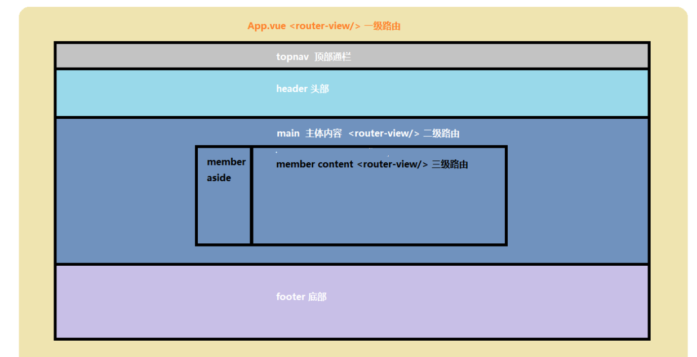
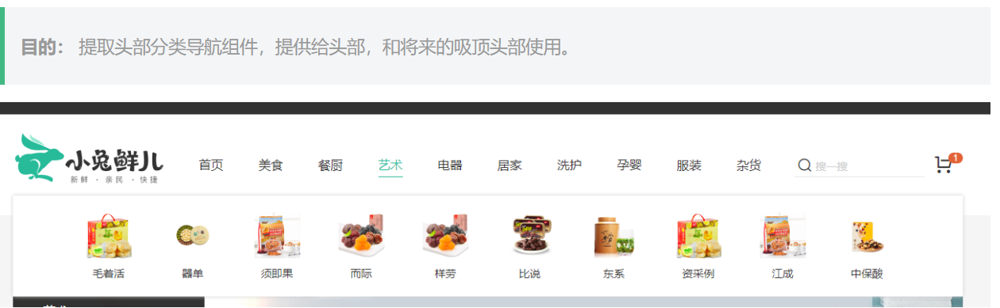
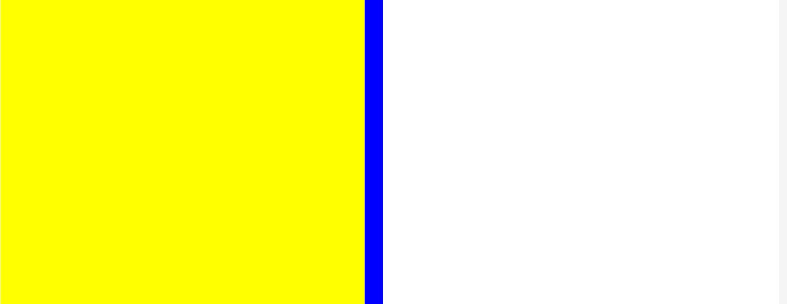
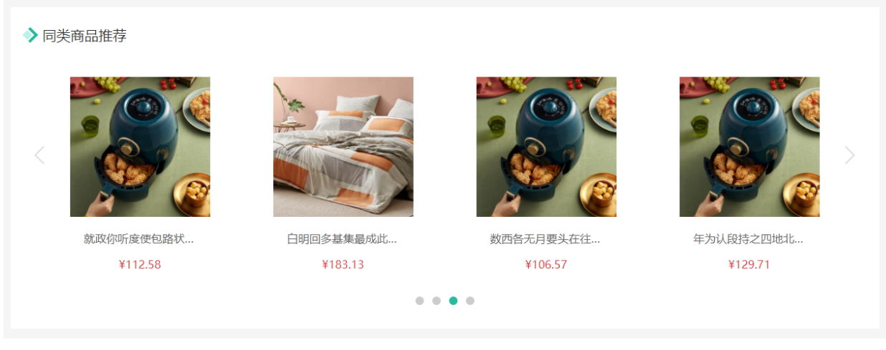

# 一、项目准备阶段


## 一、创建项目

1、第一步：打开命令行窗口。

2、第二步：执行创建项目命令行

vue create vue3_project(项目可以任意，最好是英文)

3、自定义创建


4、第四步：选中vue-router,vuex,css Pre-processors选项


5、选择vue3.0版本，选择hash模式的路由，

选择less作为预处理器，选择 standard 标准代码风格；（这里就不配图了）

6、选择 standard 标准代码风格，保存代码校验代码风格，代码提交时候校验代码风格，依赖插件或者工具的配置文件分文件保存


7、是否记录以上操作，选择否，最后等待安装即可。

## 二、目录调整

大致步骤：

- 删除无用代码和文件
- 完善项目的基础结构
- 读懂默认生成的代码


## 三、vuex基础

### 1、根模块的用法


```js
// sotre/index.js
import { createStore } from 'vuex'

export default createStore({
  state: {
    username: 'zs'
  },
  getters: {
    newName(state){
      return state.username + '!!'
    }
  },
  mutations: {
    updateName(state){
      state.username = 'ls'
    }
  },
  actions: {
    updateName(ctx) {
      setTimeout(() => {
        ctx.commit('updateName')
      }, 1000);
    }
  },
  modules: {
  }
})

```

App.vue

```vue
<template>
  <div>
    APP
    <p>{{ $store.state.username }}</p>

    <p>{{ $store.getters['newName'] }}</p>

    <button @click="mutationsFn">mutationsFn</button>
  </div>
</template>

<script >
import { useStore } from "vuex";
import { useRouter } from "vue-router";
export default {
  name: "App",
  setup() {
    // 使用vuex仓库
    const store = useStore();
    console.log(store.state.username);
    console.log(store.getters.newName);
    // console.log(store);
    // const router = useRouter()
    // console.log(router);
    const mutationsFn=() => {
      //store.commit('updateName')
      // 调用根模块actions函数
      store.dispatch('updateName')
    }
    return {mutationsFn}
  },
};
</script>

```

### 2、modules (分模块)

- 存在两种情况
  - 默认的模块，`state` 区分模块，其他 `getters` `mutations` `actions` 都在全局。
  - 带命名空间 `namespaced: true` 的模块，所有功能区分模块，更高封装度和复用。

```js

import { createStore } from 'vuex'

const moduleA = {
  state: {
    username: 'moduleA'
  },
  getters: {
    newName(state) {
      return state.username + '11'
    }
  },
  mutations: {
    updateName(state) {
      state.username = 'moduleAAAA'
    }
  }
}

// B模块
const moduleB = {
  namespaced: true,
  state: {
    username: 'moduleB'
  },
  getters: {
    newName(state) {
      return state.username + '11'
    }
  },
  mutations: {
    updateName(state) {
      state.username = 'moduleBBBB'
    }
  },
  actions: {
    updateName(ctx) {
      setTimeout(() => {
        ctx.commit('updateName')
      }, 1000);
    }
  }
}

export default createStore({
  modules: {
    moduleA,
    moduleB
  }
})

```

```vue
<template>
  <div>
    APP
    <!--使用A模块的state数据-->
    <p>{{ $store.state.moduleA.username }}</p>
    <!--使用A模块的getters数据-->
    <p>{{ $store.getters.newName }}</p>
    <!--使用B模块的state数据-->
    <p>{{ $store.state.moduleB.username }}</p>
     <!--使用B模块的getters数据  B模块用到了命名空间-->
    <p>{{ $store.getters['moduleB/newName'] }}</p>

    <button @click="mutationsFn">mutationsFn</button>
    <button @click="actionsFn">actionsFn</button>
  </div>
</template>

<script >
import { useStore } from "vuex";
export default {
  name: "App",
  setup() {
    const store = useStore()

    const mutationsFn =() => {
      store.commit("moduleB/updateName")
    }
    const actionsFn=()=> {
      store.dispatch('moduleB/updateName')
    }
    return {
      mutationsFn,
      actionsFn
    }
  },
};
</script>

```

## 四、本地项目托管到Gitee

1、先在Gitee上创建一个仓库（点击右上角的+ 号就能创建）


**注意把第一个对勾去掉**


如果是第一次将代码推送到码云，在新建仓库之前先去申请SSH公钥，具体教程网上都有，申请之后执行Git全局配置，（之前有推送代码到码云，第二次就不需要初始化配置了）

2、在项目路径下cmd进入命令窗口，执行如下命令

```sh
git add .

git commit - m "add files"

git status(这里如果显示 working tree clean 就代表工作区已经干净)


```


执行红色框框里面的代码即可（在项目路径下）


## 五、vuex持久化

**目的：让在vuex中管理的状态数据同时存储在本地。可免去自己存储的环节。**

- 在开发的过程中，像用户信息（名字，头像，token）需要vuex中存储且需要本地存储。
- 再例如，购物车如果需要未登录状态下也支持，如果管理在vuex中页需要存储在本地。
- 我们需要category模块存储分类信息，但是分类信息不需要持久化。

1）首先：我们需要安装一个vuex的插件`vuex-persistedstate`来支持vuex的状态持久化。

```sh
npm i vuex-persistedstate
```

这个时候可能会报错


大致看了报错信息，应该是eslint-config-standard和eslint-plugin-vue版本不对应导致的，我们可以选择下面2种解决方案

```sh
npm i vuex-persistedstate --legacy-peer-deps

```

```sh
npm i vuex-persistedstate --force
```

2）然后：在`src/store` 文件夹下新建 `modules` 文件，在 `modules` 下新建 `user.js` 和 `cart.js`

**src/store/modules/user.js**

```js
// 用户模块
export default {
  namespaced: true,
  state () {
    return {
      // 用户信息
      profile: {
        id: '',
        avatar: '',
        nickname: '',
        account: '',
        mobile: '',
        token: ''
      }
    }
  },
  mutations: {
    // 修改用户信息，payload就是用户信息对象
    setUser (state, payload) {
      state.profile = payload
    }
  }
}

```

src/store/modules/cart.js:

```js
// 购物车状态
export default {
  namespaced: true,
  state: () => {
    return {
      list: []
    }
  }
}

```

src/store/modules/category.js

```js
// 分类模块
export default {
  namespaced: true,
  state () {
    return {
      // 分类信息集合
      list: []
    }
  }
}

```

3）继续：在 `src/store/index.js` 中导入 user cart 模块，并使用vuex-persistedstate插件来进行持久化

```js

import { createStore } from 'vuex'
import createPersistedState from 'vuex-persistedstate'
import user from './modules/user'
import cart from './modules/cart'
import category from './modules/category'

export default createStore({
  modules: {
    user,
    cart,
    category
  },
   // 配置插件
   plugins: [
    // 默认存储在localStorage
    createPersistedState({
      // 本地存储名字
      key: 'erabbit-client-pc-124-store',
      // 指定需要存储的模块
      paths: ['user', 'cart']
    })
  ]
})

```

**测试：** user模块定义一个mutation在main.js去调用下，观察浏览器application的localStorage下数据。

```vue
<template>
  <div>
    APP
       <!-- 修改数据，测试是否持久化 -->
     {{ $store.state.user.profile.account }}
    <button @click="$store.commit('user/setUser',{account: 'zhangsang'})">设置用户信息</button>
  </div>
</template>

<script >

export default {
  name: 'App',
  setup () {
    
  }
}
</script>
```


无论刷新多少次数据都是持久化

## 六、请求工具

- 安装 axios

```sh
npm i axios
```

或者

```sh
npm i axios --force
```

- 新建 `src/utils/request.js` 模块，代码如下

```js
import axios from 'axios'

import store from '@/store'

import router from '@/router'
// 导出基准地址，原因：其他地方不是通过axios发请求的地方用上基准地址
export const baseURL = 'http://pcapi-xiaotuxian-front-devtest.itheima.net/'

const instance = axios.create({
    baseURL,
    timeout: 5000
})

instance.interceptors.request.use(config => {
     // 拦截业务逻辑
  // 进行请求配置的修改
  // 如果本地又token就在头部携带
  // 1. 获取用户信息对象
  const {profile} = store.state.user
  // 判断是否有token
  if(profile.token) {
    console.log(profile.token);
    config.headers.Authorization =  `Bearer ${profile.token}`
  }
  return config
},err=> {
    return Promise.reject(err)
})

// res => res.data  取出data数据，将来调用接口的时候直接拿到的就是后台的数据
instance.interceptors.response.use(res => res.data, err => {
    // 401 状态码，进入该函数
    if (err.response && err.response.status === 401) {
      // 1. 清空无效用户信息
      // 2. 跳转到登录页
      // 3. 跳转需要传参（当前路由地址）给登录页码
      store.commit('user/setUser', {})
      // 当前路由地址
      // 组件里头：`/user?a=10` $route.path === /user  $route.fullPath === /user?a=10
      // js模块中：router.currentRoute.value.fullPath 就是当前路由地址，router.currentRoute 是ref响应式数据
      const fullPath = encodeURIComponent(router.currentRoute.value.fullPath)
      // encodeURIComponent 转换uri编码，防止解析地址出问题
      router.push('/login?redirectUrl=' + fullPath)
    }
    return Promise.reject(err)
  })

  export default (url,method,submitData) => {
    return instance({
        url,
        method,
        [method.toLowerCase() === 'get' ? 'params' : 'data']: submitData
    })
  }

```


```vue
<template>
  <div>
    APP
       <!-- 修改数据，测试是否持久化 -->
    <button @click="fn">测试request工具函数</button>
  </div>
</template>

<script >
import request from '@/utils/request'
export default {
  name: 'App',
  setup () {
    const fn=() => {
      request('/member/profile','get',{a:10})
    }
    return {fn}
  }
}
</script>

```

## 七、路由设计




# 二、首页模块

## 一、首页路由与组件

在这之前先创建一个git分支

```sh
git checkout -b home

git branch

```

App.vue

```vue
<template>
  <!-- 一级路由 -->
  <router-view></router-view>
</template>
```

- 一级路由布局容器 `src/views/Layout.vue`

```vue
<template>
  <nav>顶部通栏</nav>
  <header>头部</header>
  <main>
    <!-- 二级路由 -->
    <router-view></router-view>
  </main>
  <footer>底部</footer>
</template>

<script>
export default {
  name: 'xtx-layout'
}
</script>

<style scoped lang='less'></style>
```

- 二级路由首页组件 `src/views/home/index.vue`

```vue
<template>
  <div class='container'>
    首页
  </div>
</template>

<script>
export default {
  name: 'HomePage'
}
</script>

<style scoped lang='less'>
</style>
```

- 配置路由规则 `src/router/index.js`

  ```js
  import { createRouter, createWebHashHistory } from 'vue-router'
  
  +const Layout = () => import('@/views/Layout')
  +const Home = () => import('@/views/home/index')
  
  const routes = [
  +  {
  +    path: '/',
  +    component: Layout,
  +    children: [
  +      { path: '/', component: Home }
  +    ]
  +  }
  ]
  
  const router = createRouter({
    history: createWebHashHistory(),
    routes
  })
  
  export default router
  
  ```

## 二、首页-less的自动化导入

**1）准备要用的变量和混入代码**

- 变量 `src/assets/styles/variables.less`

```less
// 主题
@xtxColor:#27BA9B;
// 辅助
@helpColor:#E26237;
// 成功
@sucColor:#1DC779;
// 警告
@warnColor:#FFB302;
// 价格
@priceColor:#CF4444;
```

- 混入 `src/assets/styles/mixins.less`

```less
// 鼠标经过上移阴影动画
.hoverShadow () {
  transition: all .5s;
  &:hover {
    transform: translate3d(0,-3px,0);
    box-shadow: 0 3px 8px rgba(0,0,0,0.2);
  }
}
```

- 混入 `src/assets/styles/mixins.less`

```less
// 鼠标经过上移阴影动画
.hoverShadow () {
  transition: all .5s;
  &:hover {
    transform: translate3d(0,-3px,0);
    box-shadow: 0 3px 8px rgba(0,0,0,0.2);
  }
}
```

less混入就是，申明一段css代码（选择器包裹的代码）或者函数，在其他css选择器调用，可复用包裹的代码

**测试：**src/assets/styles/mixins.less

```less
// less混入

// 演示混入
.abc {
  width: 100px;
  height: 100px;
}

.box {
  .abc();
}

.abc2 (@width) {
  width: @width;
  height: @width;
}

.box2 {
  .abc2(300px);
}

// 鼠标经过上移阴影动画
.hoverShadow () {
  transition: all .5s;
  &:hover {
    transform: translate3d(0,-3px,0);
    box-shadow: 0 3px 8px rgba(0,0,0,0.2);
  }
}
```

home/index.vue

```vue
<template>
  <div class='container'>
    首页
  </div>
</template>

<script>
export default {
  name: 'HomePage'
}
</script>

<style scoped lang='less'>
@import '../../assets/styles/mixins.less';
</style>

```

**效果：**（看红色框内容即可）


**2）完成自动注入公用变量和混入**

**遇到问题：** 每次使用公用的变量和mixin的时候需要单独引入到文件中。

**解决方法：** 使用vuecli的style-resoures-loader插件来完成自动注入到每个less文件或者vue组件中style标签中。

- 在当前项目下执行一下命令`vue add style-resources-loader`，添加一个vuecli的插件


- 安装完毕后会在`vue.config.js`中自动添加配置，如下：

```js
const { defineConfig } = require('@vue/cli-service')
module.exports = defineConfig({
  transpileDependencies: true,
  lintOnSave: false,

  pluginOptions: {
    'style-resources-loader': {
      preProcessor: 'less',
      patterns: []
    }
  }
})

```

我们可以到npm官网看下对应的配置


**测试：**

```vue
<template>
  <div class='container'>
    首页
  </div>
</template>

<script>
export default {
  name: 'HomePage'
}
</script>

<style scoped lang='less'>
.container {
  .hoverShadow();
  color: @xtxColor;
}
</style>

```

**效果：**


## 三、首页-样式重置与公用

- 重置样式

执行 `npm i normalize.css` 安装重置样式的包，然后在 `main.js` 导入 `normalize.css` 即可。

- 公用样式

新建文件 `src/assets/styles/common.less` 在该文件写入常用的样式，然后在 `main.js` 导入即可。

```
src/assets/styles/common.less
```

```less
// 自己的重置样式代码，公用样式代码
* {
  box-sizing: border-box;
 }
 
 html {
   height: 100%;
   font-size: 14px;
 }
 body {
   height: 100%;
   color: #333;
   min-width: 1240px;
   font: 1em/1.4 'Microsoft Yahei', 'PingFang SC', 'Avenir', 'Segoe UI', 'Hiragino Sans GB', 'STHeiti', 'Microsoft Sans Serif', 'WenQuanYi Micro Hei', sans-serif
 }
 
 ul,
 h1,
 h3,
 h4,
 p,
 dl,
 dd {
   padding: 0;
   margin: 0;
 }
 
 a {
   text-decoration: none;
   color: #333;
   outline: none;
 }
 
 i {
   font-style: normal;
 }
 
 input[type="text"],
 input[type="search"],
 input[type="password"], 
 input[type="checkbox"]{
   padding: 0;
   outline: none;
   border: none;
   -webkit-appearance: none;
   &::placeholder{
     color: #ccc;
   }
 }
 
 img {
   max-width: 100%;
   max-height: 100%;
   vertical-align: middle;
 }
 
 ul {
   list-style: none;
 }
 
 #app {
   background: #f5f5f5;
   user-select: none;
 }
 
 .container {
   width: 1240px;
   margin: 0 auto;
   position: relative;
 }
 
 .ellipsis {
   white-space: nowrap;
   text-overflow: ellipsis;
   overflow: hidden;
 }
 
 .ellipsis-2 {
   word-break: break-all;
   text-overflow: ellipsis;
   display: -webkit-box;
   -webkit-box-orient: vertical;
   -webkit-line-clamp: 2;
   overflow: hidden;
 }
 
 .fl {
   float: left;
 }
 
 .fr {
   float: right;
 }
 
 .clearfix:after {
   content: ".";
   display: block;
   visibility: hidden;
   height: 0;
   line-height: 0;
   clear: both;
 }


 // 离开时候淡出动画
.fade{
  &-leave {
    &-active {
      position: absolute;
      width: 100%;
      transition: opacity .5s .2s;
      z-index: 1;
    }
    &-to {
      opacity: 0;
    }
  }
}

// 面包屑动画
// 进入：右侧 20px的位移 透明度0  做过渡0.5s   本来位置 没有位移 透明度1
// 离开：本来位置 没有位移 透明度1  做过渡0.5s  右侧 20px的位移 透明度0
.fade-right-enter-from,
.fade-right-leave-to{
  transform: translateX(20px);
  opacity: 0;
}
.fade-right-enter-active,
.fade-right-leave-active{
  transition: all 0.5s;
}
.fade-right-enter-to,
.fade-right-leave-from{
  transform: none;
  opacity: 1;
}

// 表单
.xtx-form {
  padding: 50px 0;
  &-item {
    display: flex;
    align-items: center;
    width: 700px;
    margin: 0 auto;
    padding-bottom: 25px;
    .label {
      width: 180px;
      padding-right: 10px;
      text-align: right;
      color: #999;
      ~ .field {
        margin-left: 0;
      }
    }
    .field {
      width: 320px;
      height: 50px;
      position: relative;
      margin-left: 190px;
      .icon {
        position: absolute;
        left: 0;
        top: 0;
        width: 40px;
        height: 50px;
        text-align: center;
        line-height: 50px;
        color: #999;
        ~ .input {
          padding-left: 40px;
        }
      }
      .input{
        border: 1px solid #e4e4e4;
        width: 320px;
        height: 50px;
        line-height: 50px;
        padding: 0 10px;
        &.err {
          border-color: @priceColor;
        }
        &:focus,&:active{
          border-color: @xtxColor;
        }
      }
    }
    .error {
      width: 180px;
      padding-left: 10px;
      color: @priceColor;
    }
  }
  .submit {
    width: 320px;
    height: 50px;
    border-radius: 4px;
    background: @xtxColor;
    height: 50px;
    line-height: 50px;
    text-align: center;
    font-size: 16px;
    color: #fff;
    display: block;
    margin: 0 auto;
  }
}
```

**src/main.js**

```js
import { createApp } from 'vue'
import App from './App.vue'
import router from './router'
import store from './store'

//
import 'normalize.css'

import '@/assets/styles/common.less'
createApp(App).use(store).use(router).mount('#app')

```

## 四、顶部通栏布局

1）在 `public/index.html` 引入字体图标文件。

```html
<!DOCTYPE html>
<html lang="">
  <head>
    <meta charset="utf-8">
    <meta http-equiv="X-UA-Compatible" content="IE=edge">
    <meta name="viewport" content="width=device-width,initial-scale=1.0">
    <link rel="icon" href="<%= BASE_URL %>favicon.ico">
    <link rel="stylesheet" href="//at.alicdn.com/t/font_2143783_iq6z4ey5vu.css">
    <title><%= htmlWebpackPlugin.options.title %></title>
  </head>
  <body>
    <noscript>
      <strong>We're sorry but <%= htmlWebpackPlugin.options.title %> doesn't work properly without JavaScript enabled. Please enable it to continue.</strong>
    </noscript>
    <div id="app"></div>
    <!-- built files will be auto injected -->
  </body>
</html>

```

2）在 `src/components/` 下新建 `app-navbar.vue` 组件，基础布局如下：

```vue
<template>
  <nav class="app-topnav">
    <div class="container">
      <ul>
        <template v-if="profile.token">
          <li><RouterLink to="/member"><i class="iconfont icon-user"></i>{{profile.account}}</RouterLink></li>
          <li><a @click="logout()" href="javascript:;">退出登录</a></li>
        </template>
        <template v-else>
          <li><a href="javascript:;">请先登录</a></li>
        <li><a href="javascript:;">免费注册</a></li>
        </template>
        <li><a href="javascript:;">我的订单</a></li>
        <li><a href="javascript:;">会员中心</a></li>
        <li><a href="javascript:;">帮助中心</a></li>
        <li><a href="javascript:;">关于我们</a></li>
        <li>
          <a href="javascript:;"><i class="iconfont icon-phone"></i>手机版</a>
        </li>
      </ul>
    </div>
  </nav>
</template>


<script>
import { computed } from 'vue'
import { useStore } from 'vuex'
export default {
  name: 'AppTopnav',
  setup() {
    const store = useStore()
    // 使用vuex中的state需要计算属性
    const profile = computed(()=> {
      return store.state.user.profile
    })

    return {profile}
  }
};
</script>

<style lang="less">
.app-topnav {
  background: #333;
  ul {
    display: flex;
    height: 53px;
    justify-content: flex-end;
    align-items: center;
    li {
      a {
        padding: 0 15px;
        color: #cdcdcd;
        line-height: 1;
        display: inline-block;
        i {
          font-size: 14px;
          margin-right: 2px;
        }
        &:hover {
          color: @xtxColor;
        }
      }
      ~ li {
        a {
          border-left: 2px solid #666;
        }
      }
    }
  }
}
// ~ 选择器作用：选择当前选择器后的所有元素
</style>

```

3）在 `src/views/Layout.vue` 中导入使用。

```vue
<template>
 <AppNavbar/>
  <header>头部</header>
  <main>
    <!-- 二级路由 -->
    <router-view></router-view>
  </main>
  <footer>底部</footer>
</template>

<script>
import AppNavbar from '@/components/app-navbar.vue'
export default {
  name: 'xtx-layout',
  components: {
     AppNavbar
  }
}
</script>

<style scoped lang='less'>

</style>

```

4）根据当前的登录状态显示 用户名和退出登录

```js
<script>
import { useStore } from 'vuex'
import { computed } from 'vue'    
export default {
  name: 'AppTopnav',
  setup () {
      const store = useStore()
      const profile = computed(()=>{
          return store.state.user.profile
      })
      return { profile }
  }
}
</script>
```

```vue
   <template v-if="profile.token">
          <li><a href="javascript:;"><i class="iconfont icon-user"></i>{{profile.account}}</a></li>
          <li><a href="javascript:;">退出登录</a></li>
        </template>
        <template v-else>
          <li><a href="javascript:;">请先登录</a></li>
          <li><a href="javascript:;">免费注册</a></li>
        </template>
```

## 五、首页-头部布局

- 1）在 `src/components/` 下新建 `app-header.vue` 组件，基础布局如下：

```vue
<template>
  <header class='app-header'>
    <div class="container">
      <h1 class="logo"><RouterLink to="/">小兔鲜</RouterLink></h1>
      <ul class="navs">
        <li class="home"><RouterLink to="/">首页</RouterLink></li>
        <li><a href="#">美食</a></li>
        <li><a href="#">餐厨</a></li>
        <li><a href="#">艺术</a></li>
        <li><a href="#">电器</a></li>
        <li><a href="#">居家</a></li>
        <li><a href="#">洗护</a></li>
        <li><a href="#">孕婴</a></li>
        <li><a href="#">服装</a></li>
        <li><a href="#">杂货</a></li>
      </ul>
      <div class="search">
        <i class="iconfont icon-search"></i>
        <input type="text" placeholder="搜一搜">
      </div>
      <div class="cart">
        <a class="curr" href="#">
          <i class="iconfont icon-cart"></i><em>2</em>
        </a>
      </div>
    </div>
  </header>
</template>

<script>
export default {
  name: 'AppHeader'
}
</script>

<style lang="less">
.app-header {
  background: #fff;
  .container {
    display: flex;
    align-items: center;
  }
  .logo {
    width: 200px;
    a {
      display: block;
      height: 132px;
      width: 100%;
      text-indent: -9999px;
      background: url(../assets/images/logo.png) no-repeat center 18px / contain;
    }
  }
  .navs{
    width: 820px;
    display: flex;
    justify-content: space-around;
    padding-left: 40px;
    li {
      margin-right: 40px;
      width: 38px;
      text-align: center;
      a{
        font-size: 16px;
        line-height: 32px;
        height: 32px;
        display: inline-block;
      }
      &:hover {
        a {
          color: @xtxColor;
          border-bottom: 1px solid @sucColor;
        }
      }
    }
  }
  .search {
    width: 170px;
    height: 32px;
    position: relative;
    border-bottom: 1px solid #e7e7e7;
    line-height: 32px;
    .icon-search {
      font-size: 18px;
      margin-left: 5px;
    }
    input {
      width: 140px;
      padding-left: 5px;
      color: #666;
    }
  }
  .cart {
    width: 50px;
    .curr {
      height: 32px;
      line-height: 32px;
      text-align: center;
      position: relative;
      display: block;
      .icon-cart{
        font-size: 22px;
      }
        em {
        font-style: normal;
        position: absolute;
        right: 0;
        top: 0;
        padding: 1px 6px;
        line-height: 1;
        background: @helpColor;
        color: #fff;
        font-size: 12px;
        border-radius: 10px;
        font-family: Arial;
      }
    }
  }
}

</style>

```

- 2）在 `src/views/Layout.vue` 中导入使用。

```vue
<template>
 <AppNavbar/>
 <AppHeader/>
  <main>
    <!-- 二级路由 -->
    <router-view></router-view>
  </main>
  <footer>底部</footer>
</template>

<script>
import AppNavbar from '@/components/app-navbar.vue'
import AppHeader from '@/components/app-header.vue'
export default {
  name: 'xtx-layout',
  components: {
     AppNavbar,
     AppHeader
  }
}
</script>

<style scoped lang='less'>

</style>

```

## 六、首页-底部布局


首先，在 `src/components/` 下新建 `app-footer.vue` 组件，基础布局如下：

```vue
<template>
  <footer class="app-footer">
    <!-- 联系我们 -->
    <div class="contact">
      <div class="container">
        <dl>
          <dt>客户服务</dt>
          <dd><i class="iconfont icon-kefu"></i> 在线客服</dd>
          <dd><i class="iconfont icon-question"></i> 问题反馈</dd>
        </dl>
        <dl>
          <dt>关注我们</dt>
          <dd><i class="iconfont icon-weixin"></i> 公众号</dd>
          <dd><i class="iconfont icon-weibo"></i> 微博</dd>
        </dl>
        <dl>
          <dt>下载APP</dt>
          <dd class="qrcode"></dd>
          <dd class="download">
            <span>扫描二维码</span>
            <span>立马下载APP</span>
            <a href="javascript:;">下载页面</a>
          </dd>
        </dl>
        <dl>
          <dt>服务热线</dt>
          <dd class="hotline">
            400-0000-000 <small>周一至周日 8:00-18:00</small>
          </dd>
        </dl>
      </div>
    </div>
     <!-- 其它 -->
     <div class="extra">
      <div class="container">
        <div class="slogan">
          <a href="javascript:;">
            <i class="iconfont icon-footer01"></i>
            <span>价格亲民</span>
          </a>
          <a href="javascript:;">
            <i class="iconfont icon-footer02"></i>
            <span>物流快捷</span>
          </a>
          <a href="javascript:;">
            <i class="iconfont icon-footer03"></i>
            <span>品质新鲜</span>
          </a>
        </div>
        <!-- 版权信息 -->
        <div class="copyright">
          <p>
            <a href="javascript:;">关于我们</a>
            <a href="javascript:;">帮助中心</a>
            <a href="javascript:;">售后服务</a>
            <a href="javascript:;">配送与验收</a>
            <a href="javascript:;">商务合作</a>
            <a href="javascript:;">搜索推荐</a>
            <a href="javascript:;">友情链接</a>
          </p>
          <p>CopyRight © 小兔鲜儿</p>
        </div>
      </div>
    </div>
  </footer>
</template>
<script>
export default {
  name: "AppFooter",
};
</script>
<style lang="less">
.app-footer {
  overflow: hidden;
  background-color: #f5f5f5;
  padding-top: 20px;
  .contact {
  .container {
    padding: 60px 0 40px 25px;
    display: flex;
  }
  dl {
    height: 190px;
    text-align: center;
    padding: 0 72px;
    border-right: 1px solid #f2f2f2;
    color: #999;
    &:first-child {
      padding-left: 0;
    }
    &:last-child {
      border-right: none;
      padding-right: 0;
    }
  }
  dt {
      line-height: 1;
      font-size: 18px;
    }
    dd {
      margin: 36px 12px 0 0;
      float: left;
      width: 92px;
      height: 92px;
      padding-top: 10px;
      border: 1px solid #ededed;
      .iconfont {
        font-size: 36px;
        display: block;
        color: #666;
      }
      &:hover {
        .iconfont {
          color: @xtxColor;
        }
      }
      &:last-child {
        margin-right: 0;
      }
    }
    .qrcode {
      width: 92px;
      height: 92px;
      padding: 7px;
      border: 1px solid #ededed;
    }
    .download {
      padding-top: 5px;
      font-size: 14px;
      border: none;
      width:  auto;
      height: auto;
      span {
        display: block;
      }
      a {
        display: block;
        line-height: 1;
        padding: 10px 25px;
        margin-top: 5px;
        color: #fff;
        border-radius: 2px;
        background-color: @xtxColor;
      }
    }
    .hotline {
      padding-top: 20px;
      font-size: 22px;
      color: #666;
      border: none;
      width: auto;
      height: auto;
      small {
        display: block;
        font-size: 15px;
        color: #999;
      }
    }
  }
  .extra {
    background-color: #333;
  }
  .slogan {

    height: 178px;
    line-height: 58px;
    padding: 60px 100px;
    border-bottom: 1px solid #434343;
    display: flex;
    justify-content: space-between;

    a {
      height: 58px;
      line-height: 58px;
      color: #fff;
      font-size: 28px;
      i {
        font-size: 50px;
        vertical-align: middle;
        margin-right: 10px;
        font-weight: 100;
      }
      span {
        vertical-align: middle;
        text-shadow: 0 0 1px #333;
      }
    }
  }
  .copyright {
    height: 170px;
    padding-top: 40px;
    text-align: center;
    color: #999;
    font-size: 15px;
    p {
      line-height: 1;
      margin-bottom: 20px;
    }
    a{
      color: #999;
      padding: 0 10px;
      border-right: 1px solid #999;
      &:last-child {
        border-right: none;
      }
    }
  }
}
</style>

```

最后，在 `src/views/Layout.vue` 中导入使用。

```vue
<template>
 <AppNavbar/>
 <AppHeader/>
  <main>
    <!-- 二级路由 -->
    <router-view></router-view>
  </main>
  <AppFooter/>
</template>

<script>
import AppNavbar from '@/components/app-navbar.vue'
import AppHeader from '@/components/app-header.vue'
import AppFooter from '@/components/app-footer.vue'
export default {
  name: 'xtx-layout',
  components: {
     AppNavbar,
     AppHeader,
     AppFooter
  }
}
</script>

<style scoped lang='less'>

</style>

```

## 七、首页-头部分类导航组件



第一步：提取头部导航为一个组件

- 新建`src/components/app-header-nav.vue` 组件。

```vue
<template>
  <ul class="app-header-nav">
    <li class="home"><RouterLink to="/">首页</RouterLink></li>
    <li><a href="#">美食</a></li>
    <li><a href="#">餐厨</a></li>
    <li><a href="#">艺术</a></li>
    <li><a href="#">电器</a></li>
    <li><a href="#">居家</a></li>
    <li><a href="#">洗护</a></li>
    <li><a href="#">孕婴</a></li>
    <li><a href="#">服装</a></li>
    <li><a href="#">杂货</a></li>
  </ul>
</template>

<script>
export default {
  name: 'AppHeaderNav'
}
</script>

<style scoped lang='less'>
.app-header-nav {
  width: 820px;
  display: flex;
  padding-left: 40px;
  position: relative;
  z-index: 998;
  li {
    margin-right: 40px;
    width: 38px;
    text-align: center;
    a {
      font-size: 16px;
      line-height: 32px;
      height: 32px;
      display: inline-block;
    }
    &:hover {
      a {
        color: @xtxColor;
        border-bottom: 1px solid @xtxColor;
      }
    }
  }
}
</style>
```


- 在 `app-header.vue` 中使用组件。注意，删除结构和样式。

```vue
<template>
  <header class='app-header'>
    <div class="container">
      <h1 class="logo"><RouterLink to="/">小兔鲜</RouterLink></h1>
+      <AppHeaderNav />
      <div class="search">
        <i class="iconfont icon-search"></i>
        <input type="text" placeholder="搜一搜">
      </div>
      <div class="cart">
        <a class="curr" href="#">
          <i class="iconfont icon-cart"></i><em>2</em>
        </a>
      </div>
    </div>
  </header>
</template>

<script>
+import AppHeaderNav from './app-header-nav'
export default {
  name: 'AppHeader',
+  components: { AppHeaderNav }
}
</script>
```

第二步：完善子级分类布局 `src/components/app-header-nav.vue`

```vue
<template>
  <ul class="app-header-nav">
    <li class="home"><RouterLink to="/">首页</RouterLink></li>
    <li>
      <a href="#">美食</a>
      <div class="layer">
        <ul>
          <li v-for="i in 10" :key="i">
            <a href="#">
              
              <p>果干</p>
            </a>
          </li>
        </ul>
      </div>
    </li>
    <li><a href="#">餐厨</a></li>
    <li><a href="#">艺术</a></li>
    <li><a href="#">电器</a></li>
    <li><a href="#">居家</a></li>
    <li><a href="#">洗护</a></li>
    <li><a href="#">孕婴</a></li>
    <li><a href="#">服装</a></li>
    <li><a href="#">杂货</a></li>
  </ul>
</template>

<script>
export default {
  name: 'AppHeaderNav'
}
</script>

<style scoped lang='less'>
.app-header-nav {
  width: 820px;
  display: flex;
  justify-content: space-around;
  padding-left: 40px;
  position: relative; 
  z-index: 998;  
  > li {
    margin-right: 40px;
    width: 38px;
    text-align: center; 
    > a {
      font-size: 16px;
      line-height: 32px;
      height: 32px;
      display: inline-block;
    }
    &:hover {  
      > a {
        color: @xtxColor;
        border-bottom: 1px solid @xtxColor;
      }
      > .layer {
        height: 132px;
        opacity: 1;
      }
    }
  }
}
.layer {
  width: 1240px;
  background-color: #fff;
  position: absolute;
  left: -200px;
  top: 56px;
  height: 0;
  overflow: hidden;
  opacity: 0;
  box-shadow: 0 0 5px #ccc;
  transition: all .2s .1s;
  ul {
    display: flex;
    flex-wrap: wrap;
    padding: 0 70px;
    align-items: center;
    height: 132px;
    li {
      width: 110px;
      text-align: center;
      img {
        width: 60px;
        height: 60px;
      }
      p {
        padding-top: 10px;
      }
      &:hover {
        p {
          color: @xtxColor;
        }
      }
    }
  }
}
</style>
```

## 八、首页-头部分类导航渲染

**基本步骤：**

- 定义一个常量数据和后台保持一致（约定好9大分类），这样不请求后台就能展示一级分类，不至于白屏。
- 在API目录定义接口函数
- 在vuex中的category模块，基于常量数据定义state数据，定义修改分类列表函数，定义获取数据函数。
- 在Layout组件获取调用actions获取数据，在头部导航组件渲染即可。

- 定义九个分类常量数据 `src/api/constants.js`

```js
// 顶级分类
export const topCategory = [
  '居家',
  '美食',
  '服饰',
  '母婴',
  '个护',
  '严选',
  '数码',
  '运动',
  '杂货'
]

```

- 定义API函数 `src/api/category.js`

```js
// 定义首页需要的接口函数
import request from '@/utils/request'

/**
 * 获取首页头部分类数据
 */
export const findAllCategory = () => {
  return request('/home/category/head', 'get')
}
```

- vuex在category模块，来存储分类数据，提供修改和获取的函数。 `src/store/modules/category.js`

```js
// 分类模块
// 存储的分类数据
import {topCategory } from '@/api/constants'
import { findAllCategory } from '@/api/category'
export default {
  namespaced: true,
  state () {
    return {
      // 分类信息集合，依赖topCategory重新设置，保证初始化就要数据，不至于白屏
      list: topCategory.map(item => ({ name: item }))
    }
  },
  mutations: {
    setList(state,payload){
      state.list = payload
    }
  },

  actions: {
    async getList({commit}) {
      const {result} = await findAllCategory()
      console.log(result);
       // 获取数据成功，提交mutations进行数据修改
      commit('setList',result)
    }
  }
}

```

- 获取数据在 `src/views/Layout.vue` 初始化的时候

```vue
<template>
 <AppNavbar/>
 <AppHeader/>
  <main>
    <!-- 二级路由 -->
    <router-view></router-view>
  </main>
  <AppFooter/>
</template>

<script>
import AppNavbar from '@/components/app-navbar.vue'
import AppHeader from '@/components/app-header.vue'
import AppFooter from '@/components/app-footer.vue'
import { useStore } from 'vuex'
export default {
  name: 'xtx-layout',
  components: {
     AppNavbar,
     AppHeader,
     AppFooter
  },
  setup() {
    const store = useStore()
    store.dispatch('category/getList')
  }
}
</script>

<style scoped lang='less'>

</style>

```

- 在头部导航组件渲染 `src/compotents/app-header-nav.vue`

```vue
<template>
  <ul class="app-header-nav">
    <li class="home"><RouterLink to="/">首页</RouterLink></li>
    <li v-for="item in list" :key="item.id"> <RouterLink to="/">{{item.name}}</RouterLink>
      <div class="layer">
        <ul>
          <li v-for="sub in item.children" :key="sub.id">
            <RouterLink to="/">
              
              <p>{{sub.name}}</p>
            </RouterLink>
          </li>
        </ul>
      </div>
    </li>

  </ul>
</template>

<script>
import { computed } from 'vue'
import { useStore } from 'vuex'
export default {
  name: 'AppHeaderNav',
  setup() {
    const store = useStore()
    const list = computed(()=>{
      return store.state.category.list
    })
    
    return {list}
  }
}
</script>

<style scoped lang='less'>
.app-header-nav {
  width: 820px;
  display: flex;
  justify-content: space-around;
  padding-left: 40px;
  position: relative;
  z-index: 998;
  >li {
    margin-right: 40px;
    width: 38px;
    text-align: center;
    a {
      font-size: 16px;
      line-height: 32px;
      height: 32px;
      display: inline-block;
    }
    &:hover {
      a {
        color: @xtxColor;
        border-bottom: 1px solid @xtxColor;
      }
    }
  }
}
.layer {
  width: 1240px;
  background-color: #fff;
  position: absolute;
  left: -200px;
  top: 56px;
  opacity: 0;
  height: 0;
  overflow: hidden;
  box-shadow: 0 0 5px #ccc;
  transition: all .2s .1s;
  ul {
    display: flex;
    flex-wrap: wrap;
    padding: 0 70px;
    align-items: center;
    height: 132px;
    li {
      width: 110px;
      text-align: center;
      img {
        width: 60px;
        height: 60px;
      }
      p {
        padding-top: 10px;
      }
      &:hover {
        p {
          color: @xtxColor;
        }
      }
    }
  }
}
</style>

```

打印的数据：


vue中state的数据：


## 九、首页-头部分类导航交互

> 目的：实现点击的时候跳转，且能关闭二级分类弹窗。

描述：由于是单页面路由跳转不会刷新页面，css的hover一直触发无法关闭分类弹窗。

大致逻辑：

- 配置路由组件支持分类跳转
- 鼠标进入一级分类展示对应的二级分类弹窗
- 点击一级分类，二级分类，隐藏二级分类弹窗
- 离开一级分类，二级分类，隐藏二级分类弹窗
- **1) 配置路由和组件实现跳转**
  - 配置路由规则 `src/router/index.js`

```js
import { createRouter, createWebHashHistory } from 'vue-router'
import TopCategory  from '@/views/category'
import SubCategory from '@/views/category/sub'
const Layout = () => import('@/views/Layout')
const Home = () => import('@/views/home/index')
const routes = [
  {
    path: '/',
    component: Layout,
    children: [
      {
        path: '/', component: Home
      },
      {
        path: '/category/:id', component: TopCategory
      },
      {
        path: '/category/sub/:id', component: SubCategory
      }
    ]
  }

]
// vue2.0 new VueRouter({}) 创建路由实例
// vue3.0 createRouter({}) 创建路由实例
const router = createRouter({
  history: createWebHashHistory(),
  routes
})

export default router

```


**2）跳转后关闭二级分类弹窗**

- 给每一个一级分类定义控制显示隐藏的数据，`open` 布尔类型，通过open设置类名控制显示隐藏。
- 当进入一级分类的时候，将open改为true
- 当离开一级分类的时候，将open改为false
- 点击一级分类，二级分类，将open改为false

在vuex种给一级分类加open数据，并且添加了 show hide vuex的mutations函数修改 open

 `src/store/modules/category.js`

```js
// 分类模块
// 存储的分类数据
import { topCategory } from "@/api/constants";
import { findAllCategory } from "@/api/category";
export default {
  namespaced: true,
  state() {
    return {
      // 分类信息集合，依赖topCategory重新设置，保证初始化就要数据，不至于白屏
      list: topCategory.map((item) => ({ name: item })),
    };
  },
  mutations: {
    setList(state, payload) {
      state.list = payload;
    },
    show(state, id) {
      //find() 方法返回数组中满足提供的测试函数的第一个元素的值。否则返回
      const currCategory = state.list.find(item => item.id === id)
      currCategory.open = true
    },
    // 修改当前一级分类下的open数据为false
    hide (state, id) {
      const currCategory = state.list.find(item => item.id === id)
      currCategory.open = false
    }
  },

  actions: {
    async getList({ commit }) {
      const { result } = await findAllCategory();
      console.log(result);
      result.forEach(item => {
        item.open = false;
      });
      // 获取数据成功，提交mutations进行数据修改
      commit("setList", result);
    },
  },
};

```

再 头部导航组件 实现显示和隐藏 `src/components/app-header-nav.vue`


```vue
<template>
  <ul class="app-header-nav">
    <li class="home"><RouterLink to="/">首页</RouterLink></li>
    <li v-for="item in list" :key="item.id" @mousemove="show(item)" @mouseleave="hide(item)">
      <RouterLink @click="hide(item)" :to="`/category/${item.id}`">{{item.name}}</RouterLink>
      <div class="layer" :class="{open:item.open}">
        <ul>
          <li v-for="sub in item.children" :key="sub.id">
            <RouterLink  @click="hide(item)" :to="`/category/sub/${sub.id}`">
              
              <p>{{sub.name}}</p>
            </RouterLink>
          </li>
        </ul>
      </div>
    </li>
  </ul>
</template>
```

改CSS代码


## 十、首页-吸顶头部组件-传统实现

> **目的：** 完成吸顶头部

大致步骤：

- 准备吸顶组件基础布局
- 页面滚动到78px以上，显示吸顶组件。

- 新建 `src/components/app-header-sticky.vue` 组件完成布局

```vue
<template>
  <div class="app-header-sticky">
    <div class="container">
      <RouterLink class="logo" to="/" />
      <AppHeaderNav />
      <div class="right">
        <RouterLink to="/" >品牌</RouterLink>
        <RouterLink to="/" >专题</RouterLink>
      </div>
    </div>
  </div>
</template>

<script>
import AppHeaderNav from './app-header-nav'
export default {
  name: 'AppHeaderSticky',
  components: { AppHeaderNav }
}
</script>

<style scoped lang='less'>
.app-header-sticky {
  width: 100%;
  height: 80px;
  position: fixed;
  left: 0;
  top: 0;
  z-index: 999;
  background-color: #fff;
  border-bottom: 1px solid #e4e4e4;
  .container {
    display: flex;
    align-items: center;
  }
  .logo {
    width: 200px;
    height: 80px;
    background: url(../assets/images/logo.png) no-repeat  right 2px;
    background-size: 160px auto;
  }
  .right {
    width: 220px;
    display: flex;
    text-align: center;
    padding-left: 40px;
    border-left: 2px solid @xtxColor;
    a {
      width: 38px;
      margin-right: 40px;
      font-size: 16px;
      line-height: 1;
      &:hover {
        color: @xtxColor;
      }
    }
  }
}
</style>
```

- 在滚动到78px完成显示效果，需要滑出动画。

第一步：默认移出顶部且完全透明，定义一个类回到默认吸顶位置完全显示。

```css
.app-header-sticky {
  width: 100%;
  height: 80px;
  position: fixed;
  left: 0;
  top: 0;
  z-index: 999;
  background-color: #fff;
  border-bottom: 1px solid #e4e4e4;
  transform: translateY(-100%);
  opacity: 0;
  &.show {
    transition: all 0.3s linear;
    transform: none;
    opacity: 1;
  }
```

第二步：组件渲染后，监听滚动距离超过78px隐藏

```js
<script>
import AppHeaderNav from './app-header-nav'
import { onMounted,ref } from 'vue';

export default {
  name: 'AppHeaderSticky',
  components: { AppHeaderNav },
  setup(){
    const y = ref(0)
    onMounted(()=> {
      window.onscroll=()=>{
        const scrollTop = document.documentElement.scrollTop
        y.value = scrollTop
      }
    })
    return {y}
  }
}
</script>
```

```vue
 <div class="app-header-sticky" :class="{show:y>=78}">
```

第三步：v-show使用，为了吸顶头部的内容不遮住不吸顶的头部。

```vue
 <div class="container" v-show="y>=78">
```

##  十一、首页-吸顶头部组件-组合API

> **目的：** 体验基于组合API的@vueuse/core工具库

安装：@vueuse/core 包，它封装了常见的一些交互逻辑。

```sh
npm i @vueuse/core@4.9.0
因为版本问题报错就按下面的下载
npm i @vueuse/core --force
```

使用：`src/components/app-header-sticky.vue` 组件

```js
<script>
import AppHeaderNav from './app-header-nav'
//import { onMounted,ref } from 'vue';
import {userWindowScroll} from '@vueuse/core'
export default {
  name: 'AppHeaderSticky',
  components: { AppHeaderNav },
  setup(){
    const {y}  = userWindowScroll()
    // const y = ref(0)
    // onMounted(()=> {
    //   window.onscroll=()=>{
    //     const scrollTop = document.documentElement.scrollTop
    //     y.value = scrollTop
    //   }
    // })
    return {y}
  }
}
</script>
```

**总结：**

- useWindowScroll() 是@vueuse/core提供的api可返回当前页面滚动时候蜷曲的距离。x横向，y纵向
- vue3.0组合API提供了更多逻辑代码封装的能力。@vueuse/core 基于组合API封装好用的工具函数。


## 十二、首页主体-左侧分类-结构渲染

> **目的：** 实现首页主体内容-左侧分类

大致步骤：

- 准备左侧分类组件和基础布局
- 从vuex中拿出9个分类数据，且值需要两个子分类，但是左侧是10个，需要补充一个品牌数据。
  - 使用计算属性完成上面逻辑
- 渲染组件

- 准备组件：`src/views/home/components/home-category.vue`

```vue
<template>
  <div class='home-category'>
    <ul class="menu">
      <li v-for="i in 10" :key="i">
        <RouterLink to="/">居家</RouterLink>
        <RouterLink to="/">洗漱</RouterLink>
        <RouterLink to="/">清洁</RouterLink>  
      </li>
    </ul>
  </div>
</template>

<script>
export default {
  name: 'HomeCategory'
}
</script>

<style scoped lang='less'></style>
```

- 预览组件：`src/views/home/index.vue`

- 从vuex中拿出分类，取出子分类中的前两项。给一级分类追加一项品牌，进行渲染。

```vue
<template>
  <div class='home-category'>
    <ul class="menu">
      <li v-for="item in menuList" :key="item.id">
        <RouterLink :to="`/category/${item.id}`">{{item.name}}</RouterLink>
        <template v-if="item.children">
          <RouterLink
            v-for="sub in item.children"
            :key="sub.id"
            :to="`/category/sub/${sub.id}`">
            {{sub.name}}
          </RouterLink>
        </template>
      </li>
    </ul>
  </div>
</template>

<script>
import { useStore } from 'vuex'
import { reactive, computed } from 'vue'   
export default {
  name: 'HomeCategory',
  // 1. 获取vuex的一级分类，并且只需要两个二级分类
  // 2. 需要在组件内部，定义一个品牌数据
  // 3. 根据vuex的分类数据和组件中定义品牌数据，得到左侧分类完整数据(9分类+1品牌)数组
  // 4. 进行渲染即可
  setup () {  
    const brand = reactive({
      id: 'brand',
      name: '品牌',
      children: [{ id: 'brand-chilren', name: '品牌推荐' }]
    })
    
    const store = useStore()
    const menuList = computed(() {
      const list = store.state.category.list.map(item => {
        return {
          id: item.id,
          name: item.name,
          // 防止初始化没有children的时候调用slice函数报错
          children: item.children && item.children.slice(0, 2)
        }
      })
      list.push(brand)
      return list
    })
    return { menuList }
  }
}
</script>

<style scoped lang='less'>
.home-category {
  width: 250px;
  height: 500px;
  background: rgba(0,0,0,0.8);
  position: relative;
  z-index: 99;
  .menu {
    li {
      padding-left: 40px;
      height: 50px;
      line-height: 50px;
      &:hover {
        background: @xtxColor;
      }
      a {
        margin-right: 4px;
        color: #fff;
        &:first-child {
          font-size: 16px;
        }
      }
    }
  }
}
</style>
```


## 十三、首页主体-左侧分类-弹层展示

> **目的：** 实现首页主体内容-左侧分类-鼠标进入弹出

大致步骤：

- 准备布局
- 得到数据
  - 鼠标经过记录ID
  - 通过ID得到分类推荐商品，使用计算属性
  - 完成渲染

1. 准备布局：`src/views/home/components/home-category.vue`

```vue
  <!-- 弹层 -->
    <div class="layer">
      <h4>分类推荐 <small>根据您的购买或浏览记录推荐</small></h4>
      <ul>
        <li v-for="i in 9" :key="i">
          <RouterLink to="/">
            
            <div class="info">
              <p class="name ellipsis-2">【定金购】严选零食大礼包（12件）</p>
              <p class="desc ellipsis">超值组合装，满足馋嘴欲</p>
              <p class="price"><i>¥</i>100.00</p>
            </div>
          </RouterLink>
        </li>
      </ul>
    </div>
```

```less
  .layer {
    width: 990px;
    height: 500px;
    background: rgba(255,255,255,0.8);
    position: absolute;
    left: 250px;
    top: 0;
    display: none;
    padding: 0 15px;
    h4 {
      font-size: 20px;
      font-weight: normal;
      line-height: 80px;
      small {
        font-size: 16px;
        color: #666;
      }
    }
    ul {
      display: flex;
      flex-wrap: wrap;
      li {
        width: 310px;
        height: 120px;
        margin-right: 15px;
        margin-bottom: 15px;
        border: 1px solid #eee;
        border-radius: 4px;
        background: #fff;
        &:nth-child(3n) {
          margin-right: 0;
        }
        a {
          display: flex;
          width: 100%;
          height: 100%;
          align-items: center;
          padding: 10px;
          &:hover {
            background: #e3f9f4;
          }
          img {
              width: 95px;
              height: 95px;
          }
          .info {
            padding-left: 10px;
            line-height: 24px;
		    width: 190px;
            .name {
              font-size: 16px;
              color: #666;
            }
            .desc {
              color: #999;
            }
            .price {
              font-size: 22px;
              color: @priceColor;
              i {
                font-size: 16px;
              }
            }
          }
        }
      }
    }
  }
  &:hover {
    .layer {
      display: block;
    }
  }
```

2、渲染逻辑：`src/views/home/components/home-category.vue`

- 定义一个数据记录当前鼠标经过分类的ID，使用计算属性得到当前的分类推荐商品数据

- 渲染模版

```vue
<template>
  <div class="home-category">
    <ul class="menu">
      <li v-for="item in menuList" :key="item.id" @mouseenter="categoryId=item.id">
        <RouterLink :to="`/category/${item.id}}`">{{ item.name }}</RouterLink>
        <template v-if="item.children">
          <RouterLink
            v-for="sub in item.children"
            :key="sub.id"
            :to="`/category/sub/${sub.id}`"
            >{{ sub.name }}</RouterLink
          >
        </template>
      </li>
    </ul>
    <!-- 弹层 -->
    <div class="layer">
      <h4>分类推荐 <small>根据您的购买或浏览记录推荐</small></h4>
      <ul v-if="currCategory && currCategory.goods && currCategory.goods.length">
        <li v-for="item in currCategory.goods" :key="item.id">
          <RouterLink to="/">
            
            <div class="info">
              <p class="name ellipsis-2">{{ item.name }}</p>
              <p class="desc ellipsis">{{ item.desc }}</p>
              <p class="price"><i>¥</i>{{ item.price }}</p>
            </div>
          </RouterLink>
        </li>
      </ul>
    </div>
  </div>
</template>

<script>
import { useStore } from "vuex";
import { ref } from "vue";
import { reactive, computed } from "vue";


export default {
  name: "HomeCategory",
  // 1. 获取vuex的一级分类，并且只需要两个二级分类
  // 2. 需要在组件内部，定义一个品牌数据
  // 3. 根据vuex的分类数据和组件中定义品牌数据，得到左侧分类完整数据(9分类+1品牌)数组
  // 4. 进行渲染即可
  setup() {
    const brand = reactive({
      id: "brand",
      name: "品牌",
      children: [{ id: "brand-chilren", name: "品牌推荐" }],
    });

    const store = useStore();
    const menuList = computed(() => {
      const list = store.state.category.list.map((item) => {
        return {
          id: item.id,
          name: item.name,
          children: item.children && item.children.slice(0, 2),
          goods: item.goods
        };
      });
      list.push(brand);
      return list;
    });
    const categoryId = ref(null)
    console.log(menuList.value);
    const currCategory = computed(()=>{
      return menuList.value.find(item => item.id === categoryId.value)
    })
    return { menuList,categoryId,currCategory };

  },
};
</script>

<style scoped lang='less'>
.home-category {
  width: 250px;
  height: 500px;
  background: rgba(0, 0, 0, 0.8);
  position: relative;
  z-index: 99;
  .menu {
    li {
      padding-left: 40px;
      height: 50px;
      line-height: 50px;
      &:hover {
        background: @xtxColor;
      }
      a {
        margin-right: 4px;
        color: #fff;
        &:first-child {
          font-size: 16px;
        }
      }
    }
  }
  .layer {
    width: 990px;
    height: 500px;
    background: rgba(255,255,255,0.8);
    left: 250px;
    top: 0;
    position: absolute;
    padding: 0 15px;
    display: none;
    h4 {
      font-size: 20px;
      font-weight: normal;
      line-height: 80px;
      small {
        font-size: 16px;
        color: #666;
      }
    }
    ul {
      display: flex;
      flex-wrap: wrap;
      li {
        width: 310px;
        height: 120px;
        margin-right: 15px;
        margin-bottom: 15px;
        border: 1px solid #eee;
        border-radius: 4px;
        background: #fff;
        &:nth-child(3n) {
          margin-right: 0;
        }
        a {
          width: 100%;
          height: 100%;
          display: flex;
          align-items: center;
          padding: 10px;
          &:hover {
            background: #e3f9f4;
          }
          img {
              width: 95px;
              height: 95px;
          }
          .info {
            padding-left: 10px;
            line-height: 24px;
            width: 190px;
            .name {
              font-size: 16px;
              color: #666;
            }
            .desc {
              color: #999;
            }
            .price {
              font-size: 22px;
              color: @priceColor;
              i {
                font-size: 16px;
              }
            }
          }
        }
      }
    }
  }
  &:hover {
    .layer {
      display: block;
    }
  }
}
</style>

```

## 十四、首页主体-左侧分类-处理品牌

> **目的：** 品牌展示特殊，需要额外获取数据和额外的布局。

大致步骤：

- 定义API接口，在 `home-category.vue` 组件获取数据。
- 完成基础布局，根据数据进行渲染。
- 处理左侧分类激活显示。

落地代码：

1. 定义API接口，在 `home-category.vue` 组件获取数据。

src/api/home.js

```js
// 提供首页相关API函数
import request from '@/utils/request'
/**
 * 获取品牌
 * @param {Integer} limit - 品牌个数
 * @returns Promise
 */
export const findBrand = (limit = 6) => {
  return request('/home/brand', 'get', {limit})
}


```

src/views/home/components/home-category.vue

```js
+import { findBrand } from '@/api/home.js'
// ... 省略代码
setup () {
    // ... 省略代码
+    findBrand().then(data=>{
+        brand.brands = data.result
+    })
    return { menuList, categoryId, currCategory }
}
```


```js
    const brand = reactive({
      id: 'brand',
      name: '品牌',
      children: [{ id: 'brand-children', name: '品牌推荐' }],
+      brands: []
    })
```

进行渲染：`src/views/home/components/home-category.vue`

- 布局样式

```vue
<ul>
  <li class="brand" v-for="i in 6" :key="i">
    <RouterLink to="/">
      
      <div class="info">
        <p class="place"><i class="iconfont icon-dingwei"></i>北京</p>
        <p class="name ellipsis">DW</p>
        <p class="desc ellipsis-2">DW品牌闪购</p>
      </div>
    </RouterLink>
  </li>
</ul>
```

```less
 li.brand {
        height: 180px;
        a {
          align-items: flex-start;
          img {
            width: 120px;
            height: 160px;
          }
          .info {
            p {
              margin-top: 8px;
            }
            .place {
              color: #999;
            }
          }
        }
      }
```

- 进行渲染

```vue
 <!-- 品牌 -->
       <ul v-if="currCategory && currCategory.brands">
        <li class="brand" v-for="brand in currCategory.brands" :key="brand.id">
          <RouterLink to="/">
            
            <div class="info">
              <p class="place"><i class="iconfont icon-dingwei"></i>{{brand.place}}</p>
              <p class="name ellipsis">{{brand.name}}</p>
              <p class="desc ellipsis-2">{{brand.desc}}</p>
            </div>
          </RouterLink>
        </li>
      </ul>
```


处理左侧分类激活显示 `src/views/home/components/home-category.vue`

- 激活类active，绑定类，移除类


整个组件完整代码

```vue
<template>
  <div class="home-category" @mouseleave="categoryId=null">
    <ul class="menu">
      <li :class="{active:categoryId === item.id}"
        v-for="item in menuList"
        :key="item.id"
        @mouseenter="categoryId = item.id"
      >
        <RouterLink :to="`/category/${item.id}}`">{{ item.name }}</RouterLink>
        <template v-if="item.children">
          <RouterLink
            v-for="sub in item.children"
            :key="sub.id"
            :to="`/category/sub/${sub.id}`"
            >{{ sub.name }}</RouterLink
          >
        </template>
      </li>
    </ul>
    <!-- 弹层 -->
    <div class="layer">
      <h4>{{currCategory&& currCategory.id === 'brand'? '品牌':'分类'}}推荐 <small>根据您的购买或浏览记录推荐</small></h4>
      <ul
        v-if="currCategory && currCategory.goods && currCategory.goods.length"
      >
        <li v-for="item in currCategory.goods" :key="item.id">
          <RouterLink to="/">
            
            <div class="info">
              <p class="name ellipsis-2">{{ item.name }}</p>
              <p class="desc ellipsis">{{ item.desc }}</p>
              <p class="price"><i>¥</i>{{ item.price }}</p>
            </div>
          </RouterLink>
        </li>
      </ul>
       <!-- 品牌 -->
       <ul v-if="currCategory && currCategory.brands">
        <li class="brand" v-for="brand in currCategory.brands" :key="brand.id">
          <RouterLink to="/">
            
            <div class="info">
              <p class="place"><i class="iconfont icon-dingwei"></i>{{brand.place}}</p>
              <p class="name ellipsis">{{brand.name}}</p>
              <p class="desc ellipsis-2">{{brand.desc}}</p>
            </div>
          </RouterLink>
        </li>
      </ul>
    </div>


  </div>
</template>

<script>
import { useStore } from "vuex";
import { ref } from "vue";
import { reactive, computed } from "vue";
import { findBrand } from "@/api/home.js";

export default {
  name: "HomeCategory",
  // 1. 获取vuex的一级分类，并且只需要两个二级分类
  // 2. 需要在组件内部，定义一个品牌数据
  // 3. 根据vuex的分类数据和组件中定义品牌数据，得到左侧分类完整数据(9分类+1品牌)数组
  // 4. 进行渲染即可
  setup() {
    const brand = reactive({
      id: "brand",
      name: "品牌",
      children: [{ id: "brand-chilren", name: "品牌推荐" }],
      brands: [],
    });

    const store = useStore();
    const menuList = computed(() => {
      const list = store.state.category.list.map((item) => {
        return {
          id: item.id,
          name: item.name,
          children: item.children && item.children.slice(0, 2),
          goods: item.goods,
        };
      });
      list.push(brand);
      return list;
    });
    const categoryId = ref(null);
    console.log(menuList.value);
    const currCategory = computed(() => {
      return menuList.value.find((item) => item.id === categoryId.value);
    });
    console.log(findBrand());
    findBrand().then((data) => {
      brand.brands = data.result;
    });
    return { menuList, categoryId, currCategory };
  },
};
</script>

<style scoped lang='less'>
.home-category {
  width: 250px;
  height: 500px;
  background: rgba(0, 0, 0, 0.8);
  position: relative;
  z-index: 99;
  .menu {
    li {
      padding-left: 40px;
      height: 50px;
      line-height: 50px;
      &:hover,&.active {
        background: @xtxColor;
      }
      a {
        margin-right: 4px;
        color: #fff;
        &:first-child {
          font-size: 16px;
        }
      }
    }
  }
  .layer {
    width: 990px;
    height: 500px;
    background: rgba(255, 255, 255, 0.8);
    left: 250px;
    top: 0;
    position: absolute;
    padding: 0 15px;
    display: none;
    h4 {
      font-size: 20px;
      font-weight: normal;
      line-height: 80px;
      small {
        font-size: 16px;
        color: #666;
      }
    }
    ul {
      display: flex;
      flex-wrap: wrap;
      li {
        width: 310px;
        height: 120px;
        margin-right: 15px;
        margin-bottom: 15px;
        border: 1px solid #eee;
        border-radius: 4px;
        background: #fff;
        &:nth-child(3n) {
          margin-right: 0;
        }
        a {
          width: 100%;
          height: 100%;
          display: flex;
          align-items: center;
          padding: 10px;
          &:hover {
            background: #e3f9f4;
          }
          img {
            width: 95px;
            height: 95px;
          }
          .info {
            padding-left: 10px;
            line-height: 24px;
            width: 190px;
            .name {
              font-size: 16px;
              color: #666;
            }
            .desc {
              color: #999;
            }
            .price {
              font-size: 22px;
              color: @priceColor;
              i {
                font-size: 16px;
              }
            }
          }
        }
      }
      // 品牌
      li.brand {
        height: 180px;
        a {
          align-items: flex-start;
          img {
            width: 120px;
            height: 160px;
          }
          .info {
            p {
              margin-top: 8px;
            }
            .place {
              color: #999;
            }
          }
        }
      }
    }

  }
  &:hover {
    .layer {
      display: block;
    }
  }

}
</style>

```


## 十五、首页主体-左侧分类-骨架效果

> **目的：** 为了在加载的过程中等待效果更好，封装一个骨架屏组件。

大致步骤：

- 需要一个组件，做占位使用。这个占位组件有个专业术语：骨架屏组件。
  - 暴露一些属性：高，宽，背景，是否有闪动画。
- 这是一个公用组件，需要全局注册，将来这样的组件建议再vue插件中定义。
- 使用组件完成左侧分类骨架效果。

1. 封装组件：`src/components/library/xtx-skeleton.vue`

```vue
<template>
  <div class="xtx-skeleton" :style="{width,height}" :class="{shan:animated}">
    <!-- 1 盒子-->
    <div class="block" :style="{backgroundColor:bg}"></div>
    <!-- 2 闪效果 xtx-skeleton 伪元素 --->
  </div>
</template>
<script>
export default {
  name: 'XtxSkeleton',
  // 使用的时候需要动态设置 高度，宽度，背景颜色，是否闪下
  props: {
    bg: {
      type: String,
      default: '#efefef'
    },
    width: {
      type: String,
      default: '100px'
    },
    height: {
      type: String,
      default: '100px'
    },
    animated: {
      type: Boolean,
      default: false
    }
  }
}
</script>
<style scoped lang="less">
.xtx-skeleton {
  display: inline-block;
  position: relative;
  overflow: hidden;
  vertical-align: middle;
  .block {
    width: 100%;
    height: 100%;
    border-radius: 2px;
  }
}
.shan {
  &::after {
    content: "";
    position: absolute;
    animation: shan 1.5s ease 0s infinite;
    top: 0;
    width: 50%;
    height: 100%;
    background: linear-gradient(
      to left,
      rgba(255, 255, 255, 0) 0,
      rgba(255, 255, 255, 0.3) 50%,
      rgba(255, 255, 255, 0) 100%
    );
    transform: skewX(-45deg);
  }
}
@keyframes shan {
  0% {
    left: -100%;
  }
  100% {
    left: 120%;
  }
}
</style>
```

2.封装插件：插件定义 `src/componets/library/index.js` 使用插件 `src/main.js`

```js
// 扩展vue原有的功能：全局组件，自定义指令，挂载原型方法，注意：没有全局过滤器。
// 这就是插件
// vue2.0插件写法要素：导出一个对象，有install函数，默认传入了Vue构造函数，Vue基础之上扩展
// vue3.0插件写法要素：导出一个对象，有install函数，默认传入了app应用实例，app基础之上扩展

import XtxSkeleton from './xtx-skeleton.vue'

export default {
  install(app) {
     // 在app上进行扩展，app提供 component directive 函数
    // 如果要挂载原型 app.config.globalProperties 方式
    app.component(XtxSkeleton.name,XtxSkeleton)
   
  }
}

```

```js
// 省略前面代码

import ui from './components/library'

createApp(App).use(store).use(router).use(ui).mount('#app')

```

3.最后使用组件完成左侧分类骨架效果： `src/views/home/components/home-category.vue`

```less
// 骨架动画
.xtx-skeleton {
  animation: fade 1s linear infinite alternate;
}
@keyframes fade {
  from {
    opacity: 0.2;
  }
  to {
    opacity: 1;
  }
}
```


## 十六、首页主体-轮播图-基础布局

> **目的：** 封装小兔鲜轮播图组件，第一步：基础结构的使用。

**大致步骤：**

- 准备xtx-carousel组件基础布局，全局注册
- 准备home-banner组件，使用xtx-carousel组件，再首页注册使用。
- 深度作用xtx-carousel组件的默认样式

- 轮播图基础结构 `src/components/library/xtx-carousel.vue`

```vue
<template>
  <div class='xtx-carousel'>
    <ul class="carousel-body">
      <li class="carousel-item fade">
        <RouterLink to="/">
          
        </RouterLink>
      </li>
    </ul>
    <a href="javascript:;" class="carousel-btn prev"><i class="iconfont icon-angle-left"></i></a>
    <a href="javascript:;" class="carousel-btn next"><i class="iconfont icon-angle-right"></i></a>
    <div class="carousel-indicator">
      <span v-for="i in 5" :key="i"></span>
    </div>
  </div>
</template>

<script>
export default {
  name: 'XtxCarousel'
}
</script>
<style scoped lang="less">
.xtx-carousel{
  width: 100%;
  height: 100%;
  min-width: 300px;
  min-height: 150px;
  position: relative;
  .carousel{
    &-body {
      width: 100%;
      height: 100%;
    }
    &-item {
      width: 100%;
      height: 100%;
      position: absolute;
      left: 0;
      top: 0;
      opacity: 0;
      transition: opacity 0.5s linear;
      &.fade {
        opacity: 1;
        z-index: 1;
      }
      img {
        width: 100%;
        height: 100%;
      }
    }
    &-indicator {
      position: absolute;
      left: 0;
      bottom: 20px;
      z-index: 2;
      width: 100%;
      text-align: center;
      span {
        display: inline-block;
        width: 12px;
        height: 12px;
        background: rgba(0,0,0,0.2);
        border-radius: 50%;
        cursor: pointer;
        ~ span {
          margin-left: 12px;
        }
        &.active {
          background:  #fff;
        }
      }
    }
    &-btn {
      width: 44px;
      height: 44px;
      background: rgba(0,0,0,.2);
      color: #fff;
      border-radius: 50%;
      position: absolute;
      top: 228px;
      z-index: 2;
      text-align: center;
      line-height: 44px;
      opacity: 0;
      transition: all 0.5s;
      &.prev{
        left: 20px;
      }
      &.next{
        right: 20px;
      }
    }
  }
  &:hover {
    .carousel-btn {
      opacity: 1;
    }
  }
}
</style>
```

- 全局注册轮播图 `src/components/library/index.js`


```js
import XtxSkeleton from './xtx-skeleton.vue'
import XtxCarousel from './xtx-carousel.vue'
export default {
  install(app) {
    app.component(XtxSkeleton.name,XtxSkeleton)
    app.component(XtxCarousel.name, XtxCarousel)
  }
}

```

- 首页广告组件基础结构 `src/views/home/components/home-banner.vue`

```vue
<template>
  <div class="home-banner">
    <XtxCarousel />
  </div>
</template>
<script>
export default {
  name: 'HomeBanner'
}
</script>
<style scoped lang="less">
.home-banner {
  width: 1240px;
  height: 500px;
  position: absolute;
  left: 0;
  top: 0;
  z-index: 98
}
</style>
```

- 首页使用广告组件（步骤就是引入和注册组件，然后在应用）

首页组件：src/view/home/index.vue


- 覆盖轮播图组件样式 `src/views/home/components/home-banner.vue`

```less
.xtx-carousel {
  ::v-deep .carousel-btn.prev {
    left: 270px;
  }
  ::v-deep .carousel-indicator {
    padding-left: 250px;
  }
}
```

vue样式穿透 ::v-deep的具体使用

## 十七、首页主体-轮播图-渲染结构

> **目的：** 封装小兔鲜轮播图组件，第二步：动态渲染结构。

**大致步骤：**

- 定义获取广告图API函数
- 在home-banner组件获取轮播图数据，传递给xtx-carousel组件
- 在xtx-carousel组件完成渲染

- API函数 `src/api/home.js`

```js
/**
 * 获取广告图
 * @returns Promise
 */
export const findBanner = () => {
  return request('/home/banner', 'get')
}
```

- 广告组件获取数据，传给轮播图 `src/views/home/components/home-banner.vue`

```vue
<template>
  <div class="home-banner">
    <XtxCarousel :sliders = "sliders"/>
  </div>
</template>
<script>
import {ref} from 'vue'
import {findBanner} from '@/api/home'
export default {
  name: 'HomeBanner',
  setup(){
    const sliders = ref([])
    findBanner().then(data=> {
      sliders.value = data.result
    })
    console.log(findBanner());
    return{sliders}
  }
}
</script>
<style scoped lang="less">
.home-banner {
  width: 1240px;
  height: 500px;
  position: absolute;
  left: 0;
  top: 0;
  z-index: 98
}
</style>

```

我们打印看下findBanner（），发现是Promise,所以我们这里直接调用.then()方法，then方法可以接收2个参数，其中一个是成功的回调，

findBanner().then(data=> {
      sliders.value = data.result
    })

所以我们直接data.result就能拿到数据，这里的result要打开控制台看下对应的字段名


- 完成轮播图结构渲染 `src/components/library/xtx-carousel.vue`

```vue
<template>
  <div class='xtx-carousel'>
    <ul class="carousel-body">
      <li class="carousel-item " v-for="(item,i) in sliders" :key="i" :class="{fade:index === i}">
        <RouterLink to="/">
          
        </RouterLink>
      </li>
    </ul>
    <a href="javascript:;" class="carousel-btn prev"><i class="iconfont icon-angle-left"></i></a>
    <a href="javascript:;" class="carousel-btn next"><i class="iconfont icon-angle-right"></i></a>
    <div class="carousel-indicator">
      <span v-for="(item,i) in sliders" :key="i" :class="{active: index === i}"></span>
    </div>
  </div>
</template>

<script>
import { ref } from 'vue'
export default {
  name: 'XtxCarousel',
  props:{
    sliders: {
      tyoe: Array,
      default:()=>[]
    }
  },
  setup(){
    const index = ref(0)
    return{index}
  }
}
</script>
// 下面代码省略
```


## 十八、首页主体-轮播图-逻辑封装

> **目的：** 封装小兔鲜轮播图组件，第三步：逻辑功能实现。

**大致步骤：**

- 自动播放，暴露自动轮播属性，设置了就自动轮播
- 如果有自动播放，鼠标进入离开，暂停，开启
- 指示器切换，上一张，下一张
- 销毁组件，清理定时器

```
src/components/library/xtx-carousel.vue
```

- 自动轮播实现

src/components/library/xtx-carousel.vue

**步骤**：

通过前面:class="{ fade: index === i }，fade是控制显示那张图片的，

我们可以结合定时器和index的值变化来实现自动轮播，index的值变化轮播图就会变化；

当然这里的判断条件是根据silders.length，超过重新置零即可，这里的sliders(轮播图数据)（由于xtx-carousel是home-bannner的子组件）所以可以用props传递数据

```js
// 自动轮播逻辑
let timer = null;

    const autoPlayFn = () => {
      clearInterval(timer);
      timer = setInterval(() => {
        index.value++;
        if (index.value >= props.sliders.length) {
          index.value = 0;
        }
      }, props.duration);
    };
```

 这里多传了一个数据，主要是用来控制*是否自动轮播*

```vue
 <XtxCarousel auto-play :sliders="sliders" />
```

```vue
 props: {
    sliders: {
      tyoe: Array,
      default: () => [],
    },
    // 是否自动轮播
    autoPlay: {
      type: Boolean,
      default: false
    },
    // 间隔时长
    duration: {
      type: Number,
      default: 2500,
    },
```

剩下的自动播放，鼠标进入离开，暂停，开启，指示器切换上一张，下一张的逻辑都比较简单，直接列出完整代码（style的代码省略，前面已有），注意组件销毁时记得清除定时器

```vue
<template>
  <div class="xtx-carousel" @mouseenter="stop()" @mouseleave="start()">
    <ul class="carousel-body">
      <li
        class="carousel-item"
        v-for="(item, i) in sliders"
        :key="i"
        :class="{ fade: index === i }"
      >
        <RouterLink to="/">
          
        </RouterLink>
      </li>
    </ul>
    <a @click="toggle(-1)" href="javascript:;" class="carousel-btn prev"
      ><i class="iconfont icon-angle-left"></i
    ></a>
    <a @click="toggle(1)" href="javascript:;" class="carousel-btn next"
      ><i class="iconfont icon-angle-right"></i
    ></a>
    <div class="carousel-indicator">
      <span
        v-for="(item, i) in sliders"
        :key="i"
        :class="{ active: index === i }"
      ></span>
    </div>
  </div>
</template>

<script>
import { ref, watch,onUnmounted } from "vue";
export default {
  name: "XtxCarousel",
  props: {
    sliders: {
      tyoe: Array,
      default: () => [],
    },
    // 是否自动轮播
    autoPlay: {
      type: Boolean,
      default: false
    },
    // 间隔时长
    duration: {
      type: Number,
      default: 2500,
    },
  },
  setup(props) {
    const index = ref(0);
    console.log(props.duration, "13");
    // 自动轮播的逻辑
    let timer = null;

    const autoPlayFn = () => {
      clearInterval(timer);
      timer = setInterval(() => {
        index.value++;
        if (index.value >= props.sliders.length) {
          index.value = 0;
        }
      }, props.duration);
    };

    //autoPlayFn();
    // watch(index, (newValue,oldValue) => {
    //   console.log('index变了',newValue,oldValue);
    // }, { immediate: true });
    watch(() => props.sliders, (newVal) => {
      if (newVal.length && props.autoPlay) {
        autoPlayFn()
      }
    }, { immediate: true })

     // 2. 鼠标进入暂停  离开开启自动播放（有开启条件）
     const stop =() => {
      if(timer) clearInterval(timer)
     }
     const start =() => {
      if(props.sliders.length && props.autoPlay ) {
        autoPlayFn()
      }
     }
      // 3. 点击点点可以切换，上一张下一张
     const toggle=(step)=> {
      index.value = index.value + step
      if(index.value >= props.sliders.length) {
        index.value = 0
        return
      }
      if(index.value < 0) {
        index.value = props.sliders.length - 1
        return
      }
     }
     onUnmounted(()=> {
       clearInterval(timer)
     })
    return { index,stop,start,toggle };
  },
};
</script>


```

复习一下watch:


由于轮播图的接口有时候不能用，为了防止轮播图出现白屏，我们可以在promise失败的回调里面把数据替换成本地的数据


这样的话不论成功还是失败，首页轮播图不至于白屏


## 十九、首页主体-面板封装

> **目的：** 提取首页的公用面板进行复用

大致思路：

- 头部
  - 标题和副标题由props传入
  - 右侧内容由插槽传入
    - 查看更多使用次数多封装成全局组件
- 主体
  - 全部由插槽传入

`src/components/library/xtx-more.vue` 定义

```vue
<template>
  <RouterLink :to="path" class="xtx-more">
    <span>查看全部</span>
    <i class="iconfont icon-angle-right"></i>
  </RouterLink>
</template>

<script>
export default {
  name: 'XtxMore',
  props: {
    path: {
      type: String,
      default: '/'
    }
  }
}
</script>

<style scoped lang='less'>
.xtx-more {
  margin-bottom: 2px;
  span {
    font-size: 16px;
    vertical-align: middle;
    margin-right: 4px;
    color: #999;
  }
  i {
    font-size: 14px;
    vertical-align: middle;
    position: relative;
    top: 2px;
    color: #ccc;
  }
  &:hover {
    span,i {
      color: @xtxColor;
    }
  }
}
</style>

```

`src/components/library/index.js` 注册

```js

import XtxSkeleton from './xtx-skeleton.vue'
import XtxCarousel from './xtx-carousel.vue'
// +
import XtxMore from './xtx-more.vue'
export default {
  install (app) {
    app.component(XtxSkeleton.name, XtxSkeleton)
    app.component(XtxCarousel.name, XtxCarousel)
      //+
    app.component(XtxMore.name,XtxMore)
  }
}

```

- 定义首页需要的面板组件
- view/home/components/home-panel.vue

```vue
<template>
  <div class="home-panel">
    <div class="container">
      <div class="head">
        <h3>{{ title }}<small>{{ subTitle }}</small></h3>
        <slot name="right" />
      </div>
      <slot />
    </div>
  </div>
</template>

<script>
export default {
  name: 'HomePanel',
  props: {
    title: {
      type: String,
      default: ''
    },
    subTitle: {
      type: String,
      default: ''
    }
  }
}
</script>

<style scoped lang='less'>
.home-panel {
  background-color: #fff;
  .head {
    padding: 40px 0;
    display: flex;
    align-items: flex-end;
    h3 {
      flex: 1;
      font-size: 32px;
      font-weight: normal;
      margin-left: 6px;
      height: 35px;
      line-height: 35px;
      small {
        font-size: 16px;
        color: #999;
        margin-left: 20px;
      }
    }
  }
}
</style>

```

## 二十、首页主体-新鲜好物

> **目的：** 使用面板组件完成新鲜好物模块。

大致步骤：

- 封装API调用接口
- 进行组件基础布局
- 调用接口渲染组件

src/api/home.js

```js
export const findNew = () => {
  return request('home/new', 'get')
}
```

views/home/home-new.vue

```vue
<template>
  <div class="home-new">
    <HomePanel title="新鲜好物" sub-title="新鲜出炉 品质靠谱">
      <template #right><XtxMore path="/" /></template>
      <!-- 面板内容 -->
      <ul class="goods-list">
        <li v-for="item in goods" :key="item.id">
          <RouterLink :to="`/product/${item.id}`">
            
            <p class="name ellipsis">{{item.name}}</p>
            <p class="price">&yen;{{item.price}}</p>
          </RouterLink>
        </li>
      </ul>
    </HomePanel>
  </div>
</template>
<script>
import { ref } from 'vue'
import HomePanel from './home-panel'
import { findNew } from '@/api/home'
export default {
  name: 'HomeNew',
  components: { HomePanel },
  setup () {
    const goods = ref([])
    findNew().then(data => {
      goods.value = data.result
    })
    return { goods }
  }
}
</script>
<style scoped lang="less">
.goods-list {
  display: flex;
  justify-content: space-between;
  height: 406px;
  li {
    width: 306px;
    height: 406px;
    background: #f0f9f4;
    .hoverShadow();
    img {
      width: 306px;
      height: 306px;
    }
    p {
      font-size: 22px;
      padding: 12px 30px 0 30px;
      text-align: center;
    }
    .price {
      color: @priceColor;
    }
  }
}
</style>
```

src/views/home/index.vue

```vue
  <!-- 新鲜好物 -->
+    <HomeNew />
  </div>
</template>

<script>
import HomeCategory from './components/home-category'
import HomeBanner from './components/home-banner'
+import HomeNew from './components/home-new'
export default {
  name: 'xtx-home-page',
+  components: { HomeCategory, HomeBanner, HomeNew }
}
</script>
```

## 二十一、首页主体-人气推荐

这里逻辑和二十样，直接上代码

src/api/home.js

```js
export const findHot = () => {
  return request('home/hot', 'get')
}
```

src/views/home/components/home-hot.vue

```vue
<template>
  <HomePanel title="人气推荐" sub-title="人气爆款 不容错过">
    <ul ref="pannel" class="goods-list">
      <li v-for="item in goods" :key="item.id">
        <RouterLink to="/">
          
          <p class="name">{{item.title}}</p>
          <p class="desc">{{item.alt}}</p>
        </RouterLink>
      </li>
    </ul>
  </HomePanel>
</template>

<script>
import { ref } from 'vue'
import HomePanel from './home-panel'
import { findHot } from '@/api/home'
export default {
  name: 'HomeNew',
  components: { HomePanel },
  setup () {
    const goods = ref([])
    findHot().then(data => {
      goods.value = data.result
    })
    return { goods }
  }
}
</script>

<style scoped lang='less'>
.goods-list {
  display: flex;
  justify-content: space-between;
  height: 426px;
  li {
    width: 306px;
    height: 406px;
    .hoverShadow();
    img {
      width: 306px;
      height: 306px;
    }
    p {
      font-size: 22px;
      padding-top: 12px;
      text-align: center;
    }
    .desc {
      color: #999;
      font-size: 18px;
    }
  }
}
</style>
```

src/views/home/index.vue

```vue
<template>

  <div class="home-entry">
    <div class='container'>
       <!-- 左侧分类 -->
   <HomeCategory />
   <!-- 轮播图 -->
   <HomeBanner />
    </div>
</div>
 <!-- 新鲜好物 -->
 <HomeNew />

 <HomeHot/>
</template>

<script>

import HomeCategory from './components/home-category'
import HomeBanner from './components/home-banner'
import HomeNew from './components/home-new.vue'
import HomeHot from './components/home-hot.vue'
export default {
  name: 'HomePage',
  components: {
    HomeCategory,
    HomeBanner,
    HomeNew,
    HomeHot
  }

}

</script>

<style scoped lang='less'>
.container {
  .hoverShadow();
  color: @xtxColor;
}

</style>

```

## 二十二、首页主体-补充-vue动画

> **目标：** 知道vue中如何使用动画，知道Transition组件使用。

当vue中，显示隐藏，创建移除，一个元素或者一个组件的时候，可以通过transition实现动画。


如果元素或组件离开，完成一个淡出效果：

```vue
<transition name="fade">
  <p v-if="show">100</p>
</transition>

```

```less
.fade-leave {
    opacity: 1
}
.fade-leave-active {
    transition: all 1s;
}
.fade-leave-to {
    opcaity: 0
}
```

- 进入（显示，创建）
  - v-enter 进入前 （vue3.0 v-enter-from）
  - v-enter-active 进入中
  - v-enter-to 进入后
- 离开（隐藏，移除）
  - v-leave 进入前 （vue3.0 v-leave-from）
  - v-leave-active 进入中
  - v-leave-to 进入后

多个transition使用不同动画，可以添加nam属性，name属性的值替换v即可。

## 二十三、首页主体-面板骨架效果

> **目的：** 加上面板的骨架加载效果

定义一个骨架布局组件：

```
src/views/home/components/home-skeleton.vue
```

```vue
<template>
  <div class='home-skeleton'>
    <div class="item" v-for="i in 4" :key="i" :style="{backgroundColor:bg}">
      <XtxSkeleton bg="#e4e4e4" width="306px" height="306px" animated />
      <XtxSkeleton bg="#e4e4e4" width="160px" height="24px" animated />
      <XtxSkeleton bg="#e4e4e4" width="120px" height="24px" animated />
    </div>
  </div>
</template>

<script>
export default {
  name: 'HomeSkeleton',
  props: {
    bg: {
      type: String,
      default: '#fff'
    }
  }
}
</script>

<style scoped lang='less'>
.home-skeleton {
  width: 1240px;
  height: 406px;
  display: flex;
  justify-content: space-between;
  .item {
    width: 306px;
    .xtx-skeleton ~ .xtx-skeleton{
      display: block;
      margin: 16px auto 0;
    }
  }
}
</style>
```

在 `home-hot` `home-new` 组件分别使用

```vue
<template>
  <div class="home-hot">
    <HomePanel title="人气推荐" sub-title="人气爆款 不容错过">
      <div ref="target" style="position: relative;height: 426px;">
        <!-- 面板内容 -->
        <Transition name="fade">
          <ul v-if="list.length" class="goods-list">
            <li v-for="item in list" :key="item.id">
              <RouterLink to="/">
                
                <p class="name">{{item.title}}</p>
                <p class="desc">{{item.alt}}</p>
              </RouterLink>
            </li>
          </ul>
          <HomeSkeleton v-else />
        </Transition>
      </div>
    </HomePanel>
  </div>
</template>

<script>

import {ref} from 'vue'
import HomePanel from './home-panel.vue'
import {findHot} from '@/api/home'
import HomeSkeleton from './home-skeleton'
  //后面代码省略
```


```vue
<template>
  <div class="home-new">
    <HomePanel title="新鲜好物" sub-title="新鲜出炉 品质靠谱">
      <template #right><XtxMore path="/" /></template>
      <div ref="target" style="position: relative;height: 426px;">
        <!-- 面板内容 -->
        <Transition name="fade">
          <ul v-if="goods.length" class="goods-list">
            <li v-for="item in goods" :key="item.id">
              <RouterLink :to="`/product/${item.id}`">
                
                <p class="name ellipsis">{{item.name}}</p>
                <p class="price">&yen;{{item.price}}</p>
              </RouterLink>
            </li>
          </ul>
          <HomeSkeleton bg="#f0f9f4" v-else />
        </Transition>
      </div>
    </HomePanel>
  </div>
</template>
```

在 `src/assets/styles/common.less` 定义动画

```less
.fade{
  &-leave {
    &-active {
      position: absolute;
      width: 100%;
      transition: opacity .5s .2s;
      z-index: 1;
    }
    &-to {
      opacity: 0;
    }
  }
}
```


<Transition> 会在一个元素或组件进入和离开 DOM 时应用动画

## 二十四、首页主体-组件数据懒加载

> **目的：** 实现当组件进入可视区域在加载数据。

我们可以使用 `@vueuse/core` 中的 `useIntersectionObserver` 来实现监听进入可视区域行为，但是必须配合vue3.0的组合API的方式才能实现。

**大致步骤：**

- 理解 `useIntersectionObserver` 的使用，各个参数的含义
- 改造 home-new 组件成为数据懒加载，掌握 `useIntersectionObserver` 函数的用法
- 封装 `useLazyData` 函数，作为数据懒加载公用函数
- 把 `home-new` 和 `home-hot` 改造成懒加载方式

先分析下这个`useIntersectionObserver` 函数

```js
// stop 是停止观察是否进入或移出可视区域的行为    
const { stop } = useIntersectionObserver(
  // target 是观察的目标dom容器，必须是dom容器，而且是vue3.0方式绑定的dom对象
  target,
  // isIntersecting 是否进入可视区域，true是进入 false是移出
  // observerElement 被观察的dom
  ([{ isIntersecting }], observerElement) => {
    // 在此处可根据isIntersecting来判断，然后做业务
  },
)
```

1. 开始改造 `home-new` 组件：`rc/views/home/components/home-new.vue`

- 进入可视区后获取数据

  ```vue
  <template>
    <div class="home-new">
      <HomePanel title="新鲜好物" sub-title="新鲜出炉 品质靠谱">
        <template #right><XtxMore path="/" /></template>
        <div ref="target" style="position: relative; height: 426px">
          <!-- 面板内容 -->
          <Transition name="fade">
            <ul v-if="goods.length" class="goods-list">
              <li v-for="item in goods" :key="item.id">
                <RouterLink :to="`/product/${item.id}`">
                  
                  <p class="name ellipsis">{{ item.name }}</p>
                  <p class="price">&yen;{{ item.price }}</p>
                </RouterLink>
              </li>
            </ul>
            <HomeSkeleton bg="#f0f9f4" v-else />
          </Transition>
        </div>
      </HomePanel>
    </div>
  </template>
  
  
  
  <script>
  import { ref } from "vue";
  import HomePanel from "./home-panel.vue";
  import HomeSkeleton from "./home-skeleton";
  import { findNew } from "@/api/home";
  import { useIntersectionObserver  } from "@vueuse/core";
  export default {
    name: "HomeNew",
    components: {
      HomePanel,
      HomeSkeleton,
    },
    setup() {
      const goods = ref([]);
      const target = ref(null);
      const { stop } = useIntersectionObserver(
        target,
        ([{ isIntersecting }]) => {
          if (isIntersecting) {
            stop()
            findNew().then(data => {
              goods.value = data.result
            },err=>{
              console.log('失败啦');
            })
          }
        }
      )
      return { goods, target };
    },
  };
  </script>
  
  ```

  这里的target是因为我们给div绑定了ref = "target"

  


我们可以测试一下（测试的时候接口是暂时没有数据的，按我们上面代码的逻辑应该是显示的一个骨架动画，控制台打印’失败啦‘）


发现确实是可以的

由于首页面板数据加载都需要实现懒数据加载，所以封装一个钩子函数，得到数据。

src/hooks/index.js

```js
// hooks 封装逻辑，提供响应式数据。
import { useIntersectionObserver } from '@vueuse/core'
import { ref } from 'vue'
// 数据懒加载函数
export const useLazyData = (apiFn) => {
  // 需要
  // 1. 被观察的对象
  // 2. 不同的API函数
  const target = ref(null)
  const result = ref([])
  const { stop } = useIntersectionObserver(
    target,
    ([{ isIntersecting }], observerElement) => {
      if (isIntersecting) {
        stop()
        // 调用API获取数据
        apiFn().then(data => {
          result.value = data.result
        })
      }
    }
  )
  // 返回--->数据（dom,后台数据）
  return { target, result }
}
```

再次改造 `home-new` 组件：`rc/views/home/components/home-new.vue`

```js
<script>
import HomePanel from './home-panel'
import HomeSkeleton from './home-skeleton'
import { findNew } from '@/api/home'
import { useLazyData } from '@/hooks'
export default {
  name: 'HomeNew',
  components: { HomePanel, HomeSkeleton },
  setup () {
    // const goods = ref([])
    // findNew().then(data => {
    //   goods.value = data.result
    // })
    // 1. target 去绑定一个监听对象,最好的DOM
    // 2. 传入API函数，内部获取调用，返回就是响应式数据
    const { target, result } = useLazyData(findNew)
    return { goods: result, target }
  }
}
</script>
```

然后改造 `home-hot` 组件：`src/views/home/components/home-hot.vue`

```vue
<template>
  <div class="home-hot">
    <HomePanel title="人气推荐" sub-title="人气爆款 不容错过">
      <div ref="target" style="position: relative;height: 426px;">
        <!-- 面板内容 -->
        <Transition name="fade">
          <ul v-if="goods.length" class="goods-list">
            <li v-for="item in goods" :key="item.id">
              <RouterLink to="/">
                
                <p class="name">{{item.title}}</p>
                <p class="desc">{{item.alt}}</p>
              </RouterLink>
            </li>
          </ul>
          <HomeSkeleton v-else />
        </Transition>
      </div>
    </HomePanel>
  </div>
</template>

<script>


import HomePanel from './home-panel.vue'
import {findHot} from '@/api/home'
import HomeSkeleton from './home-skeleton'
import { useLazyData } from '@/hooks'
export default {
  name: 'HomeNew',
  components: { HomePanel,HomeSkeleton},
  setup(){
    const { target, result } = useLazyData(findHot)
    return { goods: result, target }
  }

}
</script>

// style代码省略
```

## 二十五、-首页主体-热门品牌

步骤基本和前面一样，直接上代码

```vue
<template>
  <HomePanel title="热门品牌" sub-title="国际经典 品质保证">
    <template v-slot:right>
      <a @click="toggle(-1)" :class="{disabled:index===0}" href="javascript:;" class="iconfont icon-angle-left prev"></a>
      <a @click="toggle(1)" :class="{disabled:index===1}" href="javascript:;" class="iconfont icon-angle-right next"></a>
    </template>
    <div ref="target" class="box">
      <Transition name="fade">
        <ul v-if="brands.length" class="list" :style="{transform:`translateX(${-index*1240}px)`}">
          <li v-for="item in brands" :key="item.id">
            <RouterLink to="/">
              
            </RouterLink>
          </li>
        </ul>
        <div v-else class="skeleton">
          <XtxSkeleton class="item" v-for="i in 5" :key="i" animated bg="#e4e4e4" width="240px" height="305px"/>
        </div>
      </Transition>
    </div>
  </HomePanel>
</template>

<script>
import { ref } from 'vue'
import HomePanel from './home-panel'
import { findBrand } from '@/api/home'
import { useLazyData } from '@/hooks'
export default {
  name: 'HomeBrand',
  components: { HomePanel },
  setup () {
    // 获取数据
    // const brands = ref([])
    // findBrand(10).then(data => {
    //   brands.value = data.result
    // })
    // 注意：useLazyData需要的是API函数，如果遇到要传参的情况，自己写函数再函数中调用API
    const { target, result } = useLazyData(() => findBrand(10))

    // 切换效果，前提只有 0 1 两页
    const index = ref(0)
    // 1. 点击上一页
    // 2. 点击下一页
    const toggle = (step) => {
      const newIndex = index.value + step
      if (newIndex < 0 || newIndex > 1) return
      index.value = newIndex
    }
    return { brands: result, toggle, index, target }
  }
}
</script>

<style scoped lang='less'>
.skeleton {
  width: 100%;
  display: flex;
  .item {
    margin-right: 10px;
    &:nth-child(5n) {
      margin-right: 0;
    }
  }
}
.home-panel {
  background:#f5f5f5
}
.iconfont {
  width: 20px;
  height: 20px;
  background: #ccc;
  color: #fff;
  display: inline-block;
  text-align: center;
  margin-left: 5px;
  background: @xtxColor;
  &::before {
    font-size: 12px;
    position: relative;
    top: -2px
  }
  &.disabled {
    background: #ccc;
    cursor: not-allowed;
  }
}
.box {
  display: flex;
  width: 100%;
  height: 345px;
  overflow: hidden;
  padding-bottom: 40px;
  .list {
    width: 200%;
    display: flex;
    transition: all 1s;
    li {
      margin-right: 10px;
      width: 240px;
      &:nth-child(5n) {
        margin-right: 0;
      }
      img {
        width: 240px;
        height: 305px;
      }
    }
  }
}
</style>

```

- 由于最后会使用到数据懒加载，那么我们也会使用组合API实现。
- 业务上，只有两页数据切换，0--->1 或者 1--->0 的方式。

所以上面写了一个toggle方法来实现左右切换，逻辑都比较简单，

```diff
useLazyData需要的是API函数，如果遇到要传参的情况，自己写函数再函数中调用API
```

最后记得在home组件中注册和使用


## 二十六、首页主体-商品区块

> **目的：** 完成商品区域展示。

**大致步骤：**

- 准备一个商品盒子组件 `home-goods` 展示单个商品
- 定义产品区块组件 `home-product` 使用 `home-goods` 完成基础布局
- 在首页中使用 `home-product` 组件
- 定义API函数，获取数据，进行渲染
- 处理板块需要进入可视区太多内容才能加载数据问题。

1. 单个商品组件：`src/views/home/components/home-goods.vue`

```vue
<template>
  <div class="goods-item">
    <RouterLink to="/" class="image">
      
    </RouterLink>
    <p class="name ellipsis-2">美威 智利原味三文鱼排 240g/袋 4片装</p>
    <p class="desc">海鲜年货</p>
    <p class="price">&yen;108.00</p>
    <div class="extra">
      <RouterLink to="/">
        <span>找相似</span>
        <span>发现现多宝贝 &gt;</span>
      </RouterLink>
    </div>
  </div>
</template>

<script>
export default {
  name: 'HomeGoods'
}
</script>

<style scoped lang='less'>
.goods-item {
  width: 240px;
  height: 300px;
  padding: 10px 30px;
  position: relative;
  overflow: hidden;
  border: 1px solid transparent;
  transition: all .5s;
  .image {
    display: block;
    width: 160px;
    height: 160px;
    margin: 0 auto;
    img {
      width: 100%;
      height: 100%;
    }
  }
  p {
    margin-top: 6px;
    font-size: 16px;
    &.name {
      height: 44px;
    }
    &.desc {
      color: #666;
      height: 22px;
    }
    &.price {
      margin-top: 10px;
      font-size: 20px;
      color: @priceColor;
    }
  }
  .extra {
    position: absolute;
    left: 0;
    bottom: 0;
    height: 86px;
    width: 100%;
    background: @xtxColor;
    text-align: center;
    transform: translate3d(0,100%,0);
    transition: all .5s;
    span {
      display: block;
      color: #fff;
      width: 120px;
      margin: 0 auto;
      line-height: 30px;
      &:first-child {
        font-size: 18px;
        border-bottom:1px solid #fff;
        line-height: 40px;
        margin-top: 5px;
      }
    }
  }
  &:hover {
    border-color: @xtxColor;
    .extra {
      transform: none;
    }
  }
}
</style>
```

产品区块组件：`src/views/home/components/home-product.vue`

```vue
<template>
  <div class="home-product">
    <HomePanel title="生鲜" v-for="i in 4" :key="i">
      <template v-slot:right>
        <div class="sub">
          <RouterLink to="/">海鲜</RouterLink>
          <RouterLink to="/">水果</RouterLink>
          <RouterLink to="/">蔬菜</RouterLink>
          <RouterLink to="/">水产</RouterLink>
          <RouterLink to="/">禽肉</RouterLink>
        </div>
        <XtxMore />
      </template>
      <div class="box">
        <RouterLink class="cover" to="/">
          
          <strong class="label">
            <span>生鲜馆</span>
            <span>全场3件7折</span>
          </strong>
        </RouterLink>
        <ul class="goods-list">
          <li v-for="i in 8" :key="i">
            <HomeGoods />
          </li>
        </ul>
      </div>
    </HomePanel>
  </div>
</template>

<script>
import HomePanel from './home-panel'
import HomeGoods from './home-goods'
export default {
  name: 'HomeProduct',
  components: { HomePanel, HomeGoods }
}
</script>

<style scoped lang='less'>
.home-product {
  background: #fff;
  height: 2900px;
  .sub {
    margin-bottom: 2px;
    a {
      padding: 2px 12px;
      font-size: 16px;
      border-radius: 4px;
      &:hover {
        background: @xtxColor;
        color: #fff;
      }
      &:last-child {
        margin-right: 80px;
      }
    }
  }
  .box {
    display: flex;
    .cover {
      width: 240px;
      height: 610px;
      margin-right: 10px;
      position: relative;
      img {
        width: 100%;
        height: 100%;
      }
      .label {
        width: 188px;
        height: 66px;
        display: flex;
        font-size: 18px;
        color: #fff;
        line-height: 66px;
        font-weight: normal;
        position: absolute;
        left: 0;
        top: 50%;
        transform: translate3d(0,-50%,0);
        span {
          text-align: center;
          &:first-child {
            width: 76px;
            background: rgba(0,0,0,.9);
          }
          &:last-child {
            flex: 1;
            background: rgba(0,0,0,.7);
          }
        }
      }
    }
    .goods-list {
      width: 990px;
      display: flex;
      flex-wrap: wrap;
      li {
        width: 240px;
        height: 300px;
        margin-right: 10px;
        margin-bottom: 10px;
        &:nth-last-child(-n+4) {
          margin-bottom: 0;
        }
        &:nth-child(4n) {
          margin-right: 0;
        }
      }
    }
  }
}
</style>
```


使用组件：`src/views/home/index.vue`（自己完成）

获取数据渲染：src/api/home.js

```js
export const findGoods = () => {
  return request('home/goods', 'get')
}

```

- 进行渲染(直接上代码)

src/views/home/components/home-product.vue

```vue
<template>
  <div class="home-product" ref="target">
    <HomePanel :title="cate.name" v-for="cate in list" :key="cate.id">
      <template v-slot:right>
        <div class="sub">
          <RouterLink v-for="sub in cate.children" :key="sub.id" to="/">{{sub.name}}</RouterLink>
        </div>
        <XtxMore />
      </template>
      <div class="box">
        <RouterLink class="cover" to="/">
          
          <strong class="label">
            <span>{{cate.name}}馆</span>
            <span>{{cate.saleInfo}}</span>
          </strong>
        </RouterLink>
        <ul class="goods-list">
          <li v-for="item in cate.goods" :key="item.id">
            <HomeGoods :goods="item" />
          </li>
        </ul>
      </div>
    </HomePanel>
  </div>
</template>

<script>
import HomePanel from './home-panel.vue'
import HomeGoods from './home-goods.vue'
import { useLazyData } from '@/hooks'
import { findGoods } from '@/api/home'
import {ref} from 'vue'
export default {
  name: 'HomeProduct',
  components: { HomePanel, HomeGoods },
  setup () {
  

    const { target, result } = useLazyData(findGoods)
    return { target, list: result }

  }
}
</script>

// style部分代码省略
```

src/views/home/components/home-goods.vue

```vue
<template>
  <div class="goods-item">
    <RouterLink to="/" class="image">
      
    </RouterLink>
    <p class="name ellipsis-2">{{goods.name}}</p>
    <p class="desc ellipsis">{{goods.desc}}</p>
    <p class="price">&yen;{{goods.price}}</p>
    <div class="extra">
      <RouterLink to="/">
        <span>找相似</span>
        <span>发现现多宝贝 &gt;</span>
      </RouterLink>
    </div>
  </div>
</template>

<script>
export default {
  name: 'HomeGoods',
  props: {
    goods: {
      type: Object,
      default: () => ({})
    }
  }
}
</script>

// style部分代码省略，前面有

```

处理问题：

- 产品区域需要滚动比较多才能去加载数据。

```js
  const { stop } = useIntersectionObserver(
    container,
    ([{ isIntersecting }], dom) => {
      if (isIntersecting) {
        stop()
        apiFn && apiFn().then(({ result }) => {
          data.value = result
        })
      }
+    }, {
+      threshold: 0
+    }
  )  
```

- threshold 容器和可视区交叉的占比（进入的面积/容器完整面试） 取值，0-1 之间，默认比0大，所以需要滚动较多才能触发进入可视区域事件。

## 二十七、首页主体-最新专题

这里的步骤和前面的重复，直接上最终的代码

- 定义API `src/api/home.js`

```js
export const findSpecial = () => {
  return request('home/special', 'get')
}
```

- 渲染组件 `src/views/home/components/home-speical.vue`

```vue
<template>
  <HomePanel title="最新专题">
    <template v-slot:right><XtxMore /></template>
    <div class="special-list" ref="homeSpecial">
      <div class="special-item" v-for="item in lists" :key="item.id">
        <RouterLink to="/">
          
          <div class="meta">
            <p class="title">
              <span class="top ellipsis">{{item.title}}</span>
              <span class="sub ellipsis">{{item.summary}}</span>
            </p>
            <span class="price">&yen;{{item.lowestPrice}}起</span>
          </div>
        </RouterLink>
        <div class="foot">
          <span class="like"><i class="iconfont icon-hart1"></i>{{item.collectNum}}</span>
          <span class="view"><i class="iconfont icon-see"></i>{{item.viewNum}}</span>
          <span class="reply"><i class="iconfont icon-message"></i>{{item.replyNum}}</span>
        </div>
      </div>
    </div>
  </HomePanel>
</template>

<script>
import HomePanel from './home-panel'
import { findSpecial } from '@/api/home';
import { useLazyData } from '@/hooks';
import {ref} from 'vue'
export default {
  name: 'HomeSpecial',
  components: { HomePanel },
  setup(){
    const lists = ref([])
    findSpecial().then(data=>{
      lists.value = data.result
    })
    const { target, result } = useLazyData(findSpecial)
    return{list:result,homeSpecial:target,lists}
  }
}
</script>

<style scoped lang='less'>
.home-panel {
  background: #f5f5f5;
}
.special-list {
  height: 380px;
  padding-bottom: 20px;
  display: flex;
  justify-content: space-between;
  .special-item {
    width: 404px;
    background: #fff;
    .hoverShadow();
    a {
      display: block;
      width: 100%;
      height: 288px;
      position: relative;
      img {
        width: 100%;
        height: 100%;
      }
      .meta {
        background-image: linear-gradient(to top,rgba(0, 0, 0, 0.8),transparent 50%);
        position: absolute;
        left: 0;
        top: 0;
        width: 100%;
        height: 288px;
        .title {
          position: absolute;
          bottom: 0px;
          left: 0;
          padding-left: 16px;
          width: 70%;
          height: 70px;
          .top {
            color: #fff;
            font-size: 22px;
            display: block;
          }
          .sub {
            display: block;
            font-size: 19px;
            color: #999;
          }
        }
        .price {
          position: absolute;
          bottom: 25px;
          right: 16px;
          line-height: 1;
          padding: 4px 8px 4px 7px;
          color: @priceColor;
          font-size: 17px;
          background-color: #fff;
          border-radius: 2px;
        }
      }
    }
    .foot {
      height: 72px;
      line-height: 72px;
      padding: 0 20px;
      font-size: 16px;

      i {
        display: inline-block;
        width: 15px;
        height: 14px;
        margin-right: 5px;
        color: #999;
      }
      .like,
      .view {
        float: left;
        margin-right: 25px;
        vertical-align: middle;
      }
      .reply {
        float: right;
        vertical-align: middle;
      }
    }
  }
}
</style>

```

使用组件：`src/views/home/index.vue`(自己完成)

## 二十八、首页主体-图片懒加载

> **目的：** 当图片进入可视区域内去加载图片，且处理加载失败，封装成指令。

介绍一个webAPI：[IntersectionObserver](https://developer.mozilla.org/en-US/docs/Web/API/IntersectionObserver/IntersectionObserver)

```js
// 创建观察对象实例
const observer = new IntersectionObserver(callback[, options])
// callback 被观察dom进入可视区离开可视区都会触发
// - 两个回调参数 entries , observer
// - entries 被观察的元素信息对象的数组 [{元素信息},{}]，信息中isIntersecting判断进入或离开
// - observer 就是观察实例
// options 配置参数
// - 三个配置属性 root rootMargin threshold
// - root 基于的滚动容器，默认是document
// - rootMargin 容器有没有外边距
// - threshold 交叉的比例

// 实例提供两个方法
// observe(dom) 观察哪个dom
// unobserve(dom) 停止观察那个dom
```

基于vue3.0和IntersectionObserver封装懒加载指令

```js
// src/components/library/index.js

import XtxSkeleton from './xtx-skeleton.vue'
import XtxCarousel from './xtx-carousel.vue'
import XtxMore from './xtx-more.vue'
import defaultImg from '@/assets/images/200.png'
export default {
  install (app) {
  
    app.component(XtxSkeleton.name, XtxSkeleton)
    app.component(XtxCarousel.name, XtxCarousel)
    app.component(XtxMore.name,XtxMore)
    defineDirective(app)
  }
}

// 指令
const defineDirective = (app) => {
  // 图片懒加载指令
  app.directive('lazyload', {
    mounted (el, binding) {
      const observer = new IntersectionObserver(([{ isIntersecting }]) => {
        if (isIntersecting) {
          observer.unobserve(el)
          el.onerror = () => {
              el.src = defaultImg
          }
          el.src = binding.value
        }
      }, {
        threshold: 0.01
      })
      observer.observe(el)
    }
  })
}

```

使用指令：src/views/home/component/home-product.vue

展示修改部分代码：

```vue
 <RouterLink class="cover" to="/">
          
          <strong class="label">
            <span>{{cate.name}}馆</span>
            <span>{{cate.saleInfo}}</span>
          </strong>
        </RouterLink>
```

其他组件想用直接修改即可。

## 二十九、提交代码

```sh
git status

git branch

git add .

git status

git commit -m "完成首页模块"

git status

git checkout master

git merge home

git branch

git push

git checkout home

git push -u origin home


```

- 期间要是提交代码出现eslint命名错误，可以按下面方法更改
- 配置.eslintrc.js文件 关闭命名规则（找到 .eslintrc.js 文件在 rules 里面加上这么一句）

```js
// 关闭名称校验
'vue/multi-word-component-names': "off" 

```


后面的就不截图了

# 三、商品分类模块


## 一、顶级类目-面包屑组件-初级

> **目的：** 封装一个简易的面包屑组件，适用于两级场景。

**大致步骤：**

- 准备静态的 `xtx-bread.vue` 组件
- 定义 `props` 暴露 `parentPath` `parentName` 属性，默认插槽，动态渲染组件
- 在 `library/index.js` 注册组件，使用验证效果。

- 基础结构 `src/components/library/xtx-bread.vue`

```vue
<template>
  <div class='xtx-bread'>
    <div class="xtx-bread-item">
      <RouterLink to="/">首页</RouterLink>
    </div>
    <i class="iconfont icon-angle-right"></i>
    <div class="xtx-bread-item">
      <RouterLink to="/category/10000">电器</RouterLink>
    </div>
    <i class="iconfont icon-angle-right"></i>
    <div class="xtx-bread-item">
      <span>空调</span>
    </div>
  </div>
</template>

<script>
export default {
  name: 'XtxBread'
}
</script>

<style scoped lang='less'>
.xtx-bread{
  display: flex;
  padding: 25px 10px;
  &-item {
    a {
      color: #666;
      transition: all .4s;
      &:hover {
        color: @xtxColor;
      }
    }
  }
  i {
    font-size: 12px;
    margin-left: 5px;
    margin-right: 5px;
    line-height: 22px;
  }
}
</style>
```

- 定义props进行渲染 `src/components/library/xtx-bread.vue`

```vue
<template>
  <div class='xtx-bread'>
    <div class="xtx-bread-item">
      <RouterLink to="/">首页</RouterLink>
    </div>
    <i class="iconfont icon-angle-right"></i>
    <div class="xtx-bread-item" v-if="parentName">
      <RouterLink v-if="parentPath" :to="parentPath">{{parentName }}</RouterLink>
      <span v-else>{{ parentName }}</span>
    </div>
    <i class="iconfont icon-angle-right" v-if="parentName"></i>
    <div class="xtx-bread-item">
      <span><slot/></span>
    </div>
  </div>
</template>

<script>
export default {
  name: 'XtxBread',
  props:{
    parentName:{
      type: String,
      default: ''
    },
    parentPath:{
      type: String,
      default:''
    }
  }
}
</script>
// style部分代码省略
```

- 注册使用 `src/components/library/index.js`

```js
import 'XtxBread' from './xtx-bread.vue'

export default {
  install (app) {
     app.component(XtxBread.name, XtxBread)
```

使用： `<XtxBread parentPath="/category/1005000" parentName="电器">空调</XtxBread>`

**总结：** 采用基本的封装手法，灵活度不是很高。

## 二、顶级类目-面包屑组件-高级

> **目的：** 封装一个高复用的面包屑组件，适用于多级场景。认识 render 选项和 h 函数。

参考element-ui的面包屑组件：


**大致步骤：**

- 使用插槽和封装选项组件完成面包屑组件基本功能，但是最后一项多一个图标。
- 学习 render 选项，h 函数 的基本使用。
- 通过 render 渲染，h 函数封装面包屑功能。

- 我们需要两个组件，`xtx-bread` 和 `xtx-bread-item` 才能完成动态展示。

定义单项面包屑组件 `src/components/library/xtx-bread-item.vue`

```vue
<template>
  <div class="xtx-bread-item">
    <RouterLink v-if="to" :to="to"><slot /></RouterLink>
    <span v-else><slot /></span>
    <i class="iconfont icon-angle-right"></i>
  </div>
</template>
<script>
export default {
  name: 'XtxBreadItem',
  props: {
    to: {
      type: [String, Object]
    }
  }
}
</script>
```

在 `library/index.js`注册

```js
import XtxBreadItem from './xtx-bread-item.vue'
export default {
  install (app) {
   // ......
    app.component(XtxBreadItem.name,XtxBreadItem)

   
  }
}
```

- 过渡版，你发现结构缺少风格图标，如果在item中加上话都会有图标，但是最后一个是不需要的。

```vue
<template>
  <div class='xtx-bread'>
    <slot />
  </div>
</template>

<script>
export default {
  name: 'XtxBread'
}
</script>
<!-- 去掉scoped全局作用 -->
<style lang='less'>
```

```vue
    <!-- 面包屑 -->
      <XtxBread>
        <XtxBreadItem to="/">首页</XtxBreadItem>
        <XtxBreadItem to="/category/1005000">电器</XtxBreadItem>
        <XtxBreadItem >空调</XtxBreadItem>
      </XtxBread>
```

- 极版，使用render函数自己进行拼接创建。

- 指定组件显示的内容：

  ```
  new Vue({选项})
  ```

  - el 选项，通过一个选择器找到容器，容器内容就是组件内容
  - template 选项，`<div>组件内容</div>` 作为组件内容
  - render选项，它是一个函数，函数回默认传人createElement的函数（h），这个函数用来创建结构，再render函数返回渲染为组件内容。它的优先级更高。

```js
//import App from './App.vue'
//new Vue({
//    render:h=>h(App)
//}).mount('#app')
// h() =====>  createElement()
// h(App) =====>  根据APP组件创建html结构
// render的返回值就是html结构，渲染到#app容器
// h() 函数参数，1.节点名称  2. 属性|数据 是对象  3. 子节点
```

xtx-bread-item.vue

```vue
<template>
  <div class="xtx-bread-item">
    <RouterLink v-if="to" :to="to"><slot /></RouterLink>
    <span v-else><slot /></span>
-    <i class="iconfont icon-angle-right"></i>
  </div>
</template>
```

xtx-bread.vue

```vue
<script>
import { h } from 'vue'
export default {
  name: 'XtxBread',
  render () {
    // 用法
    // 1. template 标签去除，单文件组件
    // 2. 返回值就是组件内容
    // 3. vue2.0 的h函数传参进来的，vue3.0 的h函数导入进来
    // 4. h 第一个参数 标签名字  第二个参数 标签属性对象  第三个参数 子节点
    // 需求
    // 1. 创建xtx-bread父容器
    // 2. 获取默认插槽内容
    // 3. 去除xtx-bread-item组件的i标签，因该由render函数来组织
    // 4. 遍历插槽中的item，得到一个动态创建的节点，最后一个item不加i标签
    // 5. 把动态创建的节点渲染再xtx-bread标签中
    const items = this.$slots.default()
    const dymanicItems = []
    items.forEach((item, i) => {
      dymanicItems.push(item)
      if (i < (items.length - 1)) {
        dymanicItems.push(h('i', { class: 'iconfont icon-angle-right' }))
      }
    })
    return h('div', { class: 'xtx-bread' }, dymanicItems)
  }
}
</script>

<style lang='less'>
// 去除 scoped 属性，目的：然样式作用到xtx-bread-item组件
.xtx-bread{
  display: flex;
  padding: 25px 10px;
  // ul li:last-child {}
  // 先找到父元素，找到所有的子元素，找到最后一个，判断是不是LI，是就是选中，不是就是无效选择器
  // ul li:last-of-type {}
  // 先找到父元素，找到所有的类型为li的元素，选中最后一个
  &-item {
    a {
      color: #666;
      transition: all .4s;
      &:hover {
        color: @xtxColor;
      }
    }
  }
  i {
    font-size: 12px;
    margin-left: 5px;
    margin-right: 5px;
    line-height: 22px;
    // 样式的方式，不合理
    // &:last-child {
    //   display: none;
    // }
  }
}
</style>
```

使用代码

```vue
  <!-- 面包屑 -->
      <XtxBread>
        <XtxBreadItem to="/">首页</XtxBreadItem>
        <XtxBreadItem to="/category/1005000">电器</XtxBreadItem>
        <XtxBreadItem >空调</XtxBreadItem>
      </XtxBread>
```


## 三、顶级类目-批量注册组件

使用 require提供的函数context加载某一个目录下的所有.vue后缀的文件

```js
// 其实就是vue插件，扩展vue功能，全局组件、指令、函数 （vue.30取消过滤器）
// 当你在mian.js导入，使用Vue.use()  (vue3.0 app)的时候就会执行install函数
// import XtxSkeleton from './xtx-skeleton.vue'
// import XtxCarousel from './xtx-carousel.vue'
// import XtxMore from './xtx-more.vue'
// import XtxBread from './xtx-bread.vue'
// import XtxBreadItem from './xtx-bread-item.vue'

// 导入library文件夹下的所有组件
// 批量导入需要使用一个函数 require.context(dir,deep,matching)
// 参数：1. 目录  2. 是否加载子目录  3. 加载的正则匹配
const importFn = require.context('./', false, /\.vue$/)
// console.dir(importFn.keys()) 文件名称数组

export default {
  install (app) {
    // app.component(XtxSkeleton.name, XtxSkeleton)
    // app.component(XtxCarousel.name, XtxCarousel)
    // app.component(XtxMore.name, XtxMore)
    // app.component(XtxBread.name, XtxBread)
    // app.component(XtxBreadItem.name, XtxBreadItem)

    // 批量注册全局组件
    importFn.keys().forEach(key => {
      // 导入组件
      const component = importFn(key).default
      // 注册组件
      app.component(component.name, component)
    })

    // 定义指令
    defineDirective(app)
  }
}

const defineDirective = (app) => {
  // 图片懒加载指令 v-lazyload
  app.directive('lazyload', {
    // vue2.0 inserted函数，元素渲染后
    // vue3.0 mounted函数，元素渲染后
    mounted (el, binding) {
      // 元素插入后才能获取到dom元素，才能使用 intersectionobserve进行监听进入可视区
      // el 是图片元素  binding.value 图片地址
      const observe = new IntersectionObserver(([{ isIntersecting }]) => {
        if (isIntersecting) {
          el.src = binding.value
          // 取消观察
          observe.unobserve(el)
        }
      }, {
        threshold: 0.01
      })
      // 进行观察
      observe.observe(el)
    }
  })
}
const importFn = require.context('./', false, /\.vue$/)


```


## 四、顶级类目-基础布局搭建

> **目的：** 完成顶级分类的，面包屑+轮播图+所属全部子级分类展示。

大致步骤：

- 准备基础结构，获取轮播图数据给组件使用
- 获取面包屑和所有分类数据给子级分类展示使用
- 基本结构和轮播图渲染 `src/views/category/index.vue`

```vue

<template>
  <div class="top-category">
    <div class="container">
      <!-- 面包屑 -->
      <XtxBread>
        <XtxBreadItem to="/">首页</XtxBreadItem>
        <XtxBreadItem>空调</XtxBreadItem>
      </XtxBread>
      <!-- 轮播图 -->
      <XtxCarousel :sliders="sliders" style="height:500px" />
      <!-- 所有二级分类 -->
      <div class="sub-list">
        <h3>全部分类</h3>
        <ul>
          <li v-for="i in 8" :key="i">
            <a href="javascript:;">
              
              <p>空调</p>
            </a>
          </li>
        </ul>
      </div>
      <!-- 不同分类商品 -->
    </div>
  </div>
</template>
<script>
import {ref} from 'vue'
import { findBanner } from '@/api/home'
export default {
  name: 'TopCategory',
  setup () {
    // 轮播图
    const sliders = ref([])
    findBanner().then(data => {
      sliders.value = data.result
    })
    return { sliders }
  }
}
</script>
<style scoped lang="less">
.top-category {
  h3 {
    font-size: 28px;
    color: #666;
    font-weight: normal;
    text-align: center;
    line-height: 100px;
  }
  .sub-list {
    margin-top: 20px;
    background-color: #fff;
    ul {
      display: flex;
      padding: 0 32px;
      flex-wrap: wrap;
      li {
        width: 168px;
        height: 160px;
        a {
          text-align: center;
          display: block;
          font-size: 16px;
          img {
            width: 100px;
            height: 100px;
          }
          p {
            line-height: 40px;
          }
          &:hover {
            color: @xtxColor;
          }
        }
      }
    }
  }
}
</style>

```

## 五、顶级类目-分类商品-布局

> **目的：** 展示各个子级分类下推荐的商品基础布局

大致步骤：

- 准备单个商品组件
- 完成推荐商品区块布局
- 商品信息组件 `src/views/category/components/goods-item.vue`

```vue
<template>
  <RouterLink to="/" class='goods-item'>
    
    <p class="name ellipsis">红功夫 麻辣小龙虾 19.99/500g 实惠到家</p>
    <p class="desc ellipsis">火锅食材</p>
    <p class="price">&yen;19.99</p>
  </RouterLink>
</template>

<script>
export default {
  name: 'GoodsItem'
}
</script>

<style scoped lang='less'>
.goods-item {
  display: block;
  width: 220px;
  padding: 20px 30px;
  text-align: center;
  .hoverShadow();
  img {
    width: 160px;
    height: 160px;
  }
  p {
    padding-top: 10px;
  }
  .name {
    font-size: 16px;
  }
  .desc {
    color: #999;
    height: 29px;
  }
  .price {
    color: @priceColor;
    font-size: 20px;
  }
}
</style>
```

- 顶级分类组件，进行布局 `src/views/category/index.vue`

```vue
<template>
     // ....前面代码省略
      <!-- 不同分类商品 -->
      <div class="ref-goods">
        <div class="head">
          <h3>- 海鲜 -</h3>
          <p class="tag">温暖柔软，品质之选</p>
          <XtxMore />
        </div>
        <div class="body">
          <GoodsItem v-for="i in 5" :key="i" />
        </div>
      </div>
    </div>
  </div>
</template>
<script>
//....省略
import GoodsItem from './components/goods-item.vue'
export default {
  name: 'TopCategory',
  components:{
    GoodsItem
  },
  setup () {
    // 轮播图
    const sliders = ref([])
    findBanner().then(data => {
      sliders.value = data.result
    })

     // 面包屑+所有分类
    const store = useStore()
    const route = useRoute()
    const topCategory = computed(()=>{
      let cate = {}
      const item = store.state.category.list.find(item=>{
        return item.id === route.params.id
      })
      // 找到数据赋值
      if(item) cate = item
      return cate
    })


    return { sliders,topCategory }
  }
}
</script>
<style scoped lang="less">
.top-category {
  //....... 省略

  .ref-goods {
    background-color: #fff;
    margin-top: 20px;
    position: relative;
    .head {
      .xtx-more {
        position: absolute;
        top: 20px;
        right: 20px;
      }
      .tag {
        text-align: center;
        color: #999;
        font-size: 20px;
        position: relative;
        top: -20px;
      }
    }
    .body {
      display: flex;
      justify-content: flex-start;
      flex-wrap: wrap;
      padding: 0 65px 30px;
    }
  }
}
</style>

```


## 六、-顶级类目-分类商品-展示

> 根据切换路由的时候，根据分类ID获取数据，渲染分类商品。

大致步骤：

- 定义API，组件初始化要去加载数据，但是动态路由不会重新初始化组件。
- 如果监听地址栏id的变化，然后变化了就去加载数据，但是初始化有不会加载了。
- 不过watch提供了 immediate: true 可让watch初始化的时候主动触发一次。

1. 定义API `src/api/category.js`

```js
/**
 * 获取单个顶级分类信息
 * @param {String} id - 顶级分类ID
 */
export const findTopCategory = (id) => {
  return request('/category', 'get', { id })
}
```

​	2.使用watch加载数据 `src/views/category/index.vue`

```js
  // 推荐商品
    const subList = ref([])
    const getSubList = () => {
      findTopCategory(route.params.id).then(data => {
        subList.value = data.result.children
      })
    }
    watch(() => route.params.id, (newVal) => {
      newVal && getSubList()
    }, { immediate: true })

    return {
      sliders,
      topCategory,
      subList
    }
```

​	3.开始渲染 `src/views/category/index.vue`

```vue
   <!-- 分类关联商品 -->
      <div class="ref-goods" v-for="item in subList" :key="item.id">
        <div class="head">
          <h3>- {{item.name}} -</h3>
          <p class="tag">{{item.desc}}</p>
          <XtxMore />
        </div>
        <div class="body">
          <GoodsItem v-for="g in item.goods" :key="g.id" :goods="g" />
        </div>
      </div>
```

​	4.开始渲染 `src/views/category/components/goods-item.vue`

```vue
<template>
   <RouterLink :to="`/product/${goods.id}`" class='goods-item'>
    
    <p class="name ellipsis">{{goods.name}}</p>
    <p class="desc ellipsis">{{goods.desc}}</p>
    <p class="price">&yen;{{goods.price}}</p>
  </RouterLink>
</template>

<script>
export default {
  name: 'GoodsItem',
  props: {
    goods: {
      type: Object,
      default:()=>{}
    }
  }
}
</script>
```

## 七、顶级类目-面包屑切换动画

> **目的：** 由于切换顶级类目，面包屑文字瞬间完成，体验差，给切换的文字加上动画。

大致步骤：

- 给面包屑ITEM组件加上Transition组件并且创建 动画条件

- 定义动画css样式

  

- 加transition和name属性，以及加上key属性关联ID才会创建和移除。
- src/views/category/index.vue

```vue

<!-- 面包屑 -->
      <XtxBread>
        <XtxBreadItem to="/">首页</XtxBreadItem>
        <Transition name="fade-right" mode="out-in">
          <XtxBreadItem :key="topCategory.id">{{topCategory.name}}</XtxBreadItem>
        </Transition>
      </XtxBread>
```

- 写动画样式 `common.less` 做为公用(如果你一开始就把代码里面的公用less样式全部复制过去你的项目里面，这里就不用重复加了)

```less
.fade-right-enter-to,
.fade-right-leave-from{
  opacity: 1;
  transform: none;
}
.fade-right-enter-active,
.fade-right-leave-active{
  transition: all .5s;
}
.fade-right-enter-from,
.fade-right-leave-to{
  opacity: 0;
  transform: translate3d(20px,0,0);
}
```

 ## 八、二级类目-处理跳转细节

> **目的：** 在路由跳转的时候，优化跳转的细节。

大致需求：

- 现在的路由跳转默认在当前浏览的位置（卷曲的高度），我们需要会到顶部。
- 在点击二级类目的时候，页面滚动到顶部，造成进入一级类名事件触发，显示其对应二级弹窗，需要处理。
- 切换到二级类目路由的时候也有ID，但是也触发了watch导致发送了请求，需要处理。

- 每次切换路由的时候滚动到顶部 `src/router/index.js`

```js
const router = createRouter({
  history: createWebHashHistory(),
  routes,
+  scrollBehavior () {
+    return { left: 0, top: 0 }
+  }
})
```

- 滚动到顶部，鼠标有时候会进入一级类目上，触发弹出二级类目。改成在一级类目上移动弹出二级类目。`src/components/app-header-nav.vue`

```vue
   <li class="home"><RouterLink to="/">首页</RouterLink></li>
+    <li @mousemove="show(item)"
```

- 切换到二级类目路由的时候也有ID，但是也触发了watch导致发送了请求，需要处理。 `src/views/category/index.vue`

```js
 watch(()=>route.params.id,(newVal)=>{
      //newVal&&getSubList() 加上一个严谨判断，在顶级类名下才发请求
      if (newVal && `/category/${newVal}` === route.path) getSubList()
    },{immediate:true})

    return { sliders,topCategory,subList }
  }
```

## 九、二级类目-展示面包屑

> 的：根据二级类目ID展示多级面包屑

大致思路：

- 封装一个独立的组件来完成，因为需要加动画。
- 使用组合API的方式通过计算属性得到所需数据

逻辑代码：

- 从vuex中通过计算属性得到面包屑所需数据 `src/views/category/components/sub-bread.vue`

```vue
<template>
  <XtxBread>
    <XtxBreadItem to="/">首页</XtxBreadItem>
    <XtxBreadItem v-if="category.top" :to="`/category/${category.top.id}`">{{category.top.name}}</XtxBreadItem>
    <Transition name="fade-right" mode="out-in">
      <XtxBreadItem v-if="category.sub" :key="category.sub.id">{{category.sub.name}}</XtxBreadItem>
    </Transition>
  </XtxBread>
</template>
<script>
import { useStore } from 'vuex'
import { useRoute } from 'vue-router'
import { computed } from 'vue'
export default {
  name: 'SubBread',
  setup () {
    // 注意：setup中this不是当前vue实例

    // 1. 获取二级分类的ID，在地址在路由中
    // route ===> this.$route
    const route = useRoute()
    console.log(route.params.id)
    // 2. 获取vuex中的类目数据
    // store ===> this.$store
    const store = useStore()
    console.log(store)
    // 3. 通过计算属性得到，二级类目的名称和ID，一级类目的名称和ID
    const category = computed(() => {
      const obj = {}
      store.state.category.list.forEach(top => {
        top.children && top.children.forEach(sub => {
          if (sub.id === route.params.id) {
            // 设置二级类目
            obj.sub = { id: sub.id, name: sub.name }
            // 设置一级类目
            obj.top = { id: top.id, name: top.name }
          }
        })
      })
      return obj
    })
    // 模版需要使用的东西需要setup返回
    return { category }
  }
}
</script>
<style scoped lang="less"></style>
```

- 将该组件在 `src/views/category/sub.vue` 中使用

```vue
<template>
  <div class='sub-category'>
    <div class="container">
      <!-- 面包屑 -->
      <SubBread />
      
    </div>
  </div>
</template>

<script>
import SubBread from './components/sub-bread'
export default {
  name: 'SubCategory',
  components: { SubBread}
}
</script>
```


## 十、二级类目-筛选区展示

> 目的：根据后台返回的筛选条件展示筛选区域。

大致步骤：

- 定义一个组件来展示筛选区域
- 获取数据进行品牌和属性的渲染

- 基础布局：`src/views/category/components/sub-filter.vue`

```vue
template>
	<!-- 筛选区 -->
   <div class="sub-filter">
     <div class="item" v-for="i in 4" :key="i">
       <div class="head">品牌：</div>
       <div class="body">
         <a href="javascript:;">全部</a>
         <a href="javascript:;" v-for="i in 4" :key="i">小米</a>
       </div>
     </div>
   </div>
</template>
<script>
export default {
  name: 'SubFilter'
}
</script>
<style scoped lang='less'>
  // 筛选区
  .sub-filter {
    background: #fff;
    padding: 25px;
    .item {
      display: flex;
      line-height: 40px;
      .head {
        width: 80px;
        color: #999;
      }
      .body {
        flex: 1;
        a {
          margin-right: 36px;
          transition: all .3s;
          display: inline-block;  
          &.active,
          &:hover {
            color: @xtxColor;
          }
        }
      }
    }
  }
</style>
```


在 `sub` 组件使用

```vue
<template>
  <div class='sub-category'>
    <div class="container">
      <!-- 面包屑 -->
      <SubBread />
      <!-- 筛选区 -->
      <SubFilter/>
    </div>
  </div>
</template>

<script>
import SubBread from './components/sub-bread'
import SubFilter from './components/sub-filter'
export default {
  name: 'SubCategory',
  components: { SubBread,SubFilter}
}
</script>

```

- 获取数据：在地址栏二级类目ID改变的时候去加载筛选条件数据

`src/api/category.js` 定义API

```js
/**
 * 获取二级分类筛选条件数据
 * @param {String} id - 二级分类ID
 */
export const findSubCategoryFilter = (id) => {
  return request('/category/sub/filter', 'get', { id })
}
```

`src/views/category/components/sub-filter.vue` 获取数据，组装数据。

```js
<script>
import {findSubCategoryFilter} from '@/api/category'
import { useRoute } from 'vue-router'
import { ref, watch } from 'vue'
export default {
  name: 'SubFilter',
  setup(){
      // 1. 获取数据
    // 2. 数据中需要全部选中，需要预览将来点击激活功能。默认选中全部
    // 3. 完成渲染
    const route = useRoute()
    const filterData = ref(null)
    const filterLoading = ref(false)
     // 4. 分类发生变化的时候需要重新获取筛选数据，需要使用侦听器
     watch(()=>route.params.id,(newVal,oldVal)=>{
         // 当你从二级分类去顶级分类也会拿到ID，不能去加载数据因为它不是二级分类的ID
         if(newVal && route.path === ('/category/sub/'+ newVal)){
          filterLoading.value = true
          newVal&&findSubCategoryFilter(route.params.id).then(data=>{
            // 每一组可选的筛选条件缺失 全部 条件，处理下数据加上全部
          // 给每一组数据加上一个选中的ID
          // 1. 品牌
          data.result.selectedBrand = null
            data.result.brands.unshift({id: null,name: '全部'})
            // 2. 属性
            data.result.saleProperties.forEach(item=>{
              item.selectedProp = null
              item.properties.unshift({ id: null, name: '全部' })
            })
            // 设置修改的数据
            filterData.value = data.result
            filterLoading.value = false
          })
         }
     },{immediate:true})
  }
}
</script>

```

渲染模板：`src/views/category/sub.vue` 且加上骨架效果

```vue
<template>
  <div class="sub-filter" v-if="filterData && !filterLoading">
    <div class="item">
      <div class="head">品牌：</div>
      <div class="body">
        <a  :class="{active:item.id===filterData.selectedBrand}" href="javascript:;" v-for="item in filterData.brands" :key="item.id">{{item.name}}</a>
      </div>
    </div>
    <div class="item" v-for="item in filterData.saleProperties" :key="item.id">
      <div class="head">{{item.name}}：</div>
      <div class="body">
        <a :class="{active:prop.id===item.selectedProp}" href="javascript:;" v-for="prop in item.properties" :key="prop.id">{{prop.name}}</a>
      </div>
    </div>
  </div>
  <div v-else class="sub-filter">
    <XtxSkeleton class="item" width="800px" height="40px"  />
    <XtxSkeleton class="item" width="800px" height="40px"  />
    <XtxSkeleton class="item" width="600px" height="40px"  />
    <XtxSkeleton class="item" width="600px" height="40px"  />
    <XtxSkeleton class="item" width="600px" height="40px"  />
  </div>
</template>
<script>
import {findSubCategoryFilter} from '@/api/category'
import { useRoute } from 'vue-router'
import { ref, watch } from 'vue'
export default {
  name: 'SubFilter',
  setup(){
      // 1. 获取数据
    // 2. 数据中需要全部选中，需要预览将来点击激活功能。默认选中全部
    // 3. 完成渲染
    const route = useRoute()
    const filterData = ref(null)
    const filterLoading = ref(false)
     // 4. 分类发生变化的时候需要重新获取筛选数据，需要使用侦听器
     watch(()=>route.params.id,(newVal,oldVal)=>{
         // 当你从二级分类去顶级分类也会拿到ID，不能去加载数据因为它不是二级分类的ID
         if(newVal && route.path === ('/category/sub/'+ newVal)){
          filterLoading.value = true
          newVal&&findSubCategoryFilter(route.params.id).then(data=>{
            // 每一组可选的筛选条件缺失 全部 条件，处理下数据加上全部
          // 给每一组数据加上一个选中的ID
          // 1. 品牌
          data.result.selectedBrand = null
            data.result.brands.unshift({id: null,name: '全部'})
            // 2. 属性
            data.result.saleProperties.forEach(item=>{
              item.selectedProp = null
              item.properties.unshift({ id: null, name: '全部' })
            })
            // 设置修改的数据
            filterData.value = data.result
            filterLoading.value = false
          })
         }
     },{immediate:true})
     return {filterData,filterLoading}
  }
}
</script>
// style部分代码省略

```


## 十一、二级类目-复选框组件封装

> 目的：实现一个自定义复选框组件。

大致步骤：

- 实现组件本身的选中与不选中效果

- 实现组件的v-model指令

- 改造成 `@vueuse/core` 的函数写法

  

- 1）实现组件功能

```vue
<template>
  <div class="xtx-checkbox" @click="changeChecked()">
    <i v-if="checked" class="iconfont icon-checked"></i>
    <i v-else class="iconfont icon-unchecked"></i>
    <span v-if="$slots.default"><slot /></span>
  </div>
</template>
<script>
import { ref } from 'vue'
export default {
  name: 'XtxCheckbox',
  setup () {
    const checked = ref(false)
    const changeChecked = () => {
      checked.value = !checked.value
    }
    return { checked, changeChecked }
  }
}
</script>
<style scoped lang="less">
.xtx-checkbox {
  display: inline-block;
  margin-right: 2px;
  .icon-checked {
    color: @xtxColor;
    ~ span {
      color: @xtxColor;
    }
  }
  i {
    position: relative;
    top: 1px;
  }
  span {
    margin-left: 2px;
  }
}
</style>
```

- 2）实现双向绑定
  - vue3.0中v-model会拆解成 属性 `modelValue` 和 事件 `update:modelValue`

```js
import { ref, watch } from 'vue'
// v-model  ====>  :modelValue  +   @update:modelValue
export default {
  name: 'XtxCheckbox',
  props: {
    modelValue: {
      type: Boolean,
      default: false
    }
  },
  setup (props, { emit }) {
    const checked = ref(false)
    const changeChecked = () => {
      checked.value = !checked.value
      // 使用emit通知父组件数据的改变
      emit('update:modelValue', checked.value)
    }
    // 使用侦听器，得到父组件传递数据，给checked数据
    watch(() => props.modelValue, () => {
      checked.value = props.modelValue
    }, { immediate: true })
    return { checked, changeChecked }
  }
}
```

- 3）补充 `@vueuse/core` 的实现

  

```js
import { useVModel } from '@vueuse/core'
// v-model  ====>  :modelValue  +   @update:modelValue
export default {
  name: 'XtxCheckbox',
  props: {
    modelValue: {
      type: Boolean,
      default: false
    }
  },
  setup (props, { emit }) {
    // 使用useVModel实现双向数据绑定v-model指令
    // 1. 使用props接收modelValue
    // 2. 使用useVModel来包装props中的modelValue属性数据
    // 3. 在使用checked.value就是使用父组件数据
    // 4. 在使用checked.value = '数据' 赋值，触发emit('update:modelvalue', '数据')
    const checked = useVModel(props, 'modelValue', emit)
    const changeChecked = () => {
      const newVal = !checked.value
      // 通知父组件
      checked.value = newVal
      // 让组件支持change事件
      emit('change', newVal)
    }
    return { checked, changeChecked }
  }
}
```

 `useVModel` 工具函数可实现双向绑定


## 十二、二级类目-结果区-排序组件

> 目的：封装排序组件，完成排序切换效果

大致步骤：

- 定义一个组件 `sub-sort`，完成基础布局
- 在 `sub.vue` 组件使用
- 完成切换排序时候的交换效果

- 1）基础布局： `src/views/category/components/sub-sort.vue`

```vue
<template>
  <div class='sub-sort'>
    <div class="sort">
      <a href="javascript:;">默认排序</a>  
      <a href="javascript:;">最新商品</a>
      <a href="javascript:;">最高人气</a>
      <a href="javascript:;">评论最多</a>
      <a href="javascript:;">
        价格排序
        <i class="arrow up" />
        <i class="arrow down" />
      </a>
    </div>
    <div class="check">
      <XtxCheckbox>仅显示有货商品</XtxCheckbox>
      <XtxCheckbox>仅显示特惠商品</XtxCheckbox>
    </div>
  </div>
</template>
<script>
export default {
  name: 'SubSort'
}
</script>
<style scoped lang='less'>
.sub-sort {
  height: 80px;
  display: flex;
  align-items: center;
  justify-content: space-between;
  .sort {
    display: flex;
    a {
      height: 30px;
      line-height: 28px;
      border: 1px solid #e4e4e4;
      padding: 0 20px;
      margin-right: 20px;
      color: #999;
      border-radius: 2px;
      position: relative;
      transition: all .3s;
      &.active {
        background: @xtxColor;
        border-color: @xtxColor;
        color: #fff;
      }
      .arrow {
        position: absolute;
        border: 5px solid transparent;
        right: 8px;
        &.up {
          top: 3px;
          border-bottom-color: #bbb;
            &.active {
            border-bottom-color: @xtxColor;
          }
        }
        &.down {
          top: 15px;
          border-top-color: #bbb;
          &.active {
            border-top-color: @xtxColor;
          }
        }
      }
    }
  }
  .check {
    .xtx-checkbox {
      margin-left: 20px;
      color: #999;
    }
  }
}
</style>
```


使用组件：`src/views/category/sub.vue`

```vue
<template>
  <div class='sub-category'>
    <div class="container">
      <!-- 面包屑 -->
      <SubBread />
      <!-- 筛选区 -->
      <SubFilter/>
      <div class="goods-list">
        <!--排序-->
        <SubSort/>
      </div>

    </div>
  </div>
</template>

<script>
import SubBread from './components/sub-bread'
import SubFilter from './components/sub-filter'
import SubSort from './components/sub-sort.vue'
export default {
  name: 'SubCategory',
  components: { SubBread,SubFilter,SubSort}
}
</script>

<style>
.goods-list {
  background: #fff;
  padding: 0 25px;
  margin-top: 25px;
}
</style>

```

- 2）交互效果：

```vue
<template>
  <div class='sub-sort'>
    <div class="sort">
      <a :class="{active:sortParams.sortField===null}" @click="changeSort(null)" href="javascript:;">默认排序</a>
      <a :class="{active:sortParams.sortField === 'publishTime'}" @click="changeSort('publishTime')" href="javascript:;">最新商品</a>
      <a :class="{active:sortParams.sortField==='orderNum'}" @click="changeSort('orderNum')" href="javascript:;">最高人气</a>
      <a :class="{active:sortParams.sortField==='evaluateNum'}" @click="changeSort('evaluateNum')" href="javascript:;">评论最多</a>
      <a @click="changeSort('price')" href="javascript:;">
        价格排序
        <i class="arrow up" :class="{active:sortParams.sortField ==='price' && sortParams.sortMethod === 'asc'}" />
        <i class="arrow down" :class="{active:sortParams.sortField==='price'&&sortParams.sortMethod==='desc'}" />
     </a>
    </div>
    <div class="check">
      <XtxCheckbox @change="changeCheck" v-model="sortParams.inventory">仅显示有货商品</XtxCheckbox>
      <XtxCheckbox @change="changeCheck" v-model="sortParams.onlyDiscount">仅显示特惠商品</XtxCheckbox>
    </div>
  </div>
</template>
<script>
import {reactive} from 'vue'
export default {
  name: 'SubSort',
  setup(props,{emit}){
     // 实现交互（实现交换的数据和后台保持一致）
    // 1. 明确交互数据
    const sortParams = reactive({
      inventory: false,
      onlyDiscount: false,
      sortField: null, // publishTime,orderNum,price,evaluateNum
      sortMethod: null // asc为正序，desc为倒序，默认为desc
    })
     // 2. 提供模板使用
    // 3. 需要绑定按钮的点击事件修改排序字段和排序方式
    const changeSort=(sortField)=>{
      if(sortField === 'price') {
        sortParams.sortField = sortField
        // 处理排序
        if(sortParams.sortMethod === null) {
          sortParams.sortMethod = 'desc'
        }
        else {
          sortParams.sortMethod === 'desc' ? 'asc' : 'desc'
        }
      }
      else {
        if(sortParams.sortField === sortField) return
        sortParams.sortField = sortField
        sortParams.sortMethod = null
      }
       // 触发 sort-change 事件
       emit('sort-change', sortParams)
    }
    const changeCheck = () => {
      // 触发 sort-change 事件
      emit('sort-change', sortParams)
    }

    return {sortParams,changeSort,changeCheck}
  }
}
</script>
// style部分代码省略

```


## 十三、二级类目-结果区-数据加载

> 目的：实现结果区域商品展示。

大致步骤：

- 完成结果区域商品布局
- 完成 `xtx-infinite-loading` 组件封装
- 使用 `xtx-infinite-loading` 完成数据加载和渲染

```
src/views/category/sub.vue
```

1. 基础布局

```vue
<template>
  <div class='sub-category'>
    <div class="container">
      <!-- 面包屑 -->
      <SubBread />
      <!-- 筛选区 -->
      <SubFilter />
      <!-- 结果区域 -->
      <div class="goods-list">
        <!-- 排序 -->
        <SubSort />
        <!-- 列表 -->
        <ul>
          <li v-for="i in 20" :key="i" >
            <GoodsItem :goods="{}" />
          </li>
        </ul>
      </div>
    </div>
  </div>
</template>

<script>
import SubBread from './components/sub-bread'
import SubFilter from './components/sub-filter'
import SubSort from './components/sub-sort'
import GoodsItem from './components/goods-item'
export default {
  name: 'SubCategory',
  components: { SubBread, SubFilter, SubSort, GoodsItem }
}
</script>

<style scoped lang='less'>
.goods-list {
  background: #fff;
  padding: 0 25px;
  margin-top: 25px;
  ul {
    display: flex;
    flex-wrap: wrap;
    padding: 0 5px;
    li {
      margin-right: 20px;
      margin-bottom: 20px;
      &:nth-child(5n) {
        margin-right: 0;
      }
    }
  }
}
</style>
```

无限列表加载组件 `src/components/xtx-infinite-loading.vue`


```vye
<template>
  <div class="xtx-infinite-loading" ref="container">
    <div class="loading" v-if="loading">
      <span class="img"></span>
      <span class="text">正在加载...</span>
    </div>
    <div class="none" v-if="finished">
      <span class="img"></span>
      <span class="text">亲，没有更多了</span>
    </div>
  </div>
</template>

<script>
import { ref } from 'vue'
import { useIntersectionObserver } from '@vueuse/core'
export default {
  name: 'XtxInfiniteLoading',
  props: {
    loading: {
      type: Boolean,
      default: false
    },
    finished: {
      type: Boolean,
      default: false
    }
  },
  setup (props, { emit }) {
    const container = ref(null)
    useIntersectionObserver(
      container,
      ([{ isIntersecting }], dom) => {
        if (isIntersecting) {
          if (props.loading === false && props.finished === false) {
            emit('infinite')
          }
        }
      },
      {
        threshold: 0
      }
    )
    return { container }
  }
}
</script>

<style scoped lang='less'>
.xtx-infinite-loading {
  .loading {
    display: flex;
    align-items: center;
    justify-content: center;
    height: 200px;
    .img {
      width: 50px;
      height: 50px;
      background: url(../../assets/images/load.gif) no-repeat center / contain;
    }
    .text {
      color: #999;
      font-size: 16px;
    }
  }
  .none {
    display: flex;
    align-items: center;
    justify-content: center;
    height: 200px;
    .img {
      width: 200px;
      height: 134px;
      background: url(../../assets/images/none.png) no-repeat center / contain;
    }
    .text {
      color: #999;
      font-size: 16px;
    }
  }
}
</style>
```

定义获取数据的API `src/api/category.js`

```js
export const findSubCategoryGoods = (params) => {
  return request('/category/goods/temporary', 'post', params)
}
```

在`src/views/category/sub.vue` 使用组件

```vue
<XtxInfiniteLoading :loading="loading" :finished="finished" @infinite="getData" />
```

```vue
<script>
import SubBread from './components/sub-bread'
import SubFilter from './components/sub-filter'
import SubSort from './components/sub-sort'
import GoodsItem from './components/goods-item'
import { ref, watch } from 'vue'
import { findSubCategoryGoods } from '@/api/category'
import { useRoute } from 'vue-router'
export default {
  name: 'SubCategory',
  components: { SubBread, SubFilter, SubSort, GoodsItem },
  setup () {
    // 1. 基础布局
    // 2. 无限加载组件
    // 3. 动态加载数据且渲染
    // 4. 任何筛选条件变化需要更新列表
    const route = useRoute()

    const loading = ref(false)
    const finished = ref(false)
    const goodsList = ref([])
    // 查询参数
    let reqParams = {
      page: 1,
      pageSize: 20
    }
    // 获取数据函数
    const getData = () => {
      loading.value = true
      reqParams.categoryId = route.params.id
      findSubCategoryGoods(reqParams).then(({ result }) => {
        if (result.items.length) {
          goodsList.value.push(...result.items)
          reqParams.page++
        } else {
          // 加载完毕
          finished.value = true
        }
        // 请求结束
        loading.value = false
      })
    }

    // 切换二级分类重新加载
    watch(() => route.params.id, (newVal) => {
      if (newVal && route.path === ('/category/sub/' + newVal)) {
        goodsList.value = []
        reqParams = {
          page: 1,
          pageSize: 20
        }
        finished.value = false
      }
    })

    return { loading, finished, goodsList, getData }
  }
}
</script>
```


## 十四、二级类目-结果区-进行筛选

> 目的：在做了筛选和排序的时候从新渲染商品列表。

大致步骤：

- 排序组件，当你点击了排序后 或者 复选框改变后 触发自定义事件 `sort-change` 传出排序参数
- 筛选组件，当你改了品牌，或者其他筛选添加，触发自定义事件 `filter-change` 传出筛选参数
- 在sub组件，分别绑定 `sort-change` `filter-change` 得到参数和当前参数合并，回到第一页，清空数据，设置未加载完成，触发加载。

src/views/category/components/sub-sort.vue（直接给出代码,style部分省略）

```vue
<template>
  <div class='sub-sort'>
    <div class="sort">
      <a :class="{active:sortParams.sortField===null}" @click="changeSort(null)" href="javascript:;">默认排序</a>
      <a :class="{active:sortParams.sortField === 'publishTime'}" @click="changeSort('publishTime')" href="javascript:;">最新商品</a>
      <a :class="{active:sortParams.sortField==='orderNum'}" @click="changeSort('orderNum')" href="javascript:;">最高人气</a>
      <a :class="{active:sortParams.sortField==='evaluateNum'}" @click="changeSort('evaluateNum')" href="javascript:;">评论最多</a>
      <a @click="changeSort('price')" href="javascript:;">
        价格排序
        <i class="arrow up" :class="{active:sortParams.sortField ==='price' && sortParams.sortMethod === 'asc'}" />
        <i class="arrow down" :class="{active:sortParams.sortField==='price'&&sortParams.sortMethod==='desc'}" />
     </a>
    </div>
    <div class="check">
      <XtxCheckbox @change="changeCheck" v-model="sortParams.inventory">仅显示有货商品</XtxCheckbox>
      <XtxCheckbox @change="changeCheck" v-model="sortParams.onlyDiscount">仅显示特惠商品</XtxCheckbox>
    </div>
  </div>
</template>
<script>
import {reactive} from 'vue'
export default {
  name: 'SubSort',
  setup(props,{emit}){
     // 实现交互（实现交换的数据和后台保持一致）
    // 1. 明确交互数据
    const sortParams = reactive({
      inventory: false,
      onlyDiscount: false,
      sortField: null, // publishTime,orderNum,price,evaluateNum
      sortMethod: null // asc为正序，desc为倒序，默认为desc
    })
     // 2. 提供模板使用
    // 3. 需要绑定按钮的点击事件修改排序字段和排序方式
    const changeSort=(sortField)=>{
      if(sortField === 'price') {
        sortParams.sortField = sortField
        // 处理排序
        if(sortParams.sortMethod === null) {
          sortParams.sortMethod = 'desc'
        }
        else {
          sortParams.sortMethod === 'desc' ? 'asc' : 'desc'
        }
      }
      else {
        if(sortParams.sortField === sortField) return
        sortParams.sortField = sortField
        sortParams.sortMethod = null
      }
       // 触发 sort-change 事件
       emit('sort-change', sortParams)
    }
    const changeCheck = () => {
      // 触发 sort-change 事件
      emit('sort-change', sortParams)
    }

    return {sortParams,changeSort,changeCheck}
  }
}
</script>


```

```js
  // 获取筛选参数
    const getFilterParams = () => {
      const filterParams = {}
      const attrs = []
      filterParams.brandId = filterData.value.selectedBrand
      filterData.value.saleProperties.forEach(p => {
        const attr = p.properties.find(attr => attr.id === p.selectedProp)
        if (attr && attr.id !== undefined) {
          attrs.push({ groupName: p.name, propertyName: attr.name })
        }
      })
      if (attrs.length) filterParams.attrs = attrs
      return filterParams
    }

    // 选择品牌
    const changeBrand = (brandId) => {
      if (filterData.value.selectedBrand === brandId) return 
      filterData.value.selectedBrand = brandId
      emit('filter-change', getFilterParams())
    }
    // 选中属性
    const changeAttr = (p, attrId) => {
      if (p.selectedProp === attrId) return
      p.selectedProp = attrId
      emit('filter-change', getFilterParams())
    }

    return { filterData, filterLoading, changeBrand, changeAttr }
  }
```

src/views/category/sub.vue

```vue
<SubFilter @sort-change="changeFilter" />
<GoodsSort @filter-change="changeSort"/>
```

```js
    // 监听筛选区改变
    const changeFilter = (filterParams) => {
      reqParams = { ...reqParams, ...filterParams }
      reqParams.page = 1
      goodsList.value = []
      finished.value = false
    }
    // 监听排序改变
    const changeSort = (sortParams) => {
      reqParams = { ...reqParams, ...sortParams }
      reqParams.page = 1
      goodsList.value = []
      finished.value = false
    }

    return { loading, finished, goodsList, getData, changeFilter, changeSort }
```

点击品牌


点击其他属性


# 四、商品详情

## 一、商品详情-基础布局

目的：完成商品详情基础布局，路由配置，搭好页面架子。


- 页面组件：`src/views/goods/index.vue`

```vue
<template>
  <div class='xtx-goods-page'>
    <div class="container">
      <!-- 面包屑 -->
      <XtxBread>
        <XtxBreadItem to="/">首页</XtxBreadItem>
        <XtxBreadItem to="/">手机</XtxBreadItem>
        <XtxBreadItem to="/">华为</XtxBreadItem>
        <XtxBreadItem to="/">p30</XtxBreadItem>
      </XtxBread>
      <!-- 商品信息 -->
      <div class="goods-info"></div>
      <!-- 商品推荐 -->
      <GoodsRelevant />
      <!-- 商品详情 -->
      <div class="goods-footer">
        <div class="goods-article">
          <!-- 商品+评价 -->
          <div class="goods-tabs"></div>
          <!-- 注意事项 -->
          <div class="goods-warn"></div>
        </div>
        <!-- 24热榜+专题推荐 -->
        <div class="goods-aside"></div>
      </div>
    </div>
  </div>
</template>

<script>

export default {
  name: 'XtxGoodsPage',
 
}
</script>

<style scoped lang='less'>
.goods-info {
  min-height: 600px;
  background: #fff;
}
.goods-footer {
  display: flex;
  margin-top: 20px;
  .goods-article {
    width: 940px;
    margin-right: 20px;
  }
  .goods-aside {
    width: 280px;
    min-height: 1000px;
  }
}
.goods-tabs {
  min-height: 600px;
  background: #fff;
}
.goods-warn {
  min-height: 600px;
  background: #fff;
  margin-top: 20px;
}
</style>

```

- 商品推荐组件：`src/views/goods/components/goods-relevant.vue`

```vue
<template>
  <div class='goods-relevant'></div>
</template>

<script>
export default {
  name: 'GoodsRelevant'
}
</script>

<style scoped lang='less'>
.goods-relevant {
  background: #fff;
  min-height: 460px;
  margin-top: 20px;
}
</style>
```

- 在组件中注册和使用(goods/index.vue)

```js
import GoodsRelevant from './components/goods-relevant'
export default {
  name: 'XtxGoodsPage',
  components: {  GoodsRelevant }
}
```

- 路由配置：`src/router/index.js`

```js
const Goods = () => import('@/views/goods/index')
   children: [
      // 省略
       { path: '/product/:id', component: Goods }
    ]
```

## 二、商品详情-渲染面包屑

> 目的：获取数据，渲染面包屑。

大致步骤：

- 定义获取商品详情API函数
- 在组件setup中获取商品详情数据
- 定义一个useXxx函数处理数据

- API函数 `src/api/product.js`

```js
import request from '@/utils/request'

/**
 * 获取商品详情
 * @param {String} id - 商品ID
 */
export const findGoods = (id) => {
  return request('/goods', 'get', { id })
}
```

- useGoods函数 `src/views/goods/index.vue` 在setup中使用

```js
<script>
import GoodsRelevant from './components/goods-relevant'
import { nextTick, ref, watch } from 'vue'
import { findGoods } from '@/api/product'
import { useRoute } from 'vue-router'
export default {
  name: 'XtxGoodsPage',
  components: {  GoodsRelevant },
  setup(){
    const goods = useGoods()

    return {goods}
  }

}
const useGoods = ()=>{
   // 出现路由地址商品ID发生变化，但是不会重新初始化组件
  const goods = ref(null)
  const route = useRoute()
  watch(()=>route.params.id,(newVal)=>{
    if(newVal && `/product/${newVal}` === route.path) {
       findGoods(route.params.id).then(data=>{
         // 让商品数据为null然后使用v-if的组件可以重新销毁和创建
         goods.value = null
        nextTick(() => {
          goods.value = data.result
          console.log(goods.value);
        })

       })
    }
  },{immediate: true})
  return goods
}

</script>
```

- 防止报错，加载完成goods再显示所有内容,渲染面包屑

```vue
<div class='xtx-goods-page' v-if="goods">
```

```vue
<div class='xtx-goods-page' v-if="goods">
    <div class="container">
      <!-- 面包屑 -->
      <XtxBread>
        <XtxBreadItem to="">首页</XtxBreadItem>
        <XtxBreadItem :to="`/category/${goods.categories[1].id}`">{{goods.categories[1].name}}</XtxBreadItem>
        <XtxBreadItem :to="`/category/sub/${goods.categories[0].id}`">{{goods.categories[0].name}}</XtxBreadItem>
        <XtxBreadItem>{{goods.name}}</XtxBreadItem>

      </XtxBread>
      <!-- 商品信息 -->
      <div class="goods-info"></div>
      <!-- 商品推荐 -->
      <GoodsRelevant />
      <!-- 商品详情 -->
      <div class="goods-footer">
        <div class="goods-article">
          <!-- 商品+评价 -->
          <div class="goods-tabs"></div>
          <!-- 注意事项 -->
          <div class="goods-warn"></div>
        </div>
        <!-- 24热榜+专题推荐 -->
        <div class="goods-aside"></div>
      </div>
    </div>
  </div>
```


## 三、复习一下nextTick

- vue3版本：
- 小案例（打印后控制台输出的是原始值）

```vue
<template>
   <button id="firstBtn" @click="testClick()" ref="aa">{{testMsg}}</button>
</template>

<script>
import {  ref,nextTick } from 'vue';
export default {
  name: 'GoodsItem',
  setup(){

    const aa = ref(null)

    const testMsg = ref('原始值')

    const testClick =() => {
      testMsg.value = '修改值'

      console.log(aa.value.innerText); // 原始值

    }
    return {testMsg,testClick,aa}
  }
}
</script>

<style scoped lang='less'>

</style>

```

**使用 nextTick()**  （打印后控制台输出的是修改值）

```vue
<template>
   <button id="firstBtn" @click="testClick()" ref="aa">{{testMsg}}</button>
</template>

<script>
import {  ref,nextTick } from 'vue';
export default {
  name: 'GoodsItem',
  setup(){

    const aa = ref(null)

    const testMsg = ref('原始值')

    const testClick =() => {
      testMsg.value = '修改值'
      nextTick(()=>{
        console.log(aa.value.innerText);  // 修改值
      })
      //console.log(aa.value.innerText);

    }
    return {testMsg,testClick,aa}
  }
}
</script>

<style scoped lang='less'>

</style>

```

**vue2版本：**

```vue
<template>
  <div class="hello">
    <div>
      <button id="firstBtn" @click="testClick()" ref="aa">{{testMsg}}</button>
    </div>
  </div>
</template>
 
<script>
export default {
  name: 'HelloWorld',
  data () {
    return {
      testMsg:"原始值",
    }
  },
  methods:{
    testClick:function(){
      let that=this;
      that.testMsg="修改后的值";
      console.log(that.$refs.aa.innerText);   //that.$refs.aa获取指定DOM，输出：原始值
    }
  }
}
</script>


```

**使用this.$nextTick()**

```js
 methods:{
    testClick:function(){
      let that=this;
      that.testMsg="修改后的值";
      that.$nextTick(function(){
        console.log(that.$refs.aa.innerText);  //输出：修改后的值
      });
    }
  }

```

## 四、商品详情-图片预览组件

目的：完成商品图片预览功能和切换


大致步骤：

- 首先准备商品信息区块左右两侧的布局盒子
- 在定义一个商品图片组件，用来实现图片预览
  - 首先组件布局，渲染
  - 实现切换图片

- 商品信息区块，布局盒子 `src/views/goods/index.vue`

```vue
   <!-- 商品信息 -->
      <div class="goods-info">
        <div class="media"></div>
        <div class="spec"></div>
      </div>
```

```less
.goods-info {
  min-height: 600px;
  background: #fff;
  display: flex;
  .media {
    width: 580px;
    height: 600px;
    padding: 30px 50px;
  }
  .spec {
    flex: 1;
    padding: 30px 30px 30px 0;
  }
}
```


我们做个测试：给mdia和spec加上颜色

 flex: 1; ：平分元素（[flex:1 到底代表什么? - 知乎 (zhihu.com)](https://zhuanlan.zhihu.com/p/136223806)）

不设置flex: 1



设置flex:1


- 商品图片组件，渲染和切换(src/views/goods/components/goods-images.vue)

```vue
<template>
  <div class="goods-image">
    <div class="middle">
      
    </div>
    <ul class="small">
      <li v-for="(img,i) in images" :key="img" :class="{active:i===currIndex}">
        
      </li>
    </ul>
  </div>
</template>
<script>
import { ref } from 'vue'
export default {
  name: 'GoodsImage',
  props: {
    images: {
      type: Array,
      default: () => []
    }
  },
  setup (props) {
    const currIndex = ref(0)
    return { currIndex }
  }
}
</script>
<style scoped lang="less">
.goods-image {
  width: 480px;
  height: 400px;
  position: relative;
  display: flex;
  .middle {
    width: 400px;
    height: 400px;
    background: #f5f5f5;
  }
  .small {
    width: 80px;
    li {
      width: 68px;
      height: 68px;
      margin-left: 12px;
      margin-bottom: 15px;
      cursor: pointer;
      &:hover,&.active {
        border: 2px solid @xtxColor;
      }
    }
  }
}
</style>
```

我们可以在goods/index.vue组件中使用

```js
import GoodsImage from './components/goods-image.vue'

components: {  GoodsRelevant,GoodsImage },
    
   // 省略
```

```vue
<div class="goods-info">
        <div class="media">
          <GoodsImage :images="goods.mainPictures"/>
        </div>
        <div class="spec"></div>
      </div>
```

这里给子组件的数据（goods.mainPictures）我们可以打印先在控制台看下数据


测试效果图：


## 五、商品详情-图片放大镜

目的：实现图片放大镜功能

- 首先准备大图容器和遮罩容器
- 然后使用`@vueuse/core`的`useMouseInElement`方法获取基于元素的偏移量
- 计算出 遮罩容器定位与大容器北京定位 暴露出数据给模板使用

落地代码：`src/views/goods/components/goods-image.vue`

```vue

<div class='goods-image'>
   <div class="large" :style="[{backgroundImage:`url(${images[currIndex]})`}]"></div>
    <div class="middle">
```

```less
.goods-image {
  width: 480px;
  height: 400px;
  position: relative;
  display: flex;
+  z-index: 500;
+  .large {
+    position: absolute;
+    top: 0;
+    left: 412px;
+    width: 400px;
+    height: 400px;
+    box-shadow: 0 0 10px rgba(0,0,0,0.1);
+    background-repeat: no-repeat;
+    background-size: 800px 800px;
+    background-color: #f8f8f8;
+  }
```

- 准备待移动的遮罩容器

```vue
  <div class="middle" ref="target">
      
+      <div class="layer"></div>
    </div>
```

```less
  .middle {
    width: 400px;
    height: 400px;
+    position: relative;
+    cursor: move;
+    .layer {
+      width: 200px;
+      height: 200px;
+      background: rgba(0,0,0,.2);
+      left: 0;
+      top: 0;
+      position: absolute;
+    }
  }
```

- 使用vueuse提供的API获取鼠标偏移量

```js
<script>
import { reactive, ref, watch } from "vue";
import { useMouseInElement } from "@vueuse/core";
export default {
  name: "GoodsImage",
  props: {
    images: {
      type: Array,
      default: () => [],
    },
  },
  setup(props) {
    const currIndex = ref(0);
    // 1. 是否显示遮罩和大图
    const show = ref(false);
    // elementX 鼠标基于容器左上角X轴偏移
    // elementY 鼠标基于容器左上角Y轴偏移
    // isOutside 鼠标是否在模板容器外

    // 2. 遮罩的坐标(样式)
    const layerPosition = reactive({ left: 0, top: 0 });
    // 3. 大图背景定位(样式)
    const largePosition = reactive({
      backgroundPositionX: 0,
      backgroundPositionY: 0,
    });
    // 4. 使用useMouseInElement得到基于元素左上角的坐标和是否离开元素数据
    const target = ref(null);
    const { elementX, elementY, isOutside } = useMouseInElement(target);

    watch([elementX, elementY, isOutside], () => {
      //console.log(elementX.value);
      // 5. 根据得到数据设置样式数据和是否显示数据
      show.value = !isOutside.value;
      // 计算坐标
      const position = { x: 0, y: 0 };
      // 控制X轴方向的定位 0-200 之间
      if (elementX.value < 100) position.x = 0;
      else if (elementX.value > 300) position.x = 200;
      else position.x = elementX.value - 100;
      //
      if (elementY.value < 100) position.y = 0;
      else if (elementY.value > 300) position.y = 200;
      else position.y = elementY.value - 100;
      // 给样式赋值
      layerPosition.left = position.x + 'px'
      layerPosition.top = position.y + 'px'
      largePosition.backgroundPositionX = -2 * position.x + 'px'
      largePosition.backgroundPositionY = -2 * position.y + 'px'
    });

    return { currIndex, show, layerPosition, largePosition, target };
  },
};
</script>
```

- 在setup中返回模板需要数据，并使用它

```vue
<template>
  <div class="goods-image">
    <!-- 大图 -->
    <div
      class="large"
      :style="[{ backgroundImage: `url(${images[currIndex]})` },largePosition]"
      v-show="show"
    ></div>
    <!-- 中图 -->
    <div class="middle" ref="target">
      
      <!-- 遮罩色块 -->
      <div class="layer" :style="layerPosition" v-show="show"></div>
    </div>
    <ul class="small">
      <li
        v-for="(img, i) in images"
        :key="img"
        :class="{ active: i === currIndex }"
      >
        
      </li>
    </ul>
  </div>
</template>
```

## 六、商品详情-基本信息展示


大致步骤：

- 商品销售属性组件
- 商品名称信息组件

落地代码：

- ⑴基础布局：

红色区域1 `src/views/goods/components/goods-sales.vue`

```vue
<template>
  <ul class="goods-sales">
    <li>
      <p>销量人气</p>
      <p>200+</p>
      <p><i class="iconfont icon-task-filling"></i>销量人气</p>
    </li>
    <li>
      <p>商品评价</p>
      <p>400+</p>
      <p><i class="iconfont icon-comment-filling"></i>查看评价</p>
    </li>
    <li>
      <p>收藏人气</p>
      <p>600+</p>
      <p><i class="iconfont icon-favorite-filling"></i>收藏商品</p>
    </li>
    <li>
      <p>品牌信息</p>
      <p>苏宁电器</p>
      <p><i class="iconfont icon-dynamic-filling"></i>品牌主页</p>
    </li>
  </ul>
</template>

<script>
export default {
  name: 'GoodsSales'
}
</script>

<style scoped lang='less'>
.goods-sales {
  display: flex;
  width: 400px;
  align-items: center;
  text-align: center;
  height: 140px;
  li {
    flex: 1;
    position: relative;
    ~ li::after {
      position: absolute;
      top: 10px;
      left: 0;
      height: 60px;
      border-left: 1px solid #e4e4e4;
      content: "";
    }
    p {
      &:first-child {
        color: #999;
      }
      &:nth-child(2) {
        color: @priceColor;
        margin-top: 10px;
      }
      &:last-child {
        color: #666;
        margin-top: 10px;
        i {
          color: @xtxColor;
          font-size: 14px;
          margin-right: 2px;
        }
        &:hover {
          color: @xtxColor;
          cursor: pointer;
        }
      }
    }
  }
}
</style>
```

红色区域2 `src/views/goods/components/goods-name.vue`

```vue
<template>
    <p class="g-name">{{goods.name}}</p>
  <p class="g-desc">{{goods.desc}}</p>
  <p class="g-price">
    <span>{{goods.price}}</span>
    <span>{{goods.oldPrice}}</span>
  </p>
  <div class="g-service">
    <dl>
      <dt>促销</dt>
      <dd>12月好物放送，App领券购买直降120元</dd>
    </dl>
    <dl>
      <dt>配送</dt>
      <dd>至 </dd>
    </dl>
    <dl>
      <dt>服务</dt>
      <dd>
        <span>无忧退货</span>
        <span>快速退款</span>
        <span>免费包邮</span>
        <a href="javascript:;">了解详情</a>
      </dd>
    </dl>
  </div>
</template>

<script>
export default {
  name: 'GoodName',
  props: {
    goods:{
      type: Object,
      defalut: ()=>({})
    }
  }
}
</script>

<style lang="less" scoped>
.g-name {
  font-size: 22px
}
.g-desc {
  color: #999;
  margin-top: 10px;
}
.g-price {
  margin-top: 10px;
  span {
    &::before {
      content: "¥";
      font-size: 14px;
    }
    &:first-child {
      color: @priceColor;
      margin-right: 10px;
      font-size: 22px;
    }
    &:last-child {
      color: #999;
      text-decoration: line-through;
      font-size: 16px;
    }
  }
}
.g-service {
  background: #f5f5f5;
  width: 500px;
  padding: 20px 10px 0 10px;
  margin-top: 10px;
  dl {
    padding-bottom: 20px;
    display: flex;
    align-items: center;
    dt {
      width: 50px;
      color: #999;
    }
    dd {
      color: #666;
      &:last-child {
        span {
          margin-right: 10px;
          &::before {
            content: "•";
            color: @xtxColor;
            margin-right: 2px;
          }
        }
        a {
          color: @xtxColor;
        }
      }
    }
  }
}
</style>

```

使用组件 `src/views/goods/index.vue`

```js
import GoodsSales from './components/goods-sales'
import GoodsName from './components/goods-name'

components: { GoodsRelevant, GoodsImage, GoodsSales, GoodsName },
```

```vue
 <!-- 商品信息 -->
      <div class="goods-info">
        <div class="media">
          <GoodsImage :images="goods.mainPictures"/>
          <GoodsSales />

        </div>
        <div class="spec">
          <GoodsName :goods="goods"/>
        </div>
      </div>
```

渲染数据 `src/views/goods/components/goods-name.vue`

```vue
  <p class="g-name">{{goods.name}}</p>
  <p class="g-desc">{{goods.desc}}</p>
  <p class="g-price">
    <span>{{goods.price}}</span>
    <span>{{goods.oldPrice}}</span>
  </p>
```

## 七、商品详情-城市组件-基础布局

目的：完成城市组件的基础布局和基本显示隐藏切换效果。


大致步骤：

- 准备基本组件结构
- 完成切换显示隐藏
- 完成点击外部隐藏

落地代码：

```
src/components/library/xtx-city.vue
```

```vue
<template>
  <div class="xtx-city" ref="target">
    <div class="select" @click="toggleDialog" :class="{active}">
      <span class="placeholder">请选择配送地址</span>
      <span class="value"></span>
      <i class="iconfont icon-angle-down"></i>
    </div>
    <div class="option" v-if="active">
      <span class="ellipsis" v-for="i in 24" :key="i">北京市</span>
    </div>
  </div>
</template>

<script>
import { ref } from 'vue'
import { onClickOutside } from '@vueuse/core'
import axios from 'axios'
export default {
  name: 'XtxCity',
  props: {
    fullLocation: {
      type: String,
      default: ''
    },
    placeholder: {
      type: String,
      defulat: '请选择配送地址'
    }
  },
  setup () {
    // 控制展开收起,默认收起
    const active = ref(false)
    const openDialog = () => {
      active.value = true
    }
    const closeDialog = () => {
      active.value = false
    }
    // 切换展开收起
    const toggleDialog = () => {
      if (active.value) closeDialog()
      else openDialog()
    }
    // 点击其他位置隐藏
    const target = ref(null)
    onClickOutside(target, () => {
      closeDialog()
    })
    return { active, toggleDialog, target }
  }
}
</script>


<style scoped lang="less">
.xtx-city {
  display: inline-block;
  position: relative;
  z-index: 400;
  .select {
    border: 1px solid #e4e4e4;
    height: 30px;
    padding: 0 5px;
    line-height: 28px;
    cursor: pointer;
    &.active {
      background: #fff;
    }
    .placeholder {
      color: #999;
    }
    .value {
      color: #666;
      font-size: 12px;
    }
    i {
      font-size: 12px;
      margin-left: 5px;
    }
  }
  .option {
    width: 542px;
    border: 1px solid #e4e4e4;
    position: absolute;
    left: 0;
    top: 29px;
    background: #fff;
    min-height: 30px;
    line-height: 30px;
    display: flex;
    flex-wrap: wrap;
    padding: 10px;
    > span {
      width: 130px;
      text-align: center;
      cursor: pointer;
      border-radius: 4px;
      padding: 0 3px;
      &:hover {
        background: #f5f5f5;
      }
    }
    .loading {
      height: 290px;
      width: 100%;
      background: url(../../assets/images/loading.gif) no-repeat center;
    }
  }
}
</style>

```

## 八、商品详情-城市组件-获取数据

目的：组件初始化的时候获取城市数据，进行默认展示。


大致步骤：

- 获取数据函数封装且支持缓存。
- 获取数据渲染且加上加载中效果。
- 加上一个`vue-cli`配置，处理图片为base64

落地代码：`src/components/library/xtx-city.vue`

```js
// 获取城市数据
// 1. 数据在哪里？https://yjy-oss-files.oss-cn-zhangjiakou.aliyuncs.com/tuxian/area.json
// 2. 何时获取？打开城市列表的时候，做个内存中缓存
// 3. 怎么使用数据？定义计算属性，根据点击的省份城市展示
const getCityData = () => {
  // 这个位置可能有异常操作，封装成promise
  return new Promise((resolve, reject) => {
    if (window.cityData) {
      // 有缓存
      resolve(window.cityData)
    } else {
      // 无缓存
      const url = 'https://yjy-oss-files.oss-cn-zhangjiakou.aliyuncs.com/tuxian/area.json'
      axios.get(url).then(res => {
        window.cityData = res.data
        resolve(window.cityData)
      })
    }
  })
}
```

完整逻辑代码

```js
setup (props,{emit}) {

    // 控制展开收起,默认收起
    const active = ref(false)
    // 所有省市区数据
    const allCityData = ref([])
       // 正在加载数据
       const loading = ref(false)

    const openDialog = () => {

      active.value = true
      // 获取地区数据
      loading.value = true
      getCityData().then(data=>{
        allCityData.value = data
        loading.value = false
      })
     
    }
    const closeDialog = () => {
      active.value = false
    }
    // 切换展开收起
    const toggleDialog = () => {

      active.value ? closeDialog() : openDialog()
    }
    // 点击其他位置隐藏
    const target = ref(null)

 

    onClickOutside(target, () => {
      // 参数1：监听那个元素
      // 参数2：点击了该元素外的其他地方触发的函数
      closeDialog()
    })

    const currList = computed(()=>{
      let list = allCityData.value

      return list

    })

    return { active, toggleDialog, target,allCityData,currList}
  }

const getCityData =()=>{
   
  return new Promise((resolve,reject)=>{
    // 约定：数据存储在window上的cityData字段
    if(window.cityData) {
      resolve(window.cityData)
    }
    else {
      const url = 'https://yjy-oss-files.oss-cn-zhangjiakou.aliyuncs.com/tuxian/area.json'
      axios.get(url).then(res=>{
        // 缓存
        window.cityData = res.data
        resolve(res.data)
        //console.log(res.data);

      })
    }
  })
}
```

**注意事项：** 需要配置10kb下的图片打包成base64的格式 `vue.config.js`

```js
  chainWebpack: config => {
    config.module
      .rule('images')
      .use('url-loader')
      .loader('url-loader')
      .tap(options => Object.assign(options, { limit: 10000 }))
  }
```

模板中使用

```vue
  <div class="option" v-if="active">
      <div v-if="loading" class="loading"></div>
      <template v-else>
        <span class="ellipsis"  v-for="item in currList" :key="item.code">{{item.name}}</span>
      </template>
    </div>
```

我们先测试在goods-name.vue使用这个组件，并且传递一个默认值

```vue
<template>
    <p class="g-name">{{goods.name}}</p>
  <p class="g-desc">{{goods.desc}}</p>
  <p class="g-price">
    <span>{{goods.price}}</span>
    <span>{{goods.oldPrice}}</span>
  </p>
  <div class="g-service">
    <dl>
      <dt>促销</dt>
      <dd>12月好物放送，App领券购买直降120元</dd>
    </dl>
    <dl>
      <dt>配送</dt>
   +   <dd>至 <XtxCity :fullLocation="fullLocation" /></dd>
    </dl>
    <dl>
      <dt>服务</dt>
      <dd>
        <span>无忧退货</span>
        <span>快速退款</span>
        <span>免费包邮</span>
        <a href="javascript:;">了解详情</a>
      </dd>
    </dl>
  </div>
</template>

<script>
import {ref} from 'vue'
export default {
  name: 'GoodName',
  props: {

    goods:{
      type: Object,
      defalut: ()=>({})
    }
  },
 + setup(){
    const fullLocation = ref('北京市 市辖区 东城区')

    return{fullLocation}
  }
}
</script>

// 省略

```

xtx-city组件接收

```vue
 <div class="select" @click="toggleDialog" :class="{active}">
      <span v-if="!fullLocation" class="placeholder">{{placeholder}}</span>
      <span v-else class="value">{{fullLocation}}</span>
      <i class="iconfont icon-angle-down"></i>
    </div>
```

## 九、商品详情-城市组件-交互逻辑

> 目的：显示省市区文字，让组件能够选择省市区并且反馈给父组件。

大致步骤：

- 明确和后台交互的时候需要产生哪些数据，省code，市code，地区code，它们组合再一起的文字。
- 商品详情的默认地址，如果登录了又地址列表，需要获取默认的地址，设置商品详情的地址。
- 然后默认的地址需要传递给`xtx-city`组件做默认值显示
- 然后 `xtx-city` 组件产生数据的时候，需要给出：省code，市code，地区code，它们组合再一起的文字。

落的代码：

- 第一步：父组件设置 省市区的code数据，对应的文字数据。

```
src/views/goods/components/goods-name.vue
```

```js
  setup (props) {
    // 默认情况
    const provinceCode = ref('110000')
    const cityCode = ref('119900')
    const countyCode = ref('110101')
    const fullLocation = ref('北京市 市辖区 东城区')
    // 有默认地址
    if (props.goods.userAddresses) {
      const defaultAddr = props.goods.userAddresses.find(addr => addr.isDefault === 1)
      if (defaultAddr) {
        provinceCode.value = defaultAddr.provinceCode
        cityCode.value = defaultAddr.cityCode
        countyCode.value = defaultAddr.countyCode
        fullLocation.value = defaultAddr.fullLocation
      }
    }
    return {  fullLocation }
  }
```

- 第二步：监听用户点击 省，市 展示 市列表和地区列表。src/components/xtx-city.vue

```vue

<div class="option" v-show="visible">
+      <span @click="changeItem(item)" class="ellipsis"
```

```js
   const changeResult = reactive({
      provinceCode: '',
      provinceName: '',
      cityCode: '',
      cityName: '',
      countyCode: '',
      countyName: '',
      fullLocation: ''  
    })
	
    const changeItem = (item) => {
      // 省份
      if (item.level === 0) {
        changeResult.provinceCode = item.code
        changeResult.provinceName = item.name
      }
      // 市
      if (item.level === 1) {
        changeResult.cityCode = item.code
        changeResult.cityName = item.name
      }
    }
```

计算出需要展示列表

```js
 // 实现计算属性：获取当前显示的地区数组
    const currList = computed(() => {
      // 默认省一级
      let list = allCityData.value
      // 可能：市一级
      if (changeResult.provinceCode && changeResult.provinceName) {
        list = list.find(p => p.code === changeResult.provinceCode).areaList
      }
      // 可能：县地区一级
      if (changeResult.cityCode && changeResult.cityName) {
        list = list.find(c => c.code === changeResult.cityCode).areaList
      }
      return list
    })
```

打开弹层清空之前的选择

```js
 const openDialog = () => {

      active.value = true
      // 获取地区数据
      loading.value = true
      getCityData().then(data=>{
        allCityData.value = data
        loading.value = false
      })
      // 清空之前选择
+      for (const key in changeResult) {
        changeResult[key] = ''
      }
    }
```

- 第三步：点击地区的时候，将数据通知给父组件使用，关闭对话框

src/components/xtx-city.vue

```js
   const changeItem = (item) => {
      console.log(item);
      if (item.level === 0) {
        console.log(item.level);
        // 省
        changeResult.provinceCode = item.code
        changeResult.provinceName = item.name
      }
      if (item.level === 1) {
        console.log(item.level);
        // 市
        changeResult.cityCode = item.code
        changeResult.cityName = item.name
      }
      if (item.level === 2) {
        // 地区
        changeResult.countyCode = item.code
        changeResult.countyName = item.name
        // 完整路径
        changeResult.fullLocation = `${changeResult.provinceName} ${changeResult.cityName} ${changeResult.countyName}`
        // 这是最后一级，选完了，关闭对话框，通知父组件数据
        closeDialog()
        emit('change', changeResult)
      }
    }
```

src/views/goods/components/goods-name.vue

```js
   // 选择城市
    const changeCity = (result) => {
      provinceCode.value = result.provinceCode
      cityCode.value = result.cityCode
      countyCode.value = result.countyCode
      fullLocation.value = result.fullLocation
    }
    return {  fullLocation, changeCity }
```

```vue
<XtxCity @change="changeCity" :fullLocation="fullLocation" />
```

## 十、规格组件-SKU&SPU概念

官方话术：

- SPU（Standard Product Unit）：标准化产品单元。是商品信息聚合的最小单位，是一组可复用、易检索的标准化信息的集合，该集合描述了一个产品的特性。通俗点讲，属性值、特性相同的商品就可以称为一个SPU。
- SKU（Stock Keeping Unit）库存量单位，即库存进出计量的单位， 可以是以件、盒、托盘等为单位。SKU是物理上不可分割的最小存货单元。在使用时要根据不同业态，不同管理模式来处理。


总结一下：

- spu代表一个商品，拥有很多相同的属性。
- sku代表该商品可选规格的任意组合，他是库存单位的唯一标识

## 十一、规格组件-基础结构和样式


大致步骤：

- 准备组件
- 使用组件

落地代码：

- 组件结构 `src/views/goods/components/goods-sku.vue`

```vue
<template>
  <div class="goods-sku">
    <dl>
      <dt>颜色</dt>
      <dd>
        
        
      </dd>
    </dl>
    <dl>
      <dt>尺寸</dt>
      <dd>
        <span class="disabled">10英寸</span>
        <span class="selected">20英寸</span>
        <span>30英寸</span>
      </dd>
    </dl>
    <dl>
      <dt>版本</dt>
      <dd>
        <span>美版</span>
        <span>港版</span>
      </dd>
    </dl>
  </div>
</template>
<script>
export default {
  name: 'GoodsSku'
}
</script>
<style scoped lang="less">
.sku-state-mixin () {
  border: 1px solid #e4e4e4;
  margin-right: 10px;
  cursor: pointer;
  &.selected {
    border-color: @xtxColor;
  }
  &.disabled {
    opacity: 0.6;
    border-style: dashed;
    cursor: not-allowed;
  }
}
.goods-sku {
  padding-left: 10px;
  padding-top: 20px;
  dl {
    display: flex;
    padding-bottom: 20px;
    align-items: center;
    dt {
      width: 50px;
      color: #999;
    }
    dd {
      flex: 1;
      color: #666;
      > img {
        width: 50px;
        height: 50px;
        .sku-state-mixin ();
      }
      > span {
        display: inline-block;
        height: 30px;
        line-height: 28px;
        padding: 0 20px;
        .sku-state-mixin ();
      }
    }
  }
}
</style>
```

- 使用组件 `src/views/goods/index.vue`

```js
import GoodsSku from './components/goods-sku'

 components: { GoodsRelevant, GoodsImage, GoodsSales, GoodsName, GoodsSku },
```

```vue
  <div class="spec">
          <!-- 名字区组件 -->
          <GoodsName :goods="goods" />
          <!-- 规格组件 -->
+          <GoodsSku :goods="goods"/>
        </div>
```

<GoodsSku :goods="goods"/>（传递数据给子组件）

总结： 每一个按钮拥有`selected` `disabled` 类名，做 选中 和 禁用要用

## 十二、规格组件-渲染与选中效果

目的：根据商品信息渲染规格，完成选中，取消选中效果。

大致步骤：

- 依赖 `goods.specs` 渲染规格
- 绑定按钮点击事件，完成选中和取消选中
  - 当前点的是选中，取消即可
  - 当前点的未选中，先当前规格按钮全部取消，当前按钮选中。

落的代码：`src/views/goods/components/goods-sku.vue`

先接收数据看下要渲染的数据格式

```js
export default {
  name: 'GoodsSku',
  props: {
    goods: {
      type: Object,
      default:()=>({spec:[],sku:[]})
    },
   
  }
}
```


src/views/goods/components/goods-sku.vue

```vue
<template>
  <div class="goods-sku">
    <dl v-for="item in goods.specs" :key="item.id">
      <dt>{{item.name}}</dt>
      <dd>
        <template v-for="val in item.values" :key="val.name">
          
          <span :class="{selected:val.selected}" @click="clickSpecs(item,val)" v-else>{{val.name}}</span>
        </template>
      </dd>
    </dl>
  </div>
</template>
<script>
export default {
  name: 'GoodsSku',
  props: {
    goods: {
      type: Object,
      default: () => ({ specs: [], skus: [] })
    }
  },
  setup (props) {
    const clickSpecs = (item, val) => {
      // 1. 选中与取消选中逻辑
      if (val.selected) {
        val.selected = false
      } else {
        item.values.forEach(bv => { bv.selected = false })
        val.selected = true
      }
    }
    return { clickSpecs }
  }
}
</script>
```

注意：`处理后台数据不规范，规格属性顺序和sku属性顺序不一致问题` `src/views/goods/index.vue` 现在无需处理。

```js
    findGoods('1369155859933827074').then(({ result }) => {
      // const sortSpecs = []
      // result.skus[0].specs.forEach(spec => {
      //   sortSpecs.push(result.specs.find(item => item.name === spec.name))
      // })
      // result.specs = sortSpecs
      result.skus.forEach(sku => {
        const sortSpecs = []
        result.specs.forEach(spec => {
          sortSpecs.push(sku.specs.find(item => item.name === spec.name))
        })
        sku.specs = sortSpecs
      })
      goods.value = result
    })
```

## 十三、规格组件-禁用效果-思路分析


大致步骤：

1. 根据后台返回的skus数据得到有效sku组合
2. 根据有效的sku组合得到所有的子集集合
3. 根据子集集合组合成一个路径字典，也就是对象。
4. 在组件初始化的时候去判断每个规格是否点击
5. 在点击规格的时候去判断其他规格是否可点击
6. 判断的依据是，拿着说有规格和现在已经选中的规则取搭配，得到可走路径。
   1. 如果可走路径在字典中，可点击
   2. 如果可走路径不在字典中，禁用

## 十四、规格组件-禁用效果-路径字典

> 目的：根据后台skus数据得到可走路径字典对象

- js算法库 https://github.com/trekhleb/javascript-algorithms
- 幂集算法 https://raw.githubusercontent.com/trekhleb/javascript-algorithms/master/src/algorithms/sets/power-set/bwPowerSet.js

```
src/vender/power-set.js
```

```js
/**
 * Find power-set of a set using BITWISE approach.
 *
 * @param {*[]} originalSet
 * @return {*[][]}
 */
export default function bwPowerSet(originalSet) {
  const subSets = [];

  // We will have 2^n possible combinations (where n is a length of original set).
  // It is because for every element of original set we will decide whether to include
  // it or not (2 options for each set element).
  const numberOfCombinations = 2 ** originalSet.length;

  // Each number in binary representation in a range from 0 to 2^n does exactly what we need:
  // it shows by its bits (0 or 1) whether to include related element from the set or not.
  // For example, for the set {1, 2, 3} the binary number of 0b010 would mean that we need to
  // include only "2" to the current set.
  for (let combinationIndex = 0; combinationIndex < numberOfCombinations; combinationIndex += 1) {
    const subSet = [];

    for (let setElementIndex = 0; setElementIndex < originalSet.length; setElementIndex += 1) {
      // Decide whether we need to include current element into the subset or not.
      if (combinationIndex & (1 << setElementIndex)) {
        subSet.push(originalSet[setElementIndex]);
      }
    }

    // Add current subset to the list of all subsets.
    subSets.push(subSet);
  }

  return subSets;
}
```

src/views/goods/components/goods-sku.vue

```js
<script>
import getPowerSet from "@/vender/power-set";
const spliter = "★";

const getPathMap = (skus) => {
  // 1. 得到所有的sku集合  props.goods.skus
  // 2. 从所有的sku中筛选出有效的sku
  // 3. 根据有效的sku使用power-set算法得到子集
  // 4. 根据子集往路径字典对象中存储 key-value
  const pathMap = {};
  skus.forEach((sku) => {
    if (sku.inventory > 0) {
      // 计算当前有库存的sku的子集
      // 例如：[1,2,3] ==> [[1],[2],[3],[1,2],[1,3],[2,3],[1,2,3]]
      // 可选值数组
      const valueArr = sku.specs.map((val) => val.valueName);

      //console.log(valueArr);
      const keys = valueArr.join(spliter)
      //console.log(keys);
      // 可选值数组 子集
      const valueArrPowerSet = getPowerSet(valueArr)
      //console.log(valueArrPowerSet);
       // 遍历子集，往pathMap插入数据
       valueArrPowerSet.forEach(arr=>{

          // 根据arr得到字符串的key，约定key是：['蓝色','美国'] ===> '蓝色★美国'
          const key = arr.join(spliter)
          console.log(key);
           // 给pathMap设置数据
        if (pathMap[key]) {
          pathMap[key].push(sku.id)
        } else {
          pathMap[key] = [sku.id]
        }
       })
    }

  });

  return pathMap;
};
export default {
  name: "GoodsSku",
  props: {
    goods: {
      type: Object,
      default: () => ({ spec: [], sku: [] }),
    },
  },
  setup(props, { emit }) {

    const pathMap = getPathMap(props.goods.skus);
    //console.log(props.goods.skus);
    console.log(pathMap);
    const changeSku = (item, val) => {
      // 当按钮是禁用的阻止程序运行
      if (val.disabled) return;
      //
      if (val.selected) {
        val.selected = false;
      } else {
        item.values.forEach((valItem) => {
          valItem.selected = false;
        });
        val.selected = true;
      }
      console.log(item);
    };
    return { changeSku };
  },
};
</script>
```


## 十五、规格组件-禁用效果-设置状态

> 目的：在组件初始化的时候，点击规格的时候，去更新其他按钮的禁用状态。

大致的步骤：

- 再需要更新状态的时候获取当前选中的规格数组
- 遍历所有的规格按钮，拿出按钮的值设置给规格数组，让后得到key
- 拿着key去路径字典中查找，有就可点击，没有禁用即可。


src/views/goods/components/goods-sku.vue

```js
// 获取已选中的值数组
const getSelectedValues = (specs) => {
  const arr = []
  specs.forEach(item => {
    // 选中的按钮对象
    const selectedVal = item.values.find(val => val.selected)
    arr.push(selectedVal ? selectedVal.name : undefined)
  })
  return arr
}
```

```js
// 更新按钮禁用状态
const updateDisabledStatus = (specs, pathMap) => {
  // 1. 约定每一个按钮的状态由本身的disabled数据来控制
  specs.forEach((item,i)=>{
    const selectedValues = getSelectedValues(specs)
    console.log(selectedValues);
    item.values.forEach(val=> {

        // 2. 判断当前是否选中，是选中不用判断
      if(val.selected) return
      // 3. 拿当前的值按照顺序套入选中的值数组
      selectedValues[i] = val.name
      console.log(selectedValues[i],'i');
       // 4. 剔除undefined数据，按照分隔符拼接key
      const key = selectedValues.filter(value => value).join(spliter)
      // 5. 拿着key去路径字典中查找是否有数据，有可以点击，没有就禁用（true）
      val.disabled = !pathMap[key]

    })
    console.log(selectedValues);
  })
}
```

```js
setup(props, { emit }) {
    console.log(props.goods.specs);
    const pathMap = getPathMap(props.goods.skus);

     // ☆组件初始化：更新按钮禁用状态
     updateDisabledStatus(props.goods.specs, pathMap)

    const changeSku = (item, val) => {
      // 当按钮是禁用的阻止程序运行
      if (val.disabled) return;
      //
      if (val.selected) {
        val.selected = false;
      } else {
        item.values.forEach((valItem) => {
          valItem.selected = false;
        });
        val.selected = true;
      }
      // ☆点击按钮时：更新按钮禁用状态
      updateDisabledStatus(props.goods.specs, pathMap)

    };
    return { changeSku };
  },
```

## 十六、规格组件-数据通讯

> 目的：根据传入的skuId进行默认选中，选择规格后触发change事件传出选择的sku数据。

大致步骤：

- 根据传入的SKUID选中对应规格按钮
- 选择规格后传递sku信息给父组件
  - 完整规格，传 skuId 价格 原价 库存 规格文字
  - 不完整的，传 空对象

落的代码：

- 根据传人的sku设置默认选中的规格 `src/views/goods/components/goods-sku.vue`

```js
  skuId: {
      type: String,
      default: ''
    }
```

```js
// 初始化选中状态
const initDefaultSelected = (goods, skuId) => {
  const sku = goods.skus.find(sku => sku.id === skuId)
  goods.specs.forEach((item,i)=> {
    const val = item.values.find(val=>val.name === sku.specs[i].valueName)
    val.selected = true
  })
}}
```

```js
 setup(props, { emit }) {

    // 根据skuId初始化选中
    if (props.skuId) {
      initDefaultSelected(props.goods, props.skuId)
    }
     ....省略
 }   
```

- 根据选择的完整sku规格传出sku信息
  - 其中传出的specsText是提供给购物车存储使用的。

```
src/views/goods/components/goods-sku.vue
```

```js
// 将你选择的sku信息通知父组件{skuId,price,oldPrice,inventory,specsText}
      // 1. 选择完整的sku组合按钮，才可以拿到这些信息，提交父组件
      // 2. 不是完整的sku组合按钮，提交空对象父组件
      const validSelectedValues = getSelectedValues(props.goods.specs).filter(v => v)
      console.log(validSelectedValues,'validSelectedValues');  // 点击一个['白蓝红']  点击2个  ['白蓝红', '21']
      if (validSelectedValues.length === props.goods.specs.length) {
        const skuIds = pathMap[validSelectedValues.join(spliter)]
        console.log(skuIds,'skuIds');
        const sku = props.goods.skus.find(sku => sku.id === skuIds[0])
        emit('change',{
          skuId: sku.id,
          price: sku.price,
          oldPrice: sku.oldPrice,
          inventory: sku.inventory,
          // 属性名：属性值 属性名1：属性值1 ... 这样的字符串
          specsText: sku.specs.reduce((p, c) => `${p} ${c.name}：${c.valueName}`, '').trim()
        })
      }
      else {
        // 不完整
        // 父组件需要判断是否规格选择完整，不完整不能加购物车。
        emit('change', {})
      }
```

src/views/goods/index.vue

```vue
      <GoodsSku :goods="goods" @change="changeSku"/>
```

```js
 setup(){
    const goods = useGoods()
    const changeSku = (sku) => {
      // 修改商品的现价原价库存信息
      if (sku.skuId) {
        goods.value.price = sku.price
        goods.value.oldPrice = sku.oldPrice
        goods.value.inventory = sku.inventory
      }

    }
    return {goods,changeSku}
  }
```

## 十七、商品详情-数量选择组件

目的：封装一个通用的数量选中组件。

大致功能分析：

- 默认值为1
- 可限制最大最小值
- 点击-就是减1 点击+就是加1
- 需要完成v-model得实现
- 存在无label情况

基础布局代码：`src/components/library/xtx-numbox.vue`

```vue
<template>
  <div class="xtx-numbox">
    <div class="label">数量</div>
    <div class="numbox">
      <a @click="changeNum(-1)" href="javascript:;">-</a>
      <input type="text" readonly :value="modelValue">
      <a @click="changeNum(1)" href="javascript:;">+</a>
    </div>
  </div>
</template>
<script>
import { useVModel } from '@vueuse/core'
export default {
  name: 'XtxNumbox',
  props: {
    label: {
      type: String
    },
    modelValue: {
      type: Number,
      default: 1
    },
    min: {
      type: Number,
      default: 1
    },
    max: {
      type: Number,
      default: 100
    }
  },
  setup (props, { emit }) {
     // 1. 绑定按钮点击事件  -按钮 +按钮 触发同一个事件，同一个函数
    // 2. 使用vueuse的useVModel做数据绑定,修改 count 通知父组件更新
    const num = useVModel(props, 'modelValue', emit)
    const changeNum = (value) => {
      const newValue = num.value + value
      if (newValue < props.min || newValue > props.max) return
      num.value = newValue
      emit('change', newValue)
    }
    return { num, changeNum }
  }
}
</script>
<style scoped lang="less">
.xtx-numbox {
  display: flex;
  align-items: center;
  .label {
    width: 60px;
    color: #999;
    padding-left: 10px;
  }
  .numbox {
    width: 120px;
    height: 30px;
    border: 1px solid #e4e4e4;
    display: flex;
    > a {
      width: 29px;
      line-height: 28px;
      text-align: center;
      background: #f8f8f8;
      font-size: 16px;
      color: #666;
      &:first-of-type {
        border-right:1px solid #e4e4e4;
      }
      &:last-of-type {
        border-left:1px solid #e4e4e4;
      }
    }
    > input {
      width: 60px;
      padding: 0 5px;
      text-align: center;
      color: #666;
    }
  }
}
</style>

```

src/views/goods/index.vue

```vue
<XtxNumbox label="数量" v-model="num" :max="goods.inventory"/>
```

```js
// 选择的数量
+    const num = ref(1)
+    return { goods, changeSku, num }
```


## 十八、商品详情-按钮组件

> 目的：封装一个通用按钮组件，有大、中、小、超小四种尺寸，有默认、主要、次要、灰色四种类型。

大致步骤：

- 完成组件基本结构
- 介绍各个参数的使用
- 测试按钮组件

落地代码：

- 封装组件：`src/components/library/xtx-button.vue`

```vue
<template>
  <button class="xtx-button ellipsis" :class="[size,type]">
    <slot />
  </button>
</template>
<script>
export default {
  name: 'XtxButton',
  props: {
    size: {
      type: String,
      default: 'middle'
    },
    type: {
      type: String,
      default: 'default'
    }
  }
}
</script>
<style scoped lang="less">
.xtx-button {
  appearance: none;
  border: none;
  outline: none;
  background: #fff;
  text-align: center;
  border: 1px solid transparent;
  border-radius: 4px;
  cursor: pointer;
}
.large {
  width: 240px;
  height: 50px;
  font-size: 16px;
}
.middle {
  width: 180px;
  height: 50px;
  font-size: 16px;
}
.small {
  width: 100px;
  height: 32px;
  font-size: 14px;  
}
.mini {
  width: 60px;
  height: 32px;
  font-size: 14px;  
}
.default {
  border-color: #e4e4e4;
  color: #666;
}
.primary {
  border-color: @xtxColor;
  background: @xtxColor;
  color: #fff;
}
.plain {
  border-color: @xtxColor;
  color: @xtxColor;
  background: lighten(@xtxColor,50%);
}
.gray {
  border-color: #ccc;
  background: #ccc;;
  color: #fff;
}
</style>
```

- 使用组件：`src/views/goods/index.vue`

```vue
       <div class="spec">
          <GoodsName :goods="goods"/>
          <GoodsSku :goods="goods" @change="changeSku"/>
          <XtxNumbox label="数量" v-model="num" :max="goods.inventory"/>
+          <XtxButton type="primary" style="margin-top:20px;">加入购物车</XtxButton>
        </div>
```

## 十九、商品详情-同类推荐组件

目的：实现商品的同类推荐与猜你喜欢展示功能。



大致功能需求：

- 完成基础布局（头部），后期改造xtx-carousel.vue组件来展示商品效果。
- 然后可以通过是否传入商品ID来区别同类推荐和猜你喜欢。

落的代码开始：

- 基础布局 `src/views/goods/components/goods-relevant.vue`

```vue
<template>
  <div class="goods-relevant">
    <div class="header">
      <i class="icon" />
      <span class="title">同类商品推荐</span>
    </div>
    <!-- 此处使用改造后的xtx-carousel.vue -->
  </div>
</template>

<script>
export default {
  // 同类推荐，猜你喜欢
  name: 'GoodsRelevant'
}
</script>

<style scoped lang='less'>
.goods-relevant {
  background: #fff;
  min-height: 460px;
  margin-top: 20px;
  .header {
    height: 80px;
    line-height: 80px;
    padding: 0 20px;
    .title {
      font-size: 20px;
      padding-left: 10px;
    }
    .icon {
      width: 16px;
      height: 16px;
      display: inline-block;
      border-top: 4px solid @xtxColor;
      border-right: 4px solid @xtxColor;
      box-sizing: border-box;
      position: relative;
      transform: rotate(45deg);
      &::before {
        content: "";
        width: 10px;
        height: 10px;
        position: absolute;
        left: 0;
        top: 2px;
        background: lighten(@xtxColor, 40%);
      }
    }
  }
}
</style>
```

`src/views/goods/index.vue` 传ID

```vue
<GoodsRelevant :goodsId="goods.id" />
```

`src/api/product.js` 定义获取数据的API

```js

/**
 * 获取商品同类推荐-未传入ID为猜喜欢
 * @param {String} id - 商品ID
 * @param {Number} limit - 获取条数
 */
export const findRelGoods = (id, limit = 16) => {
  return request('/goods/relevant', 'get', { id, limit })
```

`src/views/goods/components/goods-relevant.vue` 获取数据

```vue
   <span class="title">{{goodsId? '同类商品推荐': '猜你喜欢'}}</span>
```

```js
<script>
import { findRelGoods } from '@/api/goods'
import { ref } from 'vue'
// 得到需要的数据
const useRelGoodsData = (id) => {
  const sliders = ref([])
  findRelGoods(id).then(data => {
    // 每页4条
    const size = 4
    const total = Math.ceil(data.result.length / size)
    for (let i = 0; i < total; i++) {
      sliders.value.push(data.result.slice(i * size, (i + 1) * size))
    }
  })
  return sliders
}
export default {
  // 同类推荐，猜你喜欢
  name: 'GoodsRelevant',
  props: {
    goodsId: {
      type: String,
      default: undefined
    }
  },
  setup (props) {
    const sliders = useRelGoodsData(props.goodsId)
    return { sliders }
  }
}
</script>
```

- 改造xtx-carousel.vue组件 `src/components/library/xtx-carousel.vue`

```vue
   <RouterLink v-if="item.imgUrl" to="/">
          
        </RouterLink>
        <!-- 商品列表 item=[goods1,goods2,。。。]-->
        <div v-else class="slider">
          <RouterLink v-for="goods in item" :key="goods.id" :to="`/product/${goods.id}`">
            
            <p class="name ellipsis">{{goods.name}}</p>
            <p class="price">&yen;{{goods.price}}</p>
          </RouterLink>
        </div>
```

```less
.slider {
  display: flex;
  justify-content: space-around;
  padding: 0 40px;
  > a {
    width: 240px;
    text-align: center;
    img {
      padding: 20px;
      width: 230px!important;
      height: 230px!important;
    }
    .name {
      font-size: 16px;
      color: #666;
      padding: 0 40px;
    }
    .price {
      font-size: 16px;
      color: @priceColor;
      margin-top: 15px;
    }
  }
}
```

- 覆盖xtx-carousel.vue的样式在 `src/views/goods/components/goods-relevant.vue`

```less
:deep(.xtx-carousel) {
  height: 380px;
  .carousel {
    &-indicator {
      bottom: 30px;
      span {
        &.active {
          background: @xtxColor;
        }
      }
    }
    &-btn {
      top: 110px;
      opacity: 1;
      background: rgba(0,0,0,0);
      color: #ddd;
      i {
        font-size: 30px;
      }
    }
  }
}
```

```vue
   <!-- 此处使用改造后的xtx-carousel.vue -->
    <XtxCarousel :sliders="sliders" auto-play />
```

## 二十、商品详情-标签页组件

目的：实现商品详情组件和商品评价组件的切换


大致步骤：

- 完成基础的tab的导航布局
- 完成tab标签页的切换样式效果
- 使用动态组件完成可切换 详情 和 评论 组件

落的代码：

- 标签页基础布局 `src/vies/goods/components/goods-tabs.vue`

```vue
 <div class="goods-tabs">
    <nav>
      <a class="active" href="javascript:;">商品详情</a>
      <a href="javascript:;">商品评价<span>(500+)</span></a>
    </nav>
    <!-- 切换内容的地方 -->  
  </div>     
```

```less
.goods-tabs {
  min-height: 600px;
  background: #fff;
  nav {
    height: 70px;
    line-height: 70px;
    display: flex;
    border-bottom: 1px solid #f5f5f5;
    a {
      padding: 0 40px;
      font-size: 18px;
      position: relative;
      > span {
        color: @priceColor;
        font-size: 16px;
        margin-left: 10px;
      }
      &:first-child {
        border-right: 1px solid #f5f5f5;
      }
      &.active {
        &::before {
          content: "";
          position: absolute;
          left: 40px;
          bottom: -1px;
          width: 72px;
          height: 2px;
          background: @xtxColor;
        }
      }
    }
  }
}
```

- 使用tabs组件 `src/views/goods/index.vue`（比较简单，省略）

```vue
   <!-- 商品+评价 -->
+          <GoodsTabs :goods="goods" />
          <!-- 注意事项 -->
          <div class="goods-warn"></div>
```

- 定义详情组件，评价组件。

```
src/vies/goods/components/goods-detail.vue
```

```vue
<template>
  <div class="goods-detail">详情</div>
</template>
<script>
export default {
  name: 'GoodsDetail'
}
</script>
<style scoped lang="less"></style>
```

src/vies/goods/components/goods-comment.vue

```vue
<template>
  <div class="goods-comment">评价</div>
</template>
<script>
export default {
  name: 'GoodsComment'
}
</script>
<style scoped lang="less"></style>
```

- tabs组件切换 `src/vies/goods/components/goods-tabs.vue`

```vue
<template>
   <div class="goods-tabs">
    <nav>
      <a :class="{ active: activeName === 'detail' }"   @click="clickTab('detail')" href="javascript:;">商品详情</a>
      <a :class="{ active: activeName === 'comment' }"  @click="clickTab('comment')" href="javascript:;">商品评价<span>(500+)</span></a>
    </nav>
    <!-- 切换内容的地方 -->
      <!-- 这个位置显示对应的组件 GoodsDetail 或者 GoodsComment -->
      <component :is="'goods-'+activeName" />
  </div>
</template>


<script>
import { ref } from 'vue'
import GoodsDetail from './goods-detail'
import GoodsComment from './goods-comment'
export default {
  name: 'GoodsTabs',
  components: { GoodsDetail, GoodsComment },
  setup(){
      // detail-->详情   comment-->评价
    const activeName = ref('detail'
    const clickTab = (name) => {
      return activeName.value = name
    }
    return {activeName, clickTab}
  }
}
</script>

// style部分省略

```

## 二十一、商品详情-热榜组件

目的：展示24小时热榜商品，和周热榜商品。

大致步骤：

- 定义一个组件，完成多个组件展现型态，根据传入组件的类型决定。
  - 1代表24小时热销榜 2代表周热销榜 3代表总热销榜
- 获取数据，完成商品展示和标题样式的设置。

落的代码：

- 定义组件 `src/views/goods/components/goods-hot.vue`

```vue
<template>
  <div class="goods-hot">
    <h3>{{title}}</h3>
  </div>
</template>
<script>
import { computed } from 'vue'
export default {
  name: 'GoodsHot',
  props: {
    type: {
      type: Number,
      default: 1
    }
  },
  setup (props) {
    const titleObj = { 1: '24小时热销榜', 2: '周热销榜', 3: '总热销榜' }
    const title = computed(() => {
      return titleObj[props.type]
    })
    return { title }
  }
}
</script>
<style scoped lang="less"></style>
```

- 使用组件 `src/views/goods/index.vue`(注册和引入组件步骤省略)

```vue
   <!-- 24热榜+专题推荐 -->
        <div class="goods-aside">
          <GoodsHot  :type="1" />
          <GoodsHot  :type="2" />
        </div>
```

- 获取数据，设置组件样式  src/api/product.js

```js
/**
 * 获取热销榜数据
 * @param {String} id - 商品ID
 * @param {Integer} limit - 商品数量
 * @param {Integer} type - 热销类型，1为24小时，2为周榜，3为总榜，默认为1
 */
export const findGoodsHot = ({ id, limit = 3, type = 1 }) => {
  return request('/goods/hot', 'get', { id, limit, type })
}

```

src/views/goods/components/goot-hot.vue

```js
<script>

import { computed, ref } from 'vue'
import GoodsItem from '@/views/category/components/goods-item.vue'
import { findGoodsHot } from '@/api/product'
import { useRoute } from 'vue-router'
export default {
  name: 'GoodsHot',
  components: {GoodsItem},
  props: {
    type: {
      type: Number,
      default: 1
    },

  },
  setup (props) {
    const titleObj = { 1: '24小时热销榜', 2: '周热销榜', 3: '总热销榜' }
    const title = computed(() => {
      return titleObj[props.type]
    })

    const goodsList = ref([])
    const route = useRoute()

    findGoodsHot({id:route.params.id,type: props.type}).then(data=>{
      goodsList.value = data.result
    })

    return { title,goodsList }
  }
}
</script>
```

```vue
<template>
  <div class="goods-hot">
    <h3>{{title}}</h3>
    <div v-if="goodsList">
      <GoodsItem v-for="item in goodsList" :key="item.id" :goods="item" />
    </div>
  </div>
</template>
```

```less
.goods-hot {
  h3 {
    height: 70px;
    background: @helpColor;
    color: #fff;
    font-size: 18px;
    line-height: 70px;
    padding-left: 25px;
    margin-bottom: 10px;
    font-weight: normal;
  }
  ::v-deep .goods-item {
    background: #fff;
    width: 100%;
    margin-bottom: 10px;
    img {
      width: 200px;
      height: 200px;
    }
    p {
      margin: 0 10px;
    }
    &:hover {
      transform: none;
      box-shadow: none;
    }
  }
}
```

## 二十二、商品详情-详情组件

目的：展示商品属性和商品详情。

大致步骤：

- 完成基础布局，主要是属性，详情是图片。
- `goods/index.vue` 提供goods数据，子孙组件注入goods数据，渲染展示即可。

落的代码：

- 传递goods数据

`src/views/goods/index.vue` setup中提供数据

```js
import { provide } from "vue";
// 省略
provide('goods', goods)
```

- 使用goods数据，展示评价数量  src/views/goods/components/goods-tabs.vue

```
import { provide } from "vue";
```

```js
  setup () {
      const goods = inject('goods')
      return { goods }
  },
```

```vue
    商品评价<span>({{goods.commentCount}})</span>
```

- 使用goods数据，展示商品详情

```
src/views/goods/components/goods-detail.vue
```

```vue
<template>
  <div class="goods-detail">
    <!-- 属性 -->
    <ul class="attrs">
      <li v-for="item in goods.details.properties" :key="item.value">
        <span class="dt">{{item.name}}</span>
        <span class="dd">{{item.value}}</span>
      </li>
    </ul>
    <!-- 图片 -->
    
  </div>
</template>
<script>
export default {
  name: 'GoodsDetail',
  setup () {
      const goods = inject('goods')
      return { goods }
  }
}
</script>
<style scoped lang="less">
.goods-detail {
  padding: 40px;
  .attrs {
    display: flex;
    flex-wrap: wrap;
    margin-bottom: 30px;
    li {
      display: flex;
      margin-bottom: 10px;
      width: 50%;
      .dt {
        width: 100px;
        color: #999;
      }
      .dd {
        flex: 1;
        color: #666;
      }
    }
  }
  > img {
    width: 100%;
  }
}
</style>
```

## 二十三、商品详情-注意事项组件

目的：展示购买商品的注意事项。

```
src/views/goods/components/goods-warn.vue
```

```vue
<template>
  <!-- 注意事项 -->
  <div class="goods-warn">
    <h3>注意事项</h3>
    <p class="tit">• 购买运费如何收取？</p>
    <p>
      单笔订单金额(不含运费)满88元免邮费；不满88元，每单收取10元运费。（港澳台地区需满500元免邮费；不满500元，每单收取30元运费)
    </p>
    <br />
    <p class="tit">• 使用什么快递发货?</p>
    <p>默认使用顺丰快递发货(个别商品使用其他快递）</p>
    <p>配送范围覆盖全国大部分地区(港澳台地区除外）</p>
    <br />
    <p class="tit">• 如何申请退货?</p>
    <p>
      1.自收到商品之日起30日内，顾客可申请无忧退货，退款将原路返还，不同的银行处理时间不同，预计1-5个工作日到账；
    </p>
    <p>2.内裤和食品等特殊商品无质量问题不支持退货；</p>
    <p>
      3.退货流程：
      确认收货-申请退货-客服审核通过-用户寄回商品-仓库签收验货-退款审核-退款完成；
    </p>
    <p>
      4.因小兔鲜儿产生的退货，如质量问题，退货邮费由小兔鲜儿承担，退款完成后会以现金券的形式报销。因客户个人原因产生的退货，购买和寄回运费由客户个人承担。
    </p>
  </div>
</template>
<style lang="less" scoped>
.goods-warn {
  margin-top: 20px;
  background: #fff;
  padding-bottom: 40px;
  h3 {
    height: 70px;
    line-height: 70px;
    border-bottom: 1px solid #f5f5f5;
    padding-left: 50px;
    font-size: 18px;
    font-weight: normal;
    margin-bottom: 10px;
  }
  p {
    line-height: 40px;
    padding: 0 25px;
    color: #666;
    &.tit {
      color: #333;
    }
  }
}
</style>
```

src/views/goods/index.vue

```
import GoodsWarn from './components/goods-warn'

 components: {  GoodsWarn }, // 省略其他
```

```vue
 <!-- 注意事项 -->
          <div class="goods-warn">
            <GoodsWarn />
          </div>
```

## 二十四、商品详情-评价组件-头部渲染


目的：根据后台返回的评价信息渲染评价头部内容。

`yapi` 平台可提供模拟接口，当后台接口未开发完毕或者没有数据的情况下，可以支持前端的开发。

大致步骤：

- 完成静态布局
- 定义API接口
- 获取数据，处理完毕，提供给模版
- 渲染模版

落的代码：

- 布局 `src/views/goods/components/goods-comment.vue`

```vue
<template>
  <div class="goods-comment">
    <div class="head">
      <div class="data">
        <p><span>100</span><span>人购买</span></p>
        <p><span>99.99%</span><span>好评率</span></p>
      </div>
      <div class="tags">
        <div class="dt">大家都在说：</div>
        <div class="dd">
          <a href="javascript:;" class="active">全部评价（1000）</a>
          <a href="javascript:;">好吃（1000）</a>
          <a href="javascript:;">便宜（1000）</a>
          <a href="javascript:;">很好（1000）</a>
          <a href="javascript:;">再来一次（1000）</a>
          <a href="javascript:;">快递棒（1000）</a>
        </div>
      </div>
    </div>
    <div class="sort">
      <span>排序：</span>
      <a href="javascript:;" class="active">默认</a>
      <a href="javascript:;">最新</a>
      <a href="javascript:;">最热</a>
    </div>
    <div class="list"></div>
  </div>
</template>
<script>
export default {
  name: 'GoodsComment'
}
</script>
<style scoped lang="less">
.goods-comment {
  .head {
    display: flex;
    padding: 30px 0;
    .data {
      width: 340px;
      display: flex;
      padding: 20px;
      p {
        flex: 1;
        text-align: center;
        span {
          display: block;
          &:first-child {
            font-size: 32px;
            color: @priceColor;
          }
          &:last-child {
            color: #999;
          }
        }
      }
    }
    .tags {
      flex: 1;
      display: flex;
      border-left: 1px solid #f5f5f5;
      .dt {
        font-weight: bold;
        width: 100px;
        text-align: right;
        line-height: 42px;
      }
      .dd {
        flex: 1;
        display: flex;
        flex-wrap: wrap;
        > a {
          width: 132px;
          height: 42px;
          margin-left: 20px;
          margin-bottom: 20px;
          border-radius: 4px;
          border: 1px solid #e4e4e4;
          background: #f5f5f5;
          color: #999;
          text-align: center;
          line-height: 40px;
          &:hover {
            border-color: @xtxColor;
            background: lighten(@xtxColor,50%);
            color: @xtxColor;
          }
          &.active {
            border-color: @xtxColor;
            background: @xtxColor;
            color: #fff;
          }
        }
      }
    }
  }
  .sort {
    height: 60px;
    line-height: 60px;
    border-top: 1px solid #f5f5f5;
    border-bottom: 1px solid #f5f5f5;
    margin: 0 20px;
    color: #666;
    > span {
      margin-left: 20px;
    }
    > a {
      margin-left: 30px;
      &.active,&:hover {
        color: @xtxColor;
      }
    }
  }
}
</style>
```

- 接口 `src/api/product.js`

```js
/**
 * 查询商品评价信息
 * @param {String} id - 商品ID
 * @returns
 */
export const findGoodsCommentInfo = (id) => {
  // return request(`/goods/${id}/evaluate`, 'get')
  // axios 遇见 http https 开头的地址，不会加上基准地址
  return request(`https://mock.boxuegu.com/mock/1175/goods/${id}/evaluate`, 'get')
}

```

- 获取数据，处理数据 `src/views/goods/components/goods-comment.vue`

```js
<script>
import {findGoodsCommentInfo} from '@/api/product'
import {ref,inject} from 'vue'
export default {
  name: 'GoodsComment',
  setup(){
     // 获取评价信息
     const commentInfo = ref(null)

     const currentTagIndex = ref(0)

    const goods = inject('goods')
     // 获取评价信息
    findGoodsCommentInfo(goods.value.id).then(data=>{
       // 设置数据之前，tags数组前追加 有图tag  全部评价tag
      data.result.tags.unshift({
        title: '有图',
        tagCount:  data.result.hasPictureCount,
        type: 'img'
      })
      data.result.tags.unshift({
        title: '全部评价',
        tagCount: data.result.evaluateCount,
        type: 'all'
      })
      commentInfo.value = data.result

      console.log(data.result);
    })

    const changeTag=(i) => {
      currentTagIndex.value = i
    }

    return {commentInfo,currentTagIndex,changeTag}
  }
}
</script>
```

- 渲染模版 + tag选中效果 `src/views/goods/components/goods-comment.vue`

```vue
<template>
  <div class="goods-comment">
    <div class="head" v-if="commentInfo">
      <div class="data">
        <p><span>{{ commentInfo.salesCount }}</span><span>人购买</span></p>
        <p><span>{{ commentInfo.praisePercent }}</span><span>好评率</span></p>
      </div>
      <div class="tags">
        <div class="dt">大家都在说：</div>
        <div class="dd">
          <a
            v-for="(item,i) in commentInfo.tags"
            :key="item.title"
            href="javascript:;"
            :class="{active:currentTagIndex===i}"
            @click="changeTag(i)"
            >{{item.title}}（{{item.tagCount}}）</a
          >
        </div>
      </div>
    </div>
    <div class="sort">
      <span>排序：</span>
      <a href="javascript:;" class="active">默认</a>
      <a href="javascript:;">最新</a>
      <a href="javascript:;">最热</a>
    </div>
    <div class="list"></div>
  </div>
</template>
```

## 二十五、商品详情-评价组件-实现列表

目的：完成列表渲染，筛选和排序。

大致步骤：

- 列表基础布局
- 筛选条件数据准备
- 何时去获取数据？
  - 组件初始化
  - 点标签
  - 点排序
- 渲染列表

落地代码：

- 列表基础布局

```vue
 <!-- 列表 -->
    <div class="list">
      <div class="item">
        <div class="user">
          
          <span>兔****m</span>
        </div>
        <div class="body">
          <div class="score">
            <i class="iconfont icon-wjx01"></i>
            <i class="iconfont icon-wjx01"></i>
            <i class="iconfont icon-wjx01"></i>
            <i class="iconfont icon-wjx01"></i>
            <i class="iconfont icon-wjx02"></i>
            <span class="attr">颜色：黑色 尺码：M</span>
          </div>
          <div class="text">网易云app上这款耳机非常不错 新人下载网易云购买这款耳机优惠大 而且耳机🎧确实正品 音质特别好 戴上这款耳机 听音乐看电影效果声音真是太棒了 无线方便 小盒自动充电 最主要是质量好音质棒 想要买耳机的放心拍 音效巴巴滴 老棒了</div>
          <div class="time">
            <span>2020-10-10 10:11:22</span>
            <span class="zan"><i class="iconfont icon-dianzan"></i>100</span>
          </div>
        </div>
      </div>
    </div>
```

```less
  .list {
    padding: 0 20px;
    .item {
      display: flex;
      padding: 25px 10px;
      border-bottom: 1px solid #f5f5f5;
      .user {
        width: 160px;
        img {
          width: 40px;
          height: 40px;
          border-radius: 50%;
          overflow: hidden;
        }
        span {
          padding-left: 10px;
          color: #666;
        }
      }
      .body {
        flex: 1;
        .score {
          line-height: 40px;
          .iconfont {
            color: #ff9240;
            padding-right: 3px;
          }
          .attr {
            padding-left: 10px;
            color: #666;
          }
        }
      }
      .text {
        color: #666;
        line-height: 24px;
      }
      .time {
        color: #999;
        display: flex;
        justify-content: space-between;
        margin-top: 5px;
      }
    }
  }
```

筛选条件数据准备

- 定义筛选条件

```js
  // 筛选条件准备
    const reqParams = reactive({
      page: 1,
      pageSize: 10,
      hasPicture: null,
      tag: null,
      sortField: null
    })
```

```vue
  <div class="sort"  v-if="commentInfo">
      <span>排序：</span>
      <a @click="changeSort(null)" :class="{active:reqParams.sortField===null}" href="javascript:;">默认</a>
      <a @click="changeSort('createTime')" :class="{active:reqParams.sortField==='createTime'}" href="javascript:;">最新</a>
      <a @click="changeSort('praiseCount')" :class="{active:reqParams.sortField==='praiseCount'}" href="javascript:;">最热</a>
    </div>
```

```js
    // 改变排序
      const changeSort = (type) => {
        reqParams.sortField = type
         reqParams.page = 1
      }
```

- 获取数据（当组件初始化的时候，筛选条件改变的时候）

```js
 watch(reqParams, () => {
      findGoodsCommentList(goods.value.id, reqParams).then(data => {
        commentList.value = data.result.items
        total.value = data.result.counts
        console.log(data.result,'commentlist');
      })
    }, { immediate: true })
```

```js
import {findGoodsCommentInfo,findGoodsCommentList} from '@/api/product'
import {ref,inject,reactive,watch} from 'vue'
```

- 收集标签和是否有图条件

```js
const changeTag=(i) => {
      currentTagIndex.value = i
       // 点击tag的时候修改筛选条件
       const tag = commentInfo.value.tags[i]
        // 情况1：全部评价
      // 情况2：有图
      // 情况3：正常tag
      if (tag.type === 'all') {
        reqParams.hasPicture = null
        reqParams.tag = null
      } else if (tag.type === 'img') {
        reqParams.hasPicture = true
        reqParams.tag = null
      } else {
        reqParams.hasPicture = null
        reqParams.tag = tag.title
      }
      // 重置页码1
      reqParams.page = 1
       // 点击排序
    }
```

渲染模版

- 处理数据，昵称加*号，规格拼接字符串。

```js
   // 定义转换数据的函数（对应vue2.0的过滤器）
    const formatSpecs = (specs) => {
      return specs.reduce((p, c) => `${p} ${c.name}：${c.nameValue}`, '').trim()
    }
    const formatNickname = (nickname) => {
      return nickname.substr(0, 1) + '****' + nickname.substr(-1)
    }
```

- 整体逻辑代码

```js
import {findGoodsCommentInfo,findGoodsCommentList} from '@/api/product'
import {ref,inject,reactive,watch} from 'vue'
export default {
  name: 'GoodsComment',
  setup(){
     // 获取评价信息
     const commentInfo = ref(null)

     const currentTagIndex = ref(0)

    const goods = inject('goods')

     // 准备筛选条件数据
     const reqParams = reactive({
      page: 1,
      pageSize: 10,
      hasPicture: null,
      tag: null,
      // 排序方式：praiseCount 热度  createTime 最新
      sortField: null
    })
     // 初始化需要发请求，筛选条件发生改变发请求
     const commentList = ref([])
     const total = ref(0)

     watch(reqParams, () => {
      findGoodsCommentList(goods.value.id, reqParams).then(data => {
        commentList.value = data.result.items
        total.value = data.result.counts
        console.log(data.result,'commentlist');
      })
    }, { immediate: true })

      // 定义转换数据的函数（对应vue2.0的过滤器）
    const formatSpecs = (specs) => {
      return specs.reduce((p, c) => `${p} ${c.name}：${c.nameValue}`, '').trim()
    }
    const formatNickname = (nickname) => {
      return nickname.substr(0, 1) + '****' + nickname.substr(-1)
    }

     // 获取评价信息
    findGoodsCommentInfo(goods.value.id).then(data=>{
       // 设置数据之前，tags数组前追加 有图tag  全部评价tag
      data.result.tags.unshift({
        title: '有图',
        tagCount:  data.result.hasPictureCount,
        type: 'img'
      })
      data.result.tags.unshift({
        title: '全部评价',
        tagCount: data.result.evaluateCount,
        type: 'all'
      })
      commentInfo.value = data.result

      console.log(data.result,'commentinfo');
    })

    const changeTag=(i) => {
      currentTagIndex.value = i
       // 点击tag的时候修改筛选条件
       const tag = commentInfo.value.tags[i]
        // 情况1：全部评价
      // 情况2：有图
      // 情况3：正常tag
      if (tag.type === 'all') {
        reqParams.hasPicture = null
        reqParams.tag = null
      } else if (tag.type === 'img') {
        reqParams.hasPicture = true
        reqParams.tag = null
      } else {
        reqParams.hasPicture = null
        reqParams.tag = tag.title
      }
      // 重置页码1
      reqParams.page = 1
       // 点击排序
    }

    const changeSort = (sortField) => {
      reqParams.sortField = sortField
      // 重置页码1
      reqParams.page = 1
    }
    return {commentInfo,currentTagIndex,changeTag,reqParams,total,commentList,formatSpecs,formatNickname,changeSort}
  }
}
```

- 渲染html

```vue
<template>
  <div class="goods-comment">
    <div class="head" v-if="commentInfo">
      <div class="data">
        <p><span>{{ commentInfo.salesCount }}</span><span>人购买</span></p>
        <p><span>{{ commentInfo.praisePercent }}</span><span>好评率</span></p>
      </div>
      <div class="tags">
        <div class="dt">大家都在说：</div>
        <div class="dd">
          <a
            v-for="(item,i) in commentInfo.tags"
            :key="item.title"
            href="javascript:;"
            :class="{active:currentTagIndex===i}"
            @click="changeTag(i)"
            >{{item.title}}（{{item.tagCount}}）</a
          >
        </div>
      </div>
    </div>
    <div class="sort"  v-if="commentInfo">
      <span>排序：</span>
      <a @click="changeSort(null)" :class="{active:reqParams.sortField===null}" href="javascript:;">默认</a>
      <a @click="changeSort('createTime')" :class="{active:reqParams.sortField==='createTime'}" href="javascript:;">最新</a>
      <a @click="changeSort('praiseCount')" :class="{active:reqParams.sortField==='praiseCount'}" href="javascript:;">最热</a>
    </div>
       <!-- 列表 -->
       <div class="list" v-if="commentList">
      <div class="item" v-for="item in commentList" :key="item.id">
        <div class="user">
          
          <span>{{formatNickname(item.member.nickname)}}</span>
        </div>
        <div class="body">
          <div class="score">
            <i class="iconfont icon-wjx01"></i>
            <i class="iconfont icon-wjx01"></i>
            <i class="iconfont icon-wjx01"></i>
            <i class="iconfont icon-wjx01"></i>
            <i class="iconfont icon-wjx02"></i>
            <span class="attr">颜色：黑色 尺码：M</span>
          </div>
          <div class="text">{{item.content}}</div>
          <div class="time">
            <span>{{item.createTime}}</span>
            <span class="zan"><i class="iconfont icon-dianzan"></i>{{item.praiseCount}}</span>
          </div>
        </div>
      </div>
    </div>
  </div>
</template>
```

## 二十六、商品详情-评价组件-图片预览

目的：封装一个组件展示 图片列表 和 预览图片 功能。

大致步骤：

- 准备一个组件导入goods-comment.vue使用起来，传入图片数据
- 展示图片列表，和选中图片功能。
- 提供图片预览功能和关闭图片预览。

落的代码：

- 展示图片列表和选中效果实现

```
src/views/goods/goods-comment-image.vue
```

```vue
<template>
  <div class="goods-comment-image">
    <div class="list">
      <a
        href="javascript:;"
        :class="{active:currImage===url}"
        @click="currImage=url"
        v-for="url in pictures"
        :key="url"
      >
        
      </a>
    </div>
    <div class="preview"></div>
  </div>
</template>
<script>
import { ref } from 'vue'
export default {
  name: 'GoodsCommentImage',
  props: {
    pictures: {
      type: Array,
      default: () => []
    }
  },
  setup () {
    const currImage = ref(null)
    return { currImage }
  }
}
</script>
<style scoped lang="less">
.goods-comment-image {
  .list {
    display: flex;
    flex-wrap: wrap;
    margin-top: 10px;
    a {
      width: 120px;
      height: 120px;
      border:1px solid #e4e4e4;
      margin-right: 20px;
      margin-bottom: 10px;
      img {
        width: 100%;
        height: 100%;
        object-fit: contain;
      }
      &.active {
        border-color: @xtxColor;
      }
    }
  }
}
</style>
```

src/views/goods/goods-comment.vue

```js
+import GoodsCommentImage from './goods-comment-image'
// ...
export default {
  name: 'GoodsComment',
+  components: { GoodsCommentImage },
  props: {
```

```vue
      <!-- 使用图片预览组件 -->
        <GoodsCommentImage v-if="item.pictures.length" :pictures="item.pictures" />
          <div class="time">
```

```vue
 <div class="preview" v-if="currImage">
      
      <i @click="currImage=null" class="iconfont icon-close-new"></i>
    </div>
```

```less
  .preview {
    width: 480px;
    height: 480px;
    border: 1px solid #e4e4e4;
    background: #f8f8f8;
    margin-bottom: 20px;
    position: relative;
    img {
        width: 100%;
        height: 100%;
        object-fit: contain;
    }
    i {
      position: absolute;
      right: 0;
      top: 0;
      width: 30px;
      height: 30px;
      background: rgba(0,0,0,0.2);
      color: #fff;
      text-align: center;
      line-height: 30px;
    }
  }
```

## 二十七、商品详情-评价组件-★分页组件

> 目的：封装一个统一的分页组件。


大致步骤：

- 分页基础布局，依赖数据分析。
- 分页内部逻辑，完成切换效果。
- 接收外部数据，提供分页事件。

落的代码：

- 分页基础布局，依赖数据分析 `src/components/library/xtx-pagination.vue`

```vue
<template>
  <div class="xtx-pagination">
    <a href="javascript:;" class="disabled">上一页</a>
    <span>...</span>
    <a href="javascript:;" class="active">3</a>
    <a href="javascript:;">4</a>
    <a href="javascript:;">5</a>
    <a href="javascript:;">6</a>
    <a href="javascript:;">7</a>
    <span>...</span>
    <a href="javascript:;">下一页</a>
  </div>
</template>
<script>
export default {
  name: 'XtxPagination'
}
</script>
<style scoped lang="less">
.xtx-pagination {
  display: flex;
  justify-content: center;
  padding: 30px;
  > a {
    display: inline-block;
    padding: 5px 10px;
    border: 1px solid #e4e4e4;
    border-radius: 4px;
    margin-right: 10px;
    &:hover {
      color: @xtxColor;
    }
    &.active {
      background: @xtxColor;
      color: #fff;
      border-color: @xtxColor;
    }
    &.disabled {
      cursor: not-allowed;
      opacity: 0.4;
      &:hover {
        color: #333
      }
    }
  }
  > span {
    margin-right: 10px;
  }
}
</style>
```


- 分页内部逻辑，完成切换效果 `src/components/library/xtx-pagination.vue`

1）准备渲染数据

```vue
  setup () {
    // 总条数
    const myTotal = ref(100)
    // 每页条数
    const myPageSize = ref(10)
    // 当前第几页
    const myCurrentPage = ref(1)
    // 按钮个数
    const btnCount = 5

    // 重点：根据上述数据得到（总页数，起始页码，结束页码，按钮数组）
    const pager = computed(() => {
      // 计算总页数
      const pageCount = Math.ceil(myTotal.value / myPageSize.value)
      // 计算起始页码和结束页码
      // 1. 理想情况根据当前页码，和按钮个数可得到
      let start = myCurrentPage.value - Math.floor(btnCount / 2)
      let end = start + btnCount - 1
      // 2.1 如果起始页码小于1了，需要重新计算
      if (start < 1) {
        start = 1
        end = (start + btnCount - 1) > pageCount ? pageCount : (start + btnCount - 1)
      }
      // 2.2 如果结束页码大于总页数，需要重新计算
      if (end > pageCount) {
        end = pageCount
        start = (end - btnCount + 1) < 1 ? 1 : (end - btnCount + 1)
      }
      // 处理完毕start和end得到按钮数组
      const btnArr = []
      for (let i = start; i <= end; i++) {
        btnArr.push(i)
      }
      return { pageCount, start, end, btnArr }
    })

    return { pager, myCurrentPage}
  }
```

2）进行渲染

```vue
   <a v-if="myCurrentPage<=1" href="javascript:;" class="disabled">上一页</a>
    <a v-else href="javascript:;">上一页</a>
    <span v-if="pager.start>1">...</span>
    <a href="javascript:;" :class="{active:i===myCurrentPage}" v-for="i in pager.btnArr" :key="i">{{i}}</a>
    <span v-if="pager.end<pager.pageCount">...</span>
    <a v-if="myCurrentPage>=pager.pageCount" href="javascript:;" class="disabled">下一页</a>
    <a v-else href="javascript:;">下一页</a>
```

3）切换效果

```vue
  <div class="xtx-pagination">
    <a v-if="myCurrentPage<=1" href="javascript:;" class="disabled">上一页</a>
+    <a @click="changePage(myCurrentPage-1)" v-else href="javascript:;">上一页</a>
    <span v-if="pager.start>1">...</span>
+    <a @click="changePage(i)" href="javascript:;" :class="{active:i===myCurrentPage}" v-for="i in pager.btnArr" :key="i">{{i}}</a>
    <span v-if="pager.end<pager.pageCount">...</span>
    <a v-if="myCurrentPage>=pager.pageCount" href="javascript:;" class="disabled">下一页</a>
+    <a @click="changePage(myCurrentPage+1)" v-else href="javascript:;">下一页</a>
  </div>
```

```js
 // 改变页码
    const changePage = (newPage) => {
      myCurrentPage.value = newPage
    }

    return { pager, myCurrentPage, changePage }
```

- 接收外部数据，提供分页事件。

```js
 props: {
    total: {
      type: Number,
      default: 100
    },
    currentPage: {
      type: Number,
      default: 1
    },
    pageSize: {
      type: Number,
      default: 10
    }
  },
```

```js
    // 监听传人的值改变
    watch(props, () => {
      myTotal.value = props.total
      myPageSize.value = props.pageSize
      myCurrentPage.value = props.currentPage
    }, { immediate: true })


    // 改变页码
    const changePage = (newPage) => {
      if (myCurrentPage.value !== newPage) {
        myCurrentPage.value = newPage
        // 通知父组件最新页码
        emit('current-change', newPage)
      }
    }
```

最后使用组件：

```js
+   // 记录总条数
	const commentList = ref([])
+   const total = ref(0)
	watch(reqParams, async () => {
      const data = await findCommentListByGoods(props.goods.id, reqParams)
      commentList.value = data.result
+      total.value = data.result.counts
    }, { immediate: true })
```

```js
	// 改变分页函数
    const changePager = (np) => {
      reqParams.page = np
    }
    return { commentInfo, currTagIndex, changeTag, reqParams, changeSort, commentList, total, changePager }
```

```vue
    <!-- 分页 -->
    <XtxPagination @current-change="changePager" :total="total" :current-page="reqParams.page"  />
```

筛选和排序改变后页码回到第一页：(自行添加)

优化：有条数才显示分页

```html
<div class="xtx-pagination" v-if="total>0">
```

git 提交代码部分省略

# 五、登录模块

## 一、登录-路由与组件

先创建一个login分支

```
git checkout -b login

git branch
```


> 目的：完成登录页的路由与组件配置

组件：`src/views/login/index.vue`

```vue
<template>
  <div class="page-login">
    Login
  </div>
</template>
<script>
export default {
  name: 'PageLogin'
}
</script>
<style scoped lang="less"></style>
```

路由：`src/router/index.js` 一级路由规则

```js
+const Login = () => import('@/views/login/index')
...
const routes = [
	...
+  { path: '/login', component: Login }
]
```

链接：`src/components/app-navbar.vue`

```vue
+<li><RouterLink to="/login">请先登录</RouterLink></li>
```

## 二、-登录-基础布局

目的：完成登录页基础结构布局。

**结构分析：**

- 登录头部 LoginHeader 需要留出副标题插槽
- 登录主体 Login
- 登录底部 LoginFooter

**具体代码：**

- 头部组件 `src/views/login/components/login-header.vue`

```vue
<template>
  <header class="login-header">
    <div class="container">
      <h1 class="logo"><RouterLink to="/">小兔鲜</RouterLink></h1>
      <h3 class="sub"><slot /></h3>
      <RouterLink class="entry" to="/">
        进入网站首页
        <i class="iconfont icon-angle-right"></i>
        <i class="iconfont icon-angle-right"></i>
      </RouterLink>
    </div>
  </header>
</template>

<script>
export default {
  name: 'LoginHeader'
}
</script>

<style scoped lang='less'>
.login-header {
  background: #fff;
  border-bottom: 1px solid #e4e4e4;
  .container {
    display: flex;
    align-items: flex-end;
    justify-content: space-between;
  }
  .logo {
    width: 200px;
    a {
      display: block;
      height: 132px;
      width: 100%;
      text-indent: -9999px;
      background: url(../../../assets/images/logo.png) no-repeat center 18px / contain;
    }
  }
  .sub {
    flex: 1;
    font-size: 24px;
    font-weight: normal;
    margin-bottom: 38px;
    margin-left: 20px;
    color: #666;
  }
  .entry {
    width: 120px;
    margin-bottom: 38px;
    font-size: 16px;
    i {
      font-size: 14px;
      color: @xtxColor;
      letter-spacing: -5px;
    }
  }
}
</style>
```

- 主体组件 `src/views/login/index.vue`

```vue
<template>
  <LoginHeader>欢迎登录</LoginHeader>
  <section class="login-section">
    <div class="wrapper">
      <nav>
        <a href="javascript:;">账户登录</a>
        <a href="javascript:;">扫码登录</a>
      </nav>
    </div>
  </section>
  <LoginFooter />
</template>

<script>
import LoginHeader from './components/login-header'
import LoginFooter from './components/login-footer'
export default {
  name: 'Login',
  components: {
    LoginHeader,
    LoginFooter
  }
}
</script>

<style scoped lang='less'>
.login-section {
  background: url(../../assets/images/login-bg.png) no-repeat center / cover;
  height: 488px;
  position: relative;
  .wrapper {
    width: 380px;
    background: #fff;
    min-height: 400px;
    position: absolute;
    left: 50%;
    top: 54px;
    transform: translate3d(100px,0,0);
    box-shadow: 0 0 10px rgba(0,0,0,.15);
    nav {
      height: 55px;
      border-bottom: 1px solid #f5f5f5;
      display: flex;
      padding: 0 40px;
      text-align: right;
      align-items: center;  
      a {
        flex: 1;
        line-height: 1;
        display: inline-block;
        font-size: 18px;
        position: relative;
        &:first-child {
          border-right: 1px solid #f5f5f5;
          text-align: left;
        }
        &.active{
          color: @xtxColor;
          font-weight: bold;
        }
      }
    }
  }
}
</style>
```

## 三、登录-切换效果

目的：完成点击nav按钮切换，帐号登录和扫码登录。

**大致步骤：**

- 声明activeName数据提供模版使用
- 点击按钮设置activeName和绑定class属性
- 控制帐号登录盒子和扫码登录盒子显示隐藏

src/views/login/index.vue  (逻辑比较简单)

```vue
<template>
  <LoginHeader>欢迎登录</LoginHeader>
  <section class="login-section">
    <div class="wrapper">
      <nav>
        <a @click="activeName ='account'" :class="{active:activeName==='account'}"  href="javascript:;">账户登录</a>
        <a @click="activeName='qrcode'" :class="{active:activeName==='qrcode'}" href="javascript:;">扫码登录</a>
      </nav>
      
      <!-- 表单 -->
      <div v-if="activeName==='account'" class="account-box">表单</div>
      <!-- 二维码 -->
      <div v-if="activeName==='qrcode'" class="qrcode-box">
        
        <p>打开 <a href="javascript:;">小兔鲜App</a> 扫码登录</p>
      </div>
    </div>
  </section>
  <LoginFooter />
</template>

<script>
import LoginHeader from './components/login-header'
import LoginFooter from './components/login-footer'
import {ref} from 'vue'

export default {
  name: 'Login',
  components: {
    LoginHeader,
    LoginFooter
  },
  setup() {
    const activeName = ref('account')


    return {activeName}
  }
}
</script>

<style scoped lang='less'>
.login-section {
  background: url(../../assets/images/login-bg.png) no-repeat center / cover;
  height: 488px;
  position: relative;
  .wrapper {
    width: 380px;
    background: #fff;
    min-height: 400px;
    position: absolute;
    left: 50%;
    top: 54px;
    transform: translate3d(100px,0,0);
    box-shadow: 0 0 10px rgba(0,0,0,.15);
    nav {
      height: 55px;
      border-bottom: 1px solid #f5f5f5;
      display: flex;
      padding: 0 40px;
      text-align: right;
      align-items: center;
      a {
        flex: 1;
        line-height: 1;
        display: inline-block;
        font-size: 18px;
        position: relative;
        &:first-child {
          border-right: 1px solid #f5f5f5;
          text-align: left;
        }
        &.active{
          color: @xtxColor;
          font-weight: bold;
        }
      }
    }
  }
}
// 二维码容器
.qrcode-box {
  text-align: center;
  padding-top: 40px;
  p {
    margin-top: 20px;
    a {
      color: @xtxColor;
      font-size: 16px;
    }
  }
}
</style>

```

## 四、登录-表单组件

目的：完成表单布局和帐号登录，短信登录切换。

**大致步骤：**

- 提取组件
  - 通过isMsgLogin切换短信登录
  - 通过form.isAgree绑定同意协议
- 使用组件

**落的代码：**

1. 定义组件 `src/views/login/component/login-form.vue`

```vue
<template>
  <div class="account-box">
    <div class="toggle">
      <a @click="isMsgLogin=false" href="javascript:;" v-if="isMsgLogin">
        <i class="iconfont icon-user"></i> 使用账号登录
      </a>
      <a @click="isMsgLogin=true" href="javascript:;" v-else>
        <i class="iconfont icon-msg"></i> 使用短信登录
      </a>
    </div>
    <div class="form">
      <template v-if="!isMsgLogin">
        <div class="form-item">
          <div class="input">
            <i class="iconfont icon-user"></i>
            <input type="text" placeholder="请输入用户名或手机号" />
          </div>
          <!-- <div class="error"><i class="iconfont icon-warning" />请输入手机号</div> -->
        </div>
        <div class="form-item">
          <div class="input">
            <i class="iconfont icon-lock"></i>
            <input type="password" placeholder="请输入密码">
          </div>
        </div>
      </template>
      <template v-else>
        <div class="form-item">
          <div class="input">
            <i class="iconfont icon-user"></i>
            <input type="text" placeholder="请输入手机号" />
          </div>
        </div>
        <div class="form-item">
          <div class="input">
            <i class="iconfont icon-code"></i>
            <input type="password" placeholder="请输入验证码">
            <span class="code">发送验证码</span>
          </div>
        </div>
      </template>
      <div class="form-item">
        <div class="agree">
          <XtxCheckbox v-model="form.isAgree" />
          <span>我已同意</span>
          <a href="javascript:;">《隐私条款》</a>
          <span>和</span>
          <a href="javascript:;">《服务条款》</a>
        </div>
      </div>
      <a href="javascript:;" class="btn">登录</a>
    </div>
    <div class="action">
      
      <div class="url">
        <a href="javascript:;">忘记密码</a>
        <a href="javascript:;">免费注册</a>
      </div>
    </div>
  </div>
</template>
<script>

import {reactive, ref} from 'vue'
export default {
  name: 'LoginForm',
  setup(){
    const isMsgLogin = ref(false)
      // 表单信息对象
      const form = reactive({
      isAgree: true
    })
    return {isMsgLogin, form}

  }
}
</script>
<style lang="less" scoped>
// 账号容器
.account-box {
  .toggle {
    padding: 15px 40px;
    text-align: right;
    a {
      color: @xtxColor;
      i {
        font-size: 14px;
      }
    }
  }
  .form {
    padding: 0 40px;
    &-item {
      margin-bottom: 28px;
      .input {
        position: relative;
        height: 36px;
        > i {
          width: 34px;
          height: 34px;
          background: #cfcdcd;
          color: #fff;
          position: absolute;
          left: 1px;
          top: 1px;
          text-align: center;
          line-height: 34px;
          font-size: 18px;
        }
        input {
          padding-left: 44px;
          border: 1px solid #cfcdcd;
          height: 36px;
          line-height: 36px;
          width: 100%;
          &.error {
            border-color: @priceColor;
          }
          &.active,&:focus {
            border-color: @xtxColor;
          }
        }
        .code {
          position: absolute;
          right: 1px;
          top: 1px;
          text-align: center;
          line-height: 34px;
          font-size: 14px;
          background: #f5f5f5;
          color: #666;
          width: 90px;
          height: 34px;
          cursor: pointer;
        }
      }
      > .error {
        position: absolute;
        font-size: 12px;
        line-height: 28px;
        color: @priceColor;
        i {
          font-size: 14px;
          margin-right: 2px;
        }
      }
    }
    .agree {
      a {
        color: #069;
      }
    }
    .btn {
      display: block;
      width: 100%;
      height: 40px;
      color: #fff;
      text-align: center;
      line-height: 40px;
      background: @xtxColor;
      &.disabled {
        background: #cfcdcd;
      }
    }
  }
  .action {
    padding: 20px 40px;
    display: flex;
    justify-content: space-between;
    align-items: center;
    .url {
      a {
        color: #999;
        margin-left: 10px;
      }
    }
  }
}
</style>

```

## 五、登录-表单校验

第一步：安装

- 执行命令 `npm i vee-validate@4.0.3`

第二步：导入

- 修改文件 `src/views/login/index.vue`

```js
import { Form, Field } from 'vee-validate'
```

第三步：定义校验规则

- 新建文件 `src/utils/vee-validate-schema.js`

```js
// 定义校验规则提供给vee-validate组件使用
export default {
  // 校验account
  account (value) {
    // value是将来使用该规则的表单元素的值
    // 1. 必填
    // 2. 6-20个字符，需要以字母开头
    // 如何反馈校验成功还是失败，返回true才是成功，其他情况失败，返回失败原因。
    if (!value) return '请输入用户名'
    if (!/^[a-zA-Z]\w{5,19}$/.test(value)) return '字母开头且6-20个字符'
    return true
  },
  password (value) {
    if (!value) return '请输入密码'
    if (!/^\w{6,24}$/.test(value)) return '密码是6-24个字符'
    return true
  },
  mobile (value) {
    if (!value) return '请输入手机号'
    if (!/^1[3-9]\d{9}$/.test(value)) return '手机号格式错误'
    return true
  },
  code (value) {
    if (!value) return '请输入验证码'
    if (!/^\d{6}$/.test(value)) return '验证码是6个数字'
    return true
  },
  isAgree (value) {
    if (!value) return '请勾选同意用户协议'
    return true
  }
}
```

- 提取目的 `这些校验规则将来在其他表单验证时候可复用`

第四步：使用 `Form` 组件，使用 `vee-validate-schema` 校验规则

- 修改文件 `login-form.vue`

```diff
  <Form class="form" :validation-schema="schema"  autocomplete="off">

```

```js
import veeSchema from '@/utils/vee-validate-schema'
```

```js
  setup () {
    // 控制短信登录切换的
    const isMsgLogin = ref(false)
    // 表单对象数据
    const form = reactive({
      isAgree: true,
      account: null,
      password: null,
      mobile: null,
      code: null
    })
    // 校验规则对象
    const mySchema = {
      account: schema.account,
      password: schema.password,
      mobile: schema.mobile,
      code: schema.code,
      isAgree: schema.isAgree
    }
    return { isMsgLogin, form, scheam:mySchema, submit }
 } 
```

第五步：使用 `Field` 组件，添加表单项目校验

<Form class="form" :validation-schema="schema" v-slot="{errors}" 

```vue
   <div class="form-item">
            <div class="input">
              <i class="iconfont icon-user"></i>
+              <Field :class="{error:errors.mobile}" v-model="form.mobile" name="mobile" type="text" placeholder="请输入手机号" />
            </div>
+            <div class="error" v-if="errors.mobile"><i class="iconfont icon-warning" />{{errors.mobile}}</div>
          </div>
          <div class="form-item" v-if="!isMsgLogin">
            <div class="input">
              <i class="iconfont icon-lock"></i>
+              <Field :class="{error:errors.password}" v-model="form.password" name="password" type="password" placeholder="请输入密码" />
            </div>
+            <div class="error" v-if="errors.password"><i class="iconfont icon-warning" />{{errors.password}}</div>
          </div>
          <div class="form-item" v-else>
            <div class="input">
              <i class="iconfont icon-code"></i>
+              <Field :class="{error:errors.code}" v-model="form.code" name="code" type="password" placeholder="请输入验证码" />
              <span class="code">发送验证码</span>
            </div>
+            <div class="error" v-if="errors.code"><i class="iconfont icon-warning" />{{errors.code}}</div>
          </div>
```

```vue

```

- 其实就是把input改成 `Field` 组件，默认解析成input
- `Field` 添加name属性，作用是指定使用schema中哪个校验规则
- Form 添加 v-slot = "(errors)" 使用作用域插槽暴露error错误对象

- 通过 `errors['校验规则名称']` 取出错误信息，有则显示，无即隐藏

第六步：如何校验 自定义组件 `XtxCheckbox`

```diff
-<XtxCheckbox v-model="form.isAgree" />
+<Field as="XtxCheckbox" name="isAgree" v-model="form.isAgree"/>
```

第七步：如何在切换 短信 与 账户 登录时候清空表单和校验结果

```vue
<Form ref="formCom" class="form" :validation-schema="schema" v-slot="{errors}" 
```

```js
    // 切换表单元素，还原数据和清除校验效果
    const formCom = ref(null)
    watch(isMsgLogin, () => {
      // 还原数据
      form.isAgree = true
      form.account = null
      form.password = null
      form.mobile = null
      form.code = null
      // 补充校验效果清除，Form组件提供resetForm()
      formCom.value.resetForm()
    })
```

- 首先需要自己手动清除数据，然后使用`Form` 组件提供 resetForm 方法对表单进行清除校验结果

第八步：如何整体表单校验

```vue
<a @click="login()" href="javascript:;" class="btn">登 录</a>
```

```js
  // 需要在点击登录的时候对整体表单进行校验
    const login = async () => {
      // Form组件提供了一个 validate 函数作为整体表单校验，当是返回的是一个promise
      const valid = await formCom.value.validate()
      console.log(valid)
    }

    return { isMsgLogin, form, schema: mySchema, formCom, login }
```

## 六、登录-消息提示组件封装

> 目的：在接口请求报错的时候给用户进行提示

组件功能分析：

- 固定顶部显示，有三种类型：成功，错误，警告。
- 显示消息提示时需要动画从上滑入且淡出。
- 组件使用的方式不够便利，封装成工具函数方式。

大致实现步骤：

- 先把布局，和三种情况的显示，完成。
  - 定义组件：`src/components/library/xtx-message.vue`

```vue
<template>
  <div class="xtx-message" :style="style[type]">
    <!-- 上面绑定的是样式 -->
    <!-- 不同提示图标会变 -->
    <i class="iconfont" :class="[style[type].icon]"></i>
    <span class="text">{{text}}</span>
  </div>
</template>
<script>
export default {
  name: 'XtxMessage',
  props: {
    text: {
      type: String,
      default: ''
    },
    type: {
      type: String,
      // warn 警告  error 错误  success 成功
      default: 'warn'
    }
  },
  setup () {
    // 定义一个对象，包含三种情况的样式，对象key就是类型字符串
    const style = {
      warn: {
        icon: 'icon-warning',
        color: '#E6A23C',
        backgroundColor: 'rgb(253, 246, 236)',
        borderColor: 'rgb(250, 236, 216)'
      },
      error: {
        icon: 'icon-shanchu',
        color: '#F56C6C',
        backgroundColor: 'rgb(254, 240, 240)',
        borderColor: 'rgb(253, 226, 226)'
      },
      success: {
        icon: 'icon-queren2',
        color: '#67C23A',
        backgroundColor: 'rgb(240, 249, 235)',
        borderColor: 'rgb(225, 243, 216)'
      }
    }
    return { style }
  }
}
</script>
<style scoped lang="less">
.xtx-message {
  width: 300px;
  height: 50px;
  position: fixed;
  z-index: 9999;
  left: 50%;
  margin-left: -150px;
  top: 25px;
  line-height: 50px;
  padding: 0 25px;
  border: 1px solid #e4e4e4;
  background: #f5f5f5;
  color: #999;
  border-radius: 4px;
  i {
    margin-right: 4px;
    vertical-align: middle;
  }
  .text {
    vertical-align: middle;
  }
}
</style>
```

```vue
<XtxMessage text="手机号或密码错误" type="error" />
```

- 实现显示的时候动画效果

```vue
<template>
  <!-- <div class="xtx-message" :style="style[type]">
    <i class="iconfont" :class="[style[type].icon]"></i>
    <span class="text">{{text}}</span>
  </div> -->
  <Transition name="down">
    <div class="xtx-message" :style="style[type]" v-show="visible">
      <!-- 上面绑定的是样式 -->
      <!-- 不同提示图标会变 :class="{'icon-warning':true}" :class="['icon-warning']" -->
      <i class="iconfont" :class="[style[type].icon]"></i>
      <span class="text">{{text}}</span>
    </div>
  </Transition>
</template>
<script>
import {ref, onMounted} from 'vue'
export default {
  name: 'XtxMessage',
  props: {
    text: {
      type: String,
      default: ''
    },
    type: {
      type: String,
      // warn 警告  error 错误  success 成功
      default: 'warn'
    }
  },
  setup () {
    // 定义一个对象，包含三种情况的样式，对象key就是类型字符串
    const style = {
      warn: {
        icon: 'icon-warning',
        color: '#E6A23C',
        backgroundColor: 'rgb(253, 246, 236)',
        borderColor: 'rgb(250, 236, 216)'
      },
      error: {
        icon: 'icon-shanchu',
        color: '#F56C6C',
        backgroundColor: 'rgb(254, 240, 240)',
        borderColor: 'rgb(253, 226, 226)'
      },
      success: {
        icon: 'icon-queren2',
        color: '#67C23A',
        backgroundColor: 'rgb(240, 249, 235)',
        borderColor: 'rgb(225, 243, 216)'
      }
    }
     // 控制元素显示隐藏
     const visible = ref(false)
    onMounted(() => {
      visible.value = true
    })
    return { style, visible }
  }
}
</script>
<style scoped lang="less">
.down {
  &-enter {
    &-from {
      transform: translate3d(0,-75px,0);
      opacity: 0;
    }
    &-active {
      transition: all 0.5s;
    }
    &-to {
      transform: none;
      opacity: 1;
    }
  }
}
.xtx-message {
  width: 300px;
  height: 50px;
  position: fixed;
  z-index: 9999;
  left: 50%;
  margin-left: -150px;
  top: 25px;
  line-height: 50px;
  padding: 0 25px;
  border: 1px solid #e4e4e4;
  background: #f5f5f5;
  color: #999;
  border-radius: 4px;
  i {
    margin-right: 4px;
    vertical-align: middle;
  }
  .text {
    vertical-align: middle;
  }
}
</style>

```

- 封装成vue实例函数式调用
  - vue3.0使用app.config.globalProperties挂载原型方法
  - 也支持直接导入函数使用

src/components/library/Message.js

```js

// 提供一个能够显示xtx-message组件的函数
// 这个函数将来：导入直接使用，也可以挂载在vue实例原型上
// import Message from 'Message.js' 使用 Message({type:'error',text:'提示文字'})
// this.$message({type:'error',text:'提示文字'})

import { createVNode, render } from 'vue'
import XtxMessage from './xtx-message.vue'

// DOM容器
const div = document.createElement('div')
div.setAttribute('class', 'xtx-msssage-container')
document.body.appendChild(div)

// 定时器标识
let timer = null

export default ({ type, text }) => {
  // 渲染组件
  // 1. 导入消息提示组件
  // 2. 将消息提示组件编译为虚拟节点(dom节点)
  // createVNode(组件,属性对象（props）)
  const vnode = createVNode(XtxMessage, { type, text })
  // 3. 准备一个装载消息提示组件的DOM容器
  // 4. 将虚拟节点渲染再容器中
  // render(虚拟节点,DOM容器)
  render(vnode, div)
  // 5. 3s后销毁组件
  clearTimeout(timer)
  timer = setTimeout(() => {
    render(null, div)
  }, 3000)
}

```

src/components/library/index.js

```js
import Message from './Message'
```

```js
  // 定义指令
    defineDirective(app)

+    // 如果你想挂载全局的属性，能够通过组件实例调用的属性   this.$message
+    app.config.globalProperties.$message = Message// 原型函数
}
```

在登录逻辑中使用 

```js
import Message from '@/components/library/Message'
```

```js
    
```

## 七、-登录-账户登录

```js

import request from '@/utils/request'

/**
 * 帐号密码登录
 * @param {String} account - 帐号
 * @param {String} password - 密码
 * @returns promise
 */
export const userAccountLogin = ({ account, password }) => {
  return request('/login', 'post', { account, password })
}

```

定义修改用户信息的 mutations `src/store/module/user.js`

```diff
// 用户状态
export default {
  namespaced: true,
  state: () => ({
    id: '',
+    account:'',
    nickname: '',
    avatar: '',
    token: '',
    mobile: ''
  })
}
```

进行登录 (login-form.vue)

```js
import { userAccountLogin } from '@/api/user'
import Message from '@/components/library/Message'
import { useStore } from 'vuex'
import { useRoute, useRouter } from 'vue-router'
```

```js
<script>
import LoginHeader from "./components/login-header";
import LoginFooter from "./components/login-footer";
import LoginForm from "./components/login-form.vue";
import Message from "@/components/library/xtx-message.vue";
import { userAccountLogin } from "@/api/user";
import { ref } from "vue";

export default {
  name: "Login",
  components: {
    LoginHeader,
    LoginFooter,
    LoginForm,
  },
  setup() {
    const activeName = ref("account");
    // 使用store
    const store = useStore();
    // 使用router
    const router = useRouter();
    // 使用route
    const route = useRoute();

    // 登录提交
    const login = async () => {
      // 整体校验
      const valid = await target.value.validate();
      console.log(valid);
      if (valid) {
        // 发送请求
        userAccountLogin(form).then((data) => {
          // 成功
          // 1. 存储信息
          const { id, account, nickname, avatar, token, mobile } = data.result;
          store.commit('user/setUser',{id, account, nickname, avatar, token, mobile})
            // 2. 提示
            Message({ type: 'success', text: '登录成功' })
            // 3. 跳转
            router.push(route.query.redirectUrl || '/')
        }).catch(e=>{
          // 失败
          Message({type: 'error',text: e.response.data.message || '登录失败'})
        });
      }
    };
    return { activeName };
  },
};
</script>

```

src/store/module/user.js

```js
// 用户模块
export default {
  namespaced: true,
  state () {
    return {
      // 用户信息
      profile: {
        id: '',
        avatar: '',
        nickname: '',
        account: '',
        mobile: '',
        token: ''
      },
      // 登录后回跳路径
      redirectUrl: '/'
    }
  },
  mutations: {
    // 修改用户信息，payload就是用户信息对象
    setUser (state, payload) {
      state.profile = payload
    },
    // 修改回跳地址
    setRedirectUrl (state, url) {
      state.redirectUrl = url
    }
  }
}

```

## 八、登录-手机号登录

`src/api/user.js`实现代码

封装好发短信和进行短信登录的接口API

```js
/**
 * 获取手机号的短信验证码
 * @param {String} mobile - 手机号
 * @returns promise
 */
export const userMobileLoginMsg = (mobile) => {
  return request('/login/code', 'get', { mobile })
}

/**
 * 手机号登录
 * @param {String} mobile - 手机号
 * @param {String} code - 短信验证码，默认123456
 * @returns promise
 */
export const userMobileLogin = ({ mobile, code }) => {
  return request('/login/code', 'post', { mobile, code })
}

```

实现代码发送短信

根据数据渲染按钮文字，绑定点击事件发送验证码：

```vue
       <span @click="send()" class="code">
              {{time===0?'发送验证码':`${time}秒后发送`}}
            </span>
```

使用 schma 函数来校验mobile，如果成功继续执行，不成功使用`Form`组件错误 `setFieldError`

发送验证码，需要校验手机号，和判断是否60秒内，方可发送。组件销毁时候清除定时器。

```js
import { useIntervalFn } from '@vueuse/core'
```

```js
  // pause 暂停 resume 开始
    // useIntervalFn(回调函数,执行间隔,是否立即开启)
    const time = ref(0)
    const { pause, resume } = useIntervalFn(() => {
      time.value--
      if (time.value <= 0) {
        pause()
      }
    }, 1000, {immediate: false})
    onUnmounted(() => {
      pause()
    })

    // 发送短信
    const send = async () => {
      const valid = mySchema.mobile(form.mobile)
      if (valid === true) {
        // 通过
        if (time.value === 0) {
        // 没有倒计时才可以发送
          await userMobileLoginMsg(form.mobile)
          Message({ type: 'success', text: '发送成功' })
          time.value = 60
          resume()
        }
      } else {
        // 失败，使用vee的错误函数显示错误信息 setFieldError(字段,错误信息)
        formCom.value.setFieldError('mobile', valid)
      }
    }
        return { isMsgLogin, form, schema: mySchema, formCom, login, send, time }
```

实现代码手机号登录

```js
    // 使用store
    const store = useStore()
    // 使用router
    const router = useRouter()
    // 使用route
    const route = useRoute()
    // 登录提交
    const submit = async () => {
      // 整体校验
      const valid = await target.value.validate()
      if (valid) {
        // 发送请求
        let data = null
        try {
          if (!isMsgLogin.value) {
            // 帐号登录
            data = await userAccountLogin(form)
          } else {
            // 短信登录
            // 1. 定义两个API  短信登录，获取短信验证码
            // 2. 实现发送短信验证码发送功能
            // 3. 完成手机号短信验证码登录逻辑
            data = await userMobileLogin(form)
          }
        } catch (e) {
          Message({ type: 'error', text: e.response.data.message || '登录失败' })
        }
        // 成功
        // 1. 存储信息
        const { id, account, nickname, avatar, token, mobile } = data.result
        store.commit('user/setUser', { id, account, nickname, avatar, token, mobile })
        // 2. 提示
        Message({ type: 'success', text: '登录成功' })
        // 3. 跳转
        router.push(route.query.redirectUrl || '/')
      }
    }
```

## 九、退出登录

src/components/app-navbar.vue

```vue
        <template v-if="profile.token">
          <li>
            <a href="javascript:;"><i class="iconfont icon-user"></i>
              {{profile.account}}
            </a>
          </li>
          <li><a @click="logout()" href="javascript:;">退出登录</a></li>
        </template>
```

```diff
import { computed } from 'vue'
import { useStore } from 'vuex'
import { useRouter } from 'vue-router'
export default {
  name: 'AppTopnav',
  setup () {
    // 获取用户的登录信息才能控制切换导航菜单
    const store = useStore()
    // 使用vuex中的state需要设置计算属性，否则不是响应式
    const profile = computed(() => {
      return store.state.user.profile
    })
+    const router = userRouter()
+    const logout = () => {
+      store.commit('user/setUser',{})
+      router.push('/login')
+    }
+    return { profile, logout}
  }
}
```


## 十、登录-QQ登录-流程分析


# 九、组件封装

## 1、Vue全局指令优雅的实现弹窗拖动效果（基于element-ui）

- 1、在utlis 文件夹下新建 directive.js

```js
import Vue from 'vue'

Vue.directive("dialogDrag",{
  bind(el, binding, node, oldNode){
    const header = el.querySelector(".el-dialog__header")
    const dragEle = el.querySelector(".el-dialog")
    header.style.cursor = "move"

    const currentSty =
      dragEle.currentSty || window.getComputedStyle(dragEle,null)
      header.onmousedown = e => {
        const eleLeft = e.clientX - header.offsetLeft;
        const eleTop = e.clientY - header.offsetTop;

        let styLeft, styTop;

        if(currentSty.left.includes("%")){
          styLeft += document.body.clientWidth * (+currentSty.left.replace(/\%/g, "") / 100);
          styTop += document.body.clientHeight * (+currentSty.top.replace(/\%/g, "") / 100);
        }
        else {
          styLeft = +currentSty.left.replace(/\px/g,"")
          styTop = +currentSty.top.replace(/\px/g,"")
        }

        document.onmousemove = function(e) {
          const left = e.clientX - eleLeft
          const top = e.clientY - eleTop

          dragEle.style.left = `${left + styLeft}px`;
          dragEle.style.top = `${top + styTop}px`;
        };

        document.onmouseup = function(e) {
          document.onmousemove = null;
          document.onmouseup = null;
        }
      };
  }
});

```

2、 全局注册（main.js）

```js
import './utils/directive'
```

3、使用

- 先去element-ui 复制 Dialog 对话框代码 ，然后加上指令v-dialogDrag

```vue
<template>
  <div>
    <el-dialog title="提示"
               <!--加上指令-->
         v-dialogDrag
         :visible.sync="dialogVisible" width="30%" :before-close="handleClose">
            <span>这是一段信息</span>
            <span slot="footer" class="dialog-footer">
                <el-button @click="dialogVisible = false">取 消</el-button>
                <el-button type="primary" @click="dialogVisible = false">确 定</el-button>
            </span>
        </el-dialog>
        <el-button type="text" @click="dialogVisible = true">点击打开 Dialog</el-button>
  </div>
</template>


<script>
  export default {
    data() {
      return {
        dialogVisible: false
      };
    },
    methods: {
      handleClose(done) {
        this.$confirm('确认关闭？')
          .then(_ => {
            done();
          })
          .catch(_ => {});
      }
    }
  };
</script>

```

